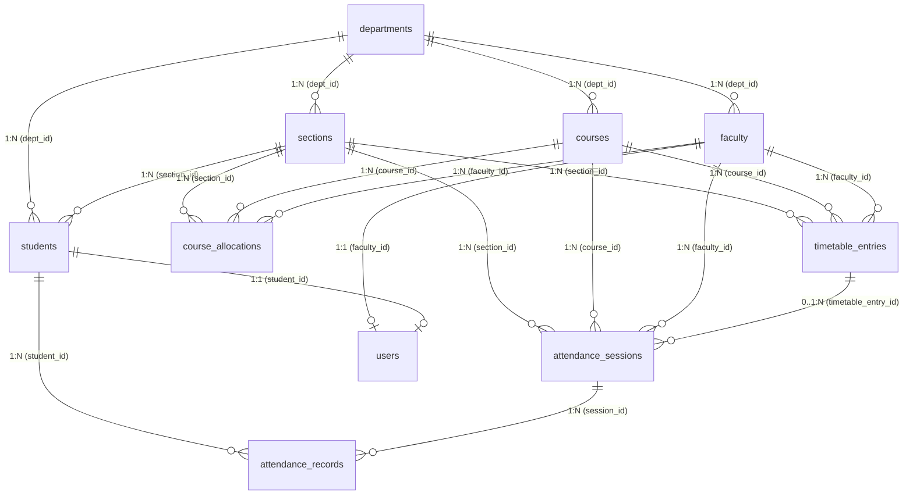
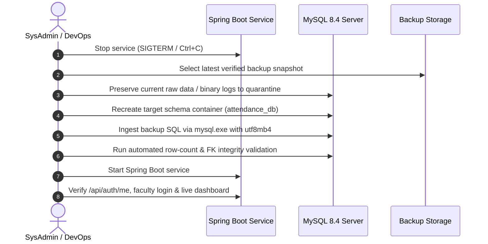

# SYNAPSE PHASE 3A: BACKUP & DISASTER RECOVERY READ-ONLY AUDIT
**Authoritative Architectural & Operational Audit**  
**Date:** October 2, 2026  
**System Target:** Synapse Smart Attendance Management System  
**Canonical Stack:** Spring Boot 3.3.3 + Spring Security (JWT) + MySQL 8.4 Community Server + Same-Origin UI (`http://localhost:8080/`)  
**Audit Scope:** Read-Only Investigation of Backup, Recovery, Data Criticality, Consistency, and Retention  
**Phase Status:** **AUDIT COMPLETE (READ-ONLY) — READY FOR PHASE 3B IMPLEMENTATION**

---

## 1. EXECUTIVE STATUS

Synapse Smart Attendance is preparing for live departmental deployment across the Computer Science & Engineering (CSE) department at SSIPMT Raipur. In this operational phase, faculty members will mark attendance continuously across 7–8 scheduled periods per day. 

### Critical Audit Finding: Zero Automated Backup Infrastructure Currently Exists
* **Transactional Vulnerability:** The verified historical records (8 sessions, 300 attendance marks in `attendance_staging_db`) exist **solely** within active MySQL data directory files on local disk (`D:\tools\mysql\data\`).
* **Absence of Backup Routines:** There are currently **no automated backup scripts**, no scheduled tasks in Windows Task Scheduler, and no off-machine replication procedures.
* **Schema vs. Transaction Gap:** The repository file [`attendance_schema.sql`](file:///D:/3RD%20SEM/PROJECTS/Projects/Smart%20Attendance/attendance_schema.sql) contains DDL and baseline seed data (departments, courses, faculty, students, timetable, users), but contains **zero attendance transaction inserts**. If MySQL data files suffer hardware corruption, disk failure, or catastrophic drop, all conducted lecture sessions and attendance marks would be permanently lost.
* **Database Isolation:** `attendance_db` is currently clean (0 sessions, 0 records). `attendance_test_db` **does not exist** on the MySQL instance.

---

## 2. CURRENT BACKUP CAPABILITY

An exhaustive search across the repository, host filesystem, and Windows operating system was performed.

### Findings Manifest:

| Component | Status | Details |
| :--- | :--- | :--- |
| **`mysqldump.exe`** | **IMPLEMENTED & VERIFIED** | Present at `D:\tools\mysql\PFiles64\MySQL\MySQL Server 8.4\bin\mysqldump.exe` (Ver 8.4.9 for Win64 on x86_64). Dry-run execution confirmed working with `--single-transaction`. |
| **`mysql.exe`** | **IMPLEMENTED & VERIFIED** | Present at `D:\tools\mysql\PFiles64\MySQL\MySQL Server 8.4\bin\mysql.exe` (Ver 8.4.9 for Win64). Used actively by test harnesses. |
| **Backup Scripts (`.bat`, `.cmd`, `.ps1`, `.sh`)** | **NOT IMPLEMENTED** | Zero backup or restore scripts exist in the repository or local tools path. |
| **Windows Task Scheduler** | **NOT CONFIGURED** | Inspected `Get-ScheduledTask`. No task exists for MySQL, Synapse, or database backup. |
| **Database DDL / Seed Files** | **IMPLEMENTED & VERIFIED** | [`attendance_schema.sql`](file:///D:/3RD%20SEM/PROJECTS/Projects/Smart%20Attendance/attendance_schema.sql) (80,569 bytes, 917 lines). Contains DDL and initial seeds for master tables, but no attendance sessions or records. |
| **Transaction Dump Files (`.sql`)** | **NOT IMPLEMENTED** | No logical or physical dump file of `attendance_staging_db` or `attendance_db` exists on disk. |
| **Binary Logging (`log_bin`)** | **IMPLEMENTED & VERIFIED** | MySQL configuration verified: `log_bin = ON`, format = `ROW`, basename = `D:\tools\mysql\data\binlog`. Point-in-time recovery (PITR) is technically enabled at engine level. |
| **Recovery Documentation** | **NOT IMPLEMENTED** | No runbook, disaster recovery manual, or restore instructions exist in project documentation. |

---

## 3. DATABASE INVENTORY

An inspection of the MySQL instance (`D:\tools\mysql\data\`) revealed two project schemas:
1. `attendance_db` (Active runtime / development database)
2. `attendance_staging_db` (Verified staging database containing Gate 1 / Phase 1 / Phase 1.1 attendance data)

Both databases share an identical schema composed of 10 tables and 2 views. All tables utilize the `InnoDB` storage engine with `utf8mb4_0900_ai_ci` collation.

### 3.1 Table Manifest and Exact Row Counts

| Table Name | Storage Engine | `attendance_db` Rows | `attendance_staging_db` Rows | Classification |
| :--- | :--- | :--- | :--- | :--- |
| `departments` | InnoDB | 1 | 1 | Master Configuration |
| `sections` | InnoDB | 4 | 4 | Master Configuration |
| `courses` | InnoDB | 14 | 14 | Master Academic Curriculum |
| `faculty` | InnoDB | 13 | 13 | Master Identity / Staff |
| `course_allocations` | InnoDB | 10 | 10 | Academic Allocation |
| `students` | InnoDB | 252 | 252 | Master Student Roster |
| `timetable_entries` | InnoDB | 80 | 80 | Operational Timetable |
| `users` | InnoDB | 258 | 258 | Authentication & RBAC |
| `attendance_sessions` | InnoDB | **0** | **8** | Transactional Session Tracking |
| `attendance_records` | InnoDB | **0** | **300** | Transactional Attendance Marks |
| `vw_section_live_attendance` | View | Derived | Derived | Analytical Aggregation View |
| `vw_student_live_attendance` | View | Derived | Derived | Analytical Aggregation View |

### 3.2 Schema Architecture, Keys & Constraints



#### Detailed Table Specifications:

1. **`departments`**
   - **Primary Key:** `dept_id` (INT, AUTO_INCREMENT)
   - **Unique Constraints:** `dept_code` (`UNIQUE KEY`)
   - **Foreign Keys:** None (Root node).

2. **`sections`**
   - **Primary Key:** `section_id` (INT, AUTO_INCREMENT)
   - **Unique Constraints:** `uq_dept_section` (`dept_id`, `section_name`)
   - **Foreign Keys:** `dept_id` $\to$ `departments(dept_id)` ON DELETE CASCADE.

3. **`courses`**
   - **Primary Key:** `course_id` (INT, AUTO_INCREMENT)
   - **Unique Constraints:** `course_code_short` (`UNIQUE KEY`)
   - **Foreign Keys:** `dept_id` $\to$ `departments(dept_id)` ON DELETE CASCADE.
   - **Key Attributes:** `is_primary` (BOOLEAN, indicates core CSVTU subjects).

4. **`faculty`**
   - **Primary Key:** `faculty_id` (INT, AUTO_INCREMENT)
   - **Unique Constraints:** `faculty_code` (`UNIQUE KEY`), `email` (`UNIQUE KEY`)
   - **Foreign Keys:** `dept_id` $\to$ `departments(dept_id)` ON DELETE CASCADE.
   - **Key Attributes:** `role` ENUM(`faculty`, `hod`, `admin`, `staff`).

5. **`course_allocations`**
   - **Primary Key:** `allocation_id` (INT, AUTO_INCREMENT)
   - **Unique Constraints:** `uq_fac_course_sec` (`faculty_id`, `course_id`, `section_id`)
   - **Foreign Keys:**
     - `faculty_id` $\to$ `faculty(faculty_id)` ON DELETE CASCADE
     - `course_id` $\to$ `courses(course_id)` ON DELETE CASCADE
     - `section_id` $\to$ `sections(section_id)` ON DELETE CASCADE
   - **Key Attributes:** `status` ENUM(`CONFIRMED`, `PENDING`).

6. **`students`**
   - **Primary Key:** `student_id` (INT, AUTO_INCREMENT)
   - **Unique Constraints:** `roll_number` (`UNIQUE KEY`), `rfid_uid` (`UNIQUE KEY`), `email` (`UNIQUE KEY`)
   - **Foreign Keys:**
     - `dept_id` $\to$ `departments(dept_id)` ON DELETE CASCADE
     - `section_id` $\to$ `sections(section_id)` ON DELETE CASCADE
   - **Key Attributes:** `status` (`Active`), `semester` (3).

7. **`timetable_entries`**
   - **Primary Key:** `entry_id` (INT, AUTO_INCREMENT)
   - **Unique Constraints:** `timetable_code` (`UNIQUE KEY`)
   - **Foreign Keys:**
     - `section_id` $\to$ `sections(section_id)` ON DELETE CASCADE
     - `course_id` $\to$ `courses(course_id)` ON DELETE CASCADE
     - `faculty_id` $\to$ `faculty(faculty_id)` ON DELETE CASCADE
   - **Key Attributes:** `day_of_week`, `day_index`, `start_time`, `end_time`, `slot_type`.

8. **`users`**
   - **Primary Key:** `user_id` (INT, AUTO_INCREMENT)
   - **Unique Constraints:** `username` (`UNIQUE KEY`), `faculty_id` (`UNIQUE KEY`), `student_id` (`UNIQUE KEY`)
   - **Foreign Keys:**
     - `faculty_id` $\to$ `faculty(faculty_id)` ON DELETE CASCADE
     - `student_id` $\to$ `students(student_id)` ON DELETE CASCADE
   - **Key Attributes:** `role` ENUM(`STUDENT`, `FACULTY`, `HOD`, `ADMIN`), `password_hash` (BCrypt).

9. **`attendance_sessions`**
   - **Primary Key:** `session_id` (INT, AUTO_INCREMENT)
   - **Unique Constraints:**
     - `uq_session_lecture`: (`course_id`, `section_id`, `lecture_number`)
     - `uq_active_recording`: (`faculty_id`, `course_id`, `section_id`, `session_date`, `active_marker`)
   - **Foreign Keys:**
     - `course_id` $\to$ `courses(course_id)` ON DELETE CASCADE
     - `faculty_id` $\to$ `faculty(faculty_id)` ON DELETE CASCADE
     - `section_id` $\to$ `sections(section_id)` ON DELETE CASCADE
     - `timetable_entry_id` $\to$ `timetable_entries(entry_id)` ON DELETE SET NULL
   - **Generated Columns:**
     - `active_marker` `VARCHAR(10) GENERATED ALWAYS AS (if(status = 'RECORDING', 'ACTIVE', NULL)) STORED`
   - **Status Field:** `status` ENUM(`RECORDING`, `COMPLETED`, `CANCELLED`).

10. **`attendance_records`**
    - **Primary Key:** `record_id` (INT, AUTO_INCREMENT)
    - **Unique Constraints:** `uq_session_student`: (`session_id`, `student_id`)
    - **Foreign Keys:**
      - `session_id` $\to$ `attendance_sessions(session_id)` ON DELETE CASCADE
      - `student_id` $\to$ `students(student_id)` ON DELETE CASCADE
    - **Status Field:** `status` ENUM(`PRESENT`, `ABSENT`).

11. **Analytical Views (`vw_section_live_attendance`, `vw_student_live_attendance`)**
    - Dynamic views calculating real-time aggregated metrics (`completed_sessions`, `attended_sessions`, `attendance_pct`, `section_avg_pct`).
    - Note on view definitions: In the existing database, the views were created with explicit `attendance_db` catalog prefix in the view body. Dumping via `mysqldump` without explicit database qualification emits generic table names, which allows portable restoration into other database names.

---

## 4. CRITICAL DATA CLASSIFICATION

A partial or table-fragmented backup strategy is fundamentally invalid for Synapse due to tight referential integrity.

```
+-----------------------------------------------------------------------------------+
|                           DATA CLASSIFICATION MATRIX                              |
+------------------------------------+------------------+-------------+-------------+
| Category                           | Tables           | Churn Rate  | Impact      |
+------------------------------------+------------------+-------------+-------------+
| Tier 1: Attendance Transactions    | sessions, records| High (Hourly| CATASTROPHIC|
| Tier 2: Authentication & Identity  | users, faculty,  | Low (Monthly| CRITICAL    |
|                                    | students         |             |             |
| Tier 3: Operational Allocation     | allocations,     | Low (Term)  | CRITICAL    |
|                                    | timetable        |             |             |
| Tier 4: Master Institutional Config| departments,     | Zero        | HIGH        |
|                                    | sections, courses|             |             |
+------------------------------------+------------------+-------------+-------------+
```

### Referential Invalidation Analysis:
* **Why backing up only `attendance_records` fails:** `attendance_records` references `session_id` and `student_id`. Without the exact parent rows in `attendance_sessions` and `students`, MySQL foreign key enforcement will reject the restore.
* **Why backing up only transactions fails:** If `users` or `course_allocations` are missing or out of sync, faculty cannot authenticate via JWT, or will receive `403 Forbidden: Identity spoofing / Allocation pending` when querying or resuming attendance.
* **Conclusion:** Complete attendance disaster recovery requires an **atomic, cohesive snapshot of all 10 tables**.

---

## 5. BACKUP COMPLETENESS & CONSISTENCY ANALYSIS

### 5.1 The Concurrency Risk
In live departmental pilot testing, teachers submit attendance marks concurrently. If a naive backup tool locks tables or reads dirty data:
1. **Lock Contention / Outage:** Issuing global read locks (`FLUSH TABLES WITH READ LOCK` without non-blocking mode) freezes Spring Boot connection pool threads (`HikariPool-1`), resulting in UI latency spikes and HTTP 504 gateway timeouts.
2. **Inconsistent Split-Brain Snapshots:** If `attendance_sessions` is dumped at 10:00:01 AM (showing status `RECORDING`) and `attendance_records` is dumped at 10:00:05 AM (after a teacher submitted 60 records and set status `COMPLETED`), the restored database would contain orphaned or logically mismatched session states.

### 5.2 Transactional Consistency Evaluation
* **InnoDB Storage Engine:** Every table in Synapse uses InnoDB.
* **Suitability of `--single-transaction`:** **EXCELLENT**.  
  `mysqldump --single-transaction` establishes an isolated transaction (`START TRANSACTION WITH CONSISTENT SNAPSHOT`). It reads a consistent snapshot of all InnoDB tables at a single point in time via MVCC (Multi-Version Concurrency Control) without blocking ongoing `INSERT`, `UPDATE`, or `SELECT` queries from faculty members.
* **Required Parameters for `mysqldump` in Synapse:**
  - `--single-transaction`: Guarantees point-in-time ACID snapshot across all 10 tables without locking the live UI.
  - `--quick`: Streams rows directly from MySQL server rather than caching massive tables in memory.
  - `--default-character-set=utf8mb4`: Prevents encoding corruption of Hindi names, diacritics, or special characters.
  - `--routines --events --triggers`: Ensures programmable objects are captured (currently 0 exist, but protects future extensions).
  - `--set-gtid-purged=OFF`: Prevents GTID errors when restoring to single-instance standalone environments.

---

## 6. RESTORE REQUIREMENTS & FAILURE MODES

A complete disaster recovery plan must address 5 distinct disaster scenarios:

### Scenario A: Local Database Corruption / Crash
* **Trigger:** Sudden power loss, disk write fault, or corrupted InnoDB tablespace (`.ibd`).
* **Restore Path:** 
  1. Terminate Spring Boot service.
  2. Drop damaged database (`DROP DATABASE attendance_db;`).
  3. Recreate clean schema container (`CREATE DATABASE attendance_db CHARACTER SET utf8mb4 COLLATE utf8mb4_unicode_ci;`).
  4. Ingest latest verified `.sql` backup snapshot via `mysql.exe`.
  5. Restart Spring Boot and verify via `/api/auth/me`.

### Scenario B: Accidental Table or Database Drop
* **Trigger:** Administrator errantly issues `DROP TABLE attendance_sessions` or `DROP DATABASE attendance_staging_db`.
* **Restore Path:** Same as Scenario A; execution of the full `.sql` dump restores DDL and all rows under foreign-key-safe execution flags (`FOREIGN_KEY_CHECKS=0`).

### Scenario C: Complete Host Machine Failure
* **Trigger:** Hardware burnout, motherboard failure, Windows OS crash.
* **Restore Path:** 
  1. Provision new Windows host.
  2. Install Java 17 and MySQL 8.4 Community Server.
  3. Configure `my.ini` (`datadir`, `port=3306`, `utf8mb4`).
  4. Ingest off-machine backup archive into newly initialized MySQL server.
  5. Deploy Spring Boot JAR with valid `application.properties` credentials.

### Scenario D: Erroneous Application Deployment / Migration
* **Trigger:** Code update accidentally corrupts or mutates attendance status records.
* **Restore Path:** Revert application code build; restore pre-deployment database snapshot.

### Scenario E: Accidental Attendance Row Deletion / Scoped Session Repair
* **Trigger:** A faculty member accidentally marks incorrect attendance or a session record is corrupted.
* **Restore Path:** Restore the latest backup snapshot into a **temporary disposable database** (e.g. `attendance_restore_temp`). Extract the specific session and record rows. Re-insert cleanly into `attendance_db` without rolling back subsequent unaffected lectures.

---

## 7. DISASTER RECOVERY RUNBOOK PROCEDURE

The concrete step-by-step procedure for a disaster recovery event:



### Step-by-Step Execution Sequence:
1. **Stop Application:** Stop Spring Boot (`mvn spring-boot:run` or Java process) to guarantee zero active incoming write transactions.
2. **Preserve Forensic Evidence:** Copy `D:\tools\mysql\data\` and current binary logs to `D:\backups\quarantine\quarantine_YYYYMMDD_HHMMSS`.
3. **Database Reset:**
   ```sql
   DROP DATABASE IF EXISTS attendance_db;
   CREATE DATABASE attendance_db CHARACTER SET utf8mb4 COLLATE utf8mb4_unicode_ci;
   ```
4. **Restore Ingestion:**
   ```cmd
   "D:\tools\mysql\PFiles64\MySQL\MySQL Server 8.4\bin\mysql.exe" --defaults-file="D:\tools\mysql\my.ini" -u root -proot --default-character-set=utf8mb4 attendance_db < "D:\backups\synapse\synapse_backup_YYYYMMDD_HHMMSS.sql"
   ```
5. **Schema & Count Verification:**
   - Execute verification query asserting:
     - 1 department, 4 sections, 14 courses, 13 faculty, 10 allocations, 252 students, 80 timetable blocks, 258 users.
     - Attendance session and record counts exactly match backup metadata.
6. **Start Application:** Launch Spring Boot backend.
7. **Smoke Verification:**
   - Execute HTTP `POST /api/auth/login` for `faculty_os`.
   - Execute HTTP `GET /api/auth/me`.
   - Access `http://localhost:8080/` in browser; verify student counts and timetable rendering.

---

## 8. TEST DATABASE REQUIREMENT

* **Current Status:** `attendance_test_db` **DOES NOT EXIST** on the MySQL server.
* **Safety Mandate:** As established in Safety Rules:
  - Do NOT test restore procedures against `attendance_staging_db` (holds 8 historical sessions and 300 records).
  - Do NOT test destructive recovery against active `attendance_db` while development or pilot is in progress.
* **Future Requirement (Phase 3B/3C):**
  A disposable, dedicated database `attendance_test_db` must be provisioned solely for automated backup verification and dry-run restoration drills. It will be created, verified, and dropped without impacting staging or production data.

---

## 9. SECURITY & DATA EXPOSURE RISKS

Logical backup files (`.sql`) contain sensitive institutional assets in plain text:
1. **Credentials & Hashes:** Table `users` contains BCrypt password hashes for all 258 faculty and students.
2. **Personally Identifiable Information (PII):** Table `students` contains full names, university roll numbers, CSVTU enrollment numbers, personal email addresses, and physical RFID card UIDs.
3. **Faculty PII:** Table `faculty` contains full names, official email addresses, designations, and employee codes.
4. **Database Admin Credentials:** Invoking `mysqldump` with `-proot` in batch scripts or PowerShell files risks exposing passwords via process monitoring tools (`Get-Process`, Task Manager) or shell history.

### Security Storage Policies:
* **Prohibited Locations:**
  - `target/classes/static/` or any web-accessible directory.
  - Project repository tracked by Git (must be explicitly added to `.gitignore`).
  - Public temporary directories (`C:\Temp`, `C:\Users\Public`).
* **Approved Backup Storage:**
  - Dedicated local directory outside project webroot: `D:\backups\synapse\`.
  - Windows NTFS file permissions restricted strictly to local Administrators and the designated Synapse service account.
  - Command invocation via secure MySQL login path (`mysql_config_editor`) or isolated option file rather than plain-text command-line password flags.

---

## 10. PILOT RETENTION POLICY PROPOSAL

For a departmental pilot where 5–10 faculty members conduct classes across 4 sections daily:

```
+-----------------------------------------------------------------------------------+
|                        PROPOSED PILOT RETENTION SCHEDULE                          |
+-------------------+----------------+----------------------------------------------+
| Backup Type       | Frequency      | Retention Period                             |
+-------------------+----------------+----------------------------------------------+
| Daily Pre-Lecture | Every morning  | 14 Days                                      |
|                   | at 08:00 AM    |                                              |
| Intra-Day Snapshot| Post-lecture   | 48 Hours                                     |
|                   | at 13:30 &     |                                              |
|                   | 17:30 PM       |                                              |
| Weekly Milestone  | Friday evening | 8 Weeks                                      |
|                   | at 18:00 PM    |                                              |
| Term Milestone    | Gate 1, Midterm| Indefinite (Accreditation archive)           |
|                   | End-of-Term    |                                              |
| Off-Site / Media  | Weekly Zip     | Replicated to secondary physical drive / NAS |
+-------------------+----------------+----------------------------------------------+
```

---

## 11. OPERATIONAL SIMPLICITY & ARCHITECTURAL DISCIPLINE

In adherence to non-negotiable safety rules:
* **No Speculative Bloat:** No Docker, Kubernetes, cloud blob storage agents, Redis, or microservices will be introduced.
* **Native Tooling:** The entire backup and disaster-recovery mechanism will use deterministic, native Windows tooling:
  - Windows PowerShell 5.1 / 7 (`.ps1`) scripts.
  - Native MySQL utilities (`mysqldump.exe`, `mysql.exe`).
  - Standard Windows Task Scheduler for trigger automation.

---

## 12. PROPOSED IMPLEMENTATION PLAN (PHASE 3B & 3C)

```
[Phase 3A: Audit] ---> [Phase 3B: Scripting] ---> [Phase 3C: Verification Drill]
 (Complete & Signed)     1. backup_synapse.ps1     1. Provision attendance_test_db
                         2. restore_synapse.ps1    2. Backup staging & dev
                         3. config / option file   3. Restore to test_db
                         4. verify_backup.ps1      4. Assert row counts match
                                                   5. Teardown test_db
```

1. **Phase 3B — Script Implementation:**
   - Create `scripts/backup_synapse.ps1`: Automated, timestamped backup script with `--single-transaction`, `--quick`, UTF-8, and error logging.
   - Create `scripts/restore_synapse.ps1`: Safe restore script requiring explicit confirmation, with pre-restore target database validation.
   - Implement automated backup metadata generation (JSON sidecar storing database name, timestamp, schema version, table counts).
2. **Phase 3C — Non-Destructive Restore Verification Drill:**
   - Provision `attendance_test_db`.
   - Take backup of `attendance_staging_db`.
   - Restore backup into `attendance_test_db`.
   - Execute verification suite checking exact row counts (8 sessions, 300 records, 252 students, 13 faculty, etc.).
   - Clean up `attendance_test_db`.

---

## 13. RISKS & UNKNOWNS

1. **MySQL Command-line Password Warning (Risk: Low):**
   Providing `-p<password>` triggers `mysql: [Warning] Using a password on the command line interface can be insecure.` to standard error. In automated scripts, stderr redirection must isolate actual errors from this informational warning, or use a temporary defaults file.
2. **Disk Space for Long-Term Dumps (Risk: Low):**
   Full logical dumps of Synapse are currently small (~1.5 MB uncompressed). With 252 students and ~500 lectures across a semester, a full dump will not exceed 20 MB. Disk exhaustion is not an immediate risk for pilot testing, but rolling retention ensures bounded storage.
3. **Active Session Interruption during Power Failure (Risk: Medium):**
   If power fails while a session is in `RECORDING` state before completion, the session remains `RECORDING`. Restore will preserve that exact state.

---

## 14. IMPLEMENTED VS VERIFIED DISTINCTION

| Item | Classification | Evidence / Basis |
| :--- | :--- | :--- |
| `mysqldump.exe` executable | **VERIFIED** | Successfully executed version check (8.4.9) and dry-run dump. |
| `mysql.exe` executable | **VERIFIED** | Successfully executed queries and table inspections. |
| InnoDB consistent snapshot capability | **VERIFIED** | Dry-run executed with `--single-transaction`; all 10 tables confirmed InnoDB. |
| `attendance_staging_db` contents | **VERIFIED** | Exact row counts queried: 8 sessions, 300 attendance records, 252 students. |
| `attendance_db` contents | **VERIFIED** | Exact row counts queried: 0 sessions, 0 attendance records, 252 students. |
| `attendance_test_db` non-existence | **VERIFIED** | `SHOW DATABASES` confirmed only `attendance_db` and `attendance_staging_db` exist. |
| View portability across databases | **VERIFIED** | `mysqldump` verified to strip database name prefixes from view definitions. |
| Automated backup scripts | **NOT IMPLEMENTED** | None exist in repository. |
| Scheduled Task automation | **NOT IMPLEMENTED** | Windows Task Scheduler confirmed empty for Synapse. |
| Automated restore verification script | **PROPOSED** | Detailed in Section 12 for Phase 3B/3C. |
| Production backup destination directory | **PROPOSED** | `D:\backups\synapse\` proposed for deployment. |
| Real power failure recovery behavior | **UNKNOWN** | Hardware power failure cannot be simulated without host interruption. |

---

## 15. PHASE 3A GATE DECISION

### **GATE DECISION: PASS (READ-ONLY AUDIT COMPLETE)**
* All database objects, schemas, keys, constraints, and relationships have been comprehensively cataloged.
* Data criticality has been formally classified.
* Concurrency and transactional consistency risks have been analyzed and solved via `mysqldump --single-transaction`.
* Recovery runbooks, security risks, retention policies, and implementation requirements are fully specified.
* Zero application code, database schema, or attendance data was modified during this phase.

**System is ready for Phase 3B (Controlled Backup & Restore Implementation) upon user instruction.**
