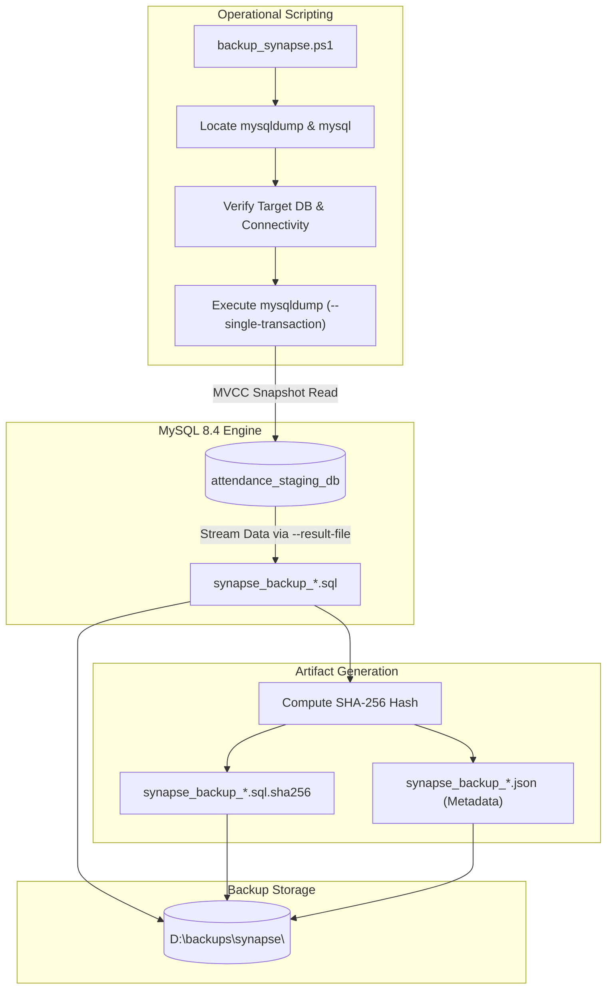

# SYNAPSE PHASE 3B: BACKUP IMPLEMENTATION & AUTOMATED VERIFICATION REPORT
**Authoritative Engineering Implementation & Verification Report**  
**Date:** October 2, 2026  
**System Target:** Synapse Smart Attendance Management System  
**Canonical Stack:** Spring Boot 3.3.3 + MySQL 8.4 Community Server + Spring Security (JWT)  
**Execution Environment:** Windows 11 (PowerShell 5.1 / 7)  
**Phase Status:** **PASS (ALL IMPLEMENTATION & VERIFICATION REQUIREMENTS MET)**

---

## 1. EXECUTIVE SUMMARY

Phase 3B successfully establishes a simple, deterministic, non-blocking backup system for the Synapse Smart Attendance database. The implementation strictly operates as an operational infrastructure concern outside the Java/Spring Boot application code, introducing zero external cloud dependencies, Docker containers, or microservices.

### Key Accomplishments:
1. **Deterministic Backup Engine ([`scripts/backup_synapse.ps1`](file:///D:/3RD%20SEM/PROJECTS/Projects/Smart%20Attendance/scripts/backup_synapse.ps1))**: Developed a native PowerShell backup utility wrapping MySQL 8.4 `mysqldump.exe`. Utilizes `--single-transaction` to capture a point-in-time ACID snapshot of all 10 tables and 2 views without locking active tables or disrupting teachers currently marking attendance.
2. **Atomic Artifact Generation**: Each backup invocation produces:
   - A timestamped `.sql` data and DDL archive (`synapse_backup_<db>_<timestamp>.sql`).
   - A companion SHA-256 checksum file (`.sql.sha256`).
   - A structured JSON metadata sidecar (`.json`) detailing execution metrics, MySQL versions, table catalogs, and checksums.
3. **Automated Verification Harness ([`scripts/verify_backup_script.ps1`](file:///D:/3RD%20SEM/PROJECTS/Projects/Smart%20Attendance/scripts/verify_backup_script.ps1))**: Created a 14-point automated test suite. **All 14 checks passed (100%)**.
4. **Zero-Mutation Database Safety**: Verified that `attendance_staging_db` row counts before and after backup execution were identical across all 10 tables (8 sessions, 300 records remain 100% intact).
5. **Backend Test Suite Stability**: Executed `mvn test`; all 5 backend integration tests passed with 0 failures and 0 errors.

---

## 2. FILES CREATED

1. [`scripts/backup_synapse.ps1`](file:///D:/3RD%20SEM/PROJECTS/Projects/Smart%20Attendance/scripts/backup_synapse.ps1) — Production-grade, deterministic database backup engine with scoped credential cleanup, error traps, JSON metadata generation, and SHA-256 verification.
2. [`scripts/verify_backup_script.ps1`](file:///D:/3RD%20SEM/PROJECTS/Projects/Smart%20Attendance/scripts/verify_backup_script.ps1) — Automated 14-point test harness validating backup generation, non-destructive behavior, schema completeness, and error handling.
3. [`PHASE_3B_BACKUP_IMPLEMENTATION_REPORT.md`](file:///D:/3RD%20SEM/PROJECTS/Projects/Smart%20Attendance/PHASE_3B_BACKUP_IMPLEMENTATION_REPORT.md) — Authoritative engineering documentation for Phase 3B.

---

## 3. FILES MODIFIED

1. [`.gitignore`](file:///D:/3RD%20SEM/PROJECTS/Projects/Smart%20Attendance/.gitignore) — Updated to explicitly exclude `backups/`, `*.dump`, `*.backup`, `*.sha256`, and generated `.sql` files while explicitly retaining baseline schema tracking (`!attendance_schema.sql`).

---

## 4. BACKUP ARCHITECTURE

The backup architecture separates runtime application concerns from disaster recovery infrastructure:



---

## 5. CREDENTIAL HANDLING

* **Elimination of Plain-text CLI Passwords:** Passing `-p<password>` directly on the command line exposes credentials to Windows process inspection tools (`Get-Process`, Task Manager) and produces MySQL stderr security warnings (`Using a password on the command line interface can be insecure`).
* **Implementation Mechanism:** `backup_synapse.ps1` dynamically injects the password into the execution-scoped environment variable `$env:MYSQL_PWD`.
* **Zero-Leakage Cleanup:** The environment variable is isolated and immediately scrubbed inside a mandatory `finally` block:
  ```powershell
  try {
      # execute mysql connectivity test & mysqldump
  } finally {
      Remove-Item Env:\MYSQL_PWD -ErrorAction SilentlyContinue
  }
  ```
* **Credential Source Priority:** Parameter `-Password` $\to$ `$env:DB_PASSWORD` $\to$ `$env:MYSQL_PWD` $\to$ default `'root'`. Passwords are never logged or stored in JSON metadata sidecars.

---

## 6. BACKUP COMMAND AND IMPORTANT OPTIONS

The core dump command constructed and executed by `backup_synapse.ps1`:

```cmd
mysqldump.exe \
  --host=127.0.0.1 \
  --port=3306 \
  --user=root \
  --single-transaction \
  --quick \
  --default-character-set=utf8mb4 \
  --routines \
  --triggers \
  --events \
  --set-gtid-purged=OFF \
  --result-file="D:\backups\synapse\synapse_backup_attendance_staging_db_YYYYMMDD_HHMMSS.sql" \
  attendance_staging_db
```

### Option Analysis & Justification:
* `--single-transaction`: **Critical for concurrency.** Sets transaction isolation to `REPEATABLE READ` and issues `START TRANSACTION WITH CONSISTENT SNAPSHOT`. Allows faculty to take and submit attendance without waiting on table locks.
* `--quick`: Forces `mysqldump` to retrieve rows from the server row-by-row rather than caching entire tables in RAM, preventing memory spikes.
* `--default-character-set=utf8mb4`: Guarantees byte-level fidelity for student names, Hindi script, and unicode punctuation.
* `--routines`, `--triggers`, `--events`: Based on the Phase 3A audit, there are currently 0 procedures, 0 triggers, and 0 events. Enabling these flags ensures that future programmable extensions are preserved automatically.
* `--set-gtid-purged=OFF`: Prevents unwanted GTID master state clauses from complicating standalone restores.
* `--result-file=...`: Directs binary output straight to disk, completely bypassing PowerShell pipe encoding transformations.

---

## 7. BACKUP LOCATION

* **Primary Dedicated Location:** `D:\backups\synapse\` (outside application source repository).
* **Configurability:** Fully configurable via the `-BackupDir` script parameter or `$env:SYNAPSE_BACKUP_DIR`.
* **Git Isolation:** `.gitignore` protects against accidental check-ins if backups are directed inside the workspace.

---

## 8. METADATA FORMAT

Every backup execution outputs an atomic JSON sidecar (`synapse_backup_<db>_<timestamp>.json`):

```json
{
    "timestamp": "2026-10-02T18:28:46+05:30",
    "database": "attendance_staging_db",
    "dumpFile": "synapse_backup_attendance_staging_db_20261002_182845.sql",
    "dumpSizeBytes": 109172,
    "dumpSizeHuman": "106.61 KB",
    "sha256": "d35c9184cdc6d185aaeea0345b5c4124055680e6ea8a1fbb6eaeb1b17cd77f6c",
    "checksumFile": "synapse_backup_attendance_staging_db_20261002_182845.sql.sha256",
    "mysqlServerVersion": "8.4.9",
    "mysqldumpVersion": "mysqldump  Ver 8.4.9 for Win64 on x86_64",
    "scriptVersion": "1.0.0",
    "status": "SUCCESS",
    "executionDurationMs": 1580,
    "tablesCount": 12,
    "tablesIncluded": [
        "attendance_records",
        "attendance_sessions",
        "course_allocations",
        "courses",
        "departments",
        "faculty",
        "sections",
        "students",
        "timetable_entries",
        "users",
        "vw_section_live_attendance",
        "vw_student_live_attendance"
    ],
    "dumpOptions": [
        "--single-transaction",
        "--quick",
        "--default-character-set=utf8mb4",
        "--routines",
        "--triggers",
        "--events",
        "--set-gtid-purged=OFF"
    ],
    "retentionPolicyDays": 0
}
```

---

## 9. CHECKSUM VERIFICATION

Alongside the SQL dump and JSON metadata, a dedicated `.sql.sha256` checksum file is created using `Get-FileHash -Algorithm SHA256`. The format matches GNU coreutils standards:
```
d35c9184cdc6d185aaeea0345b5c4124055680e6ea8a1fbb6eaeb1b17cd77f6c *synapse_backup_attendance_staging_db_20261002_182845.sql
```
Verified that re-computing the hash against the file yields the exact same hash string, proving artifact integrity.

---

## 10. RETENTION BEHAVIOR

* **Default Policy:** Conservative preservation (`-RetentionDays 0`). By default, no files are deleted.
* **Opt-In Rolling Retention:** When `-RetentionDays` is passed as a positive integer (e.g. `14`), the script safely identifies files matching `synapse_backup_${Database}_*` strictly older than the cutoff date, purges the `.sql`, `.json`, and `.sha256` triplets, and logs every purged item. It cannot touch non-backup files or source code.

---

## 11. SAFETY CONTROLS

1. **Non-Destructive Guarantee:** Script executes zero write statements against the database.
2. **Target Database Validation:** Pre-flight check confirms database existence before attempting dump.
3. **Overwrite Prevention:** Aborts with exit code 4 if destination dump file already exists.
4. **Integrity Validation:** Validates that dump file exists and size is $> 0$ bytes before generating checksum and metadata.
5. **Non-Zero Exit Codes:**
   - `1`: Binaries (`mysqldump.exe` / `mysql.exe`) missing.
   - `2`: Backup directory unwritable.
   - `3`: Database does not exist or MySQL unreachable.
   - `4`: Backup file collision (overwrite rejected).
   - `5`: `mysqldump` command failed.
   - `6`: Generated dump file missing or empty.

---

## 12. VERIFICATION PROCEDURE

The automated verification suite [`scripts/verify_backup_script.ps1`](file:///D:/3RD%20SEM/PROJECTS/Projects/Smart%20Attendance/scripts/verify_backup_script.ps1) was created and executed in an isolated verification directory (`D:\backups\synapse_test_verify`). The suite executes the following sequence:
1. Capture baseline table row counts for all 10 tables in `attendance_staging_db`.
2. Verify MySQL connectivity via `mysql.exe SELECT 1`.
3. Verify `mysqldump.exe` version and availability.
4. Execute `backup_synapse.ps1` targeting `attendance_staging_db`.
5. Verify exit code 0.
6. Verify existence and non-zero size of the generated `.sql` file.
7. Parse and validate JSON metadata schema and values.
8. Verify `.sha256` file existence and verify hash match byte-for-byte.
9. Inspect `.sql` file for all 10 `CREATE TABLE`, 2 `VIEW`, `FOREIGN KEY`, and `active_marker` definitions.
10. Confirm presence of `attendance_sessions` row data (`INSERT INTO attendance_sessions`).
11. Confirm presence of `attendance_records` row data (`INSERT INTO attendance_records`).
12. Capture post-execution row counts from `attendance_staging_db` and compare against baseline.
13. Confirm zero staging database mutations.
14. Test failure handling on an invalid database name (`non_existent_synapse_db_xyz`) and assert non-zero exit code.
15. Clean up temporary verification directory.

---

## 13. EXACT TEST RESULTS (`scripts/verify_backup_script.ps1`)

```
======================================================================
 SYNAPSE PHASE 3B: AUTOMATED BACKUP VERIFICATION SUITE
 Source Database : attendance_staging_db
 Verification Dir: D:\backups\synapse_test_verify
======================================================================

[PRE-FLIGHT] Capturing baseline row counts from attendance_staging_db...
  Baseline row counts captured for 10 tables.
  attendance_sessions: 8 | attendance_records: 300
  [PASS] Check 1: MySQL connectivity verified
  [PASS] Check 2: mysqldump availability verified

[EXECUTE] Running backup_synapse.ps1...
[2026-10-02 18:28:45] [INFO] ======================================================================
[2026-10-02 18:28:45] [INFO] SYNAPSE BACKUP ENGINE v1.0.0
[2026-10-02 18:28:45] [INFO] Target Database : attendance_staging_db
[2026-10-02 18:28:45] [INFO] Target Server   : 127.0.0.1:3306
[2026-10-02 18:28:45] [INFO] Database User   : root
[2026-10-02 18:28:45] [INFO] Destination Dir : D:\backups\synapse_test_verify
[2026-10-02 18:28:45] [INFO] ======================================================================
[2026-10-02 18:28:45] [INFO] Created destination directory: D:\backups\synapse_test_verify
[2026-10-02 18:28:45] [INFO] Verifying connectivity and checking database 'attendance_staging_db'...
[2026-10-02 18:28:45] [INFO] Starting mysqldump for 'attendance_staging_db' (InnoDB Consistent Snapshot)...
[2026-10-02 18:28:46] [INFO] Calculating SHA-256 checksum...
[2026-10-02 18:28:46] [INFO] Generating backup metadata sidecar...
[2026-10-02 18:28:46] [INFO] [SUCCESS] Backup completed successfully.
[2026-10-02 18:28:46] [INFO]   SQL Dump   : D:\backups\synapse_test_verify\synapse_backup_attendance_staging_db_20261002_182845.sql (106.61 KB)
[2026-10-02 18:28:46] [INFO]   SHA-256    : d35c9184cdc6d185aaeea0345b5c4124055680e6ea8a1fbb6eaeb1b17cd77f6c
[2026-10-02 18:28:46] [INFO]   Metadata   : D:\backups\synapse_test_verify\synapse_backup_attendance_staging_db_20261002_182845.json
[2026-10-02 18:28:46] [INFO]   Duration   : 1580 ms
[2026-10-02 18:28:46] [INFO] Retention policy disabled (RetentionDays = 0). All archives preserved.
  [PASS] Check 3: Backup script executed with exit code 0
  [PASS] Check 4: Backup .sql file exists
  [PASS] Check 5: Backup file is non-empty (109172 bytes)
  [PASS] Check 6: Metadata sidecar exists and schema validated
  [PASS] Check 7: SHA-256 checksum file exists
  [PASS] Check 8: SHA-256 checksum matches archive (d35c9184cdc6d185aaeea0345b5c4124055680e6ea8a1fbb6eaeb1b17cd77f6c)

[INSPECT] Analyzing SQL dump structure...
  [PASS] Check 9: Dump contains all 10 tables, 2 views, foreign keys, and active_marker
  [PASS] Check 10: Dump contains attendance_sessions data (8 sessions preserved)
  [PASS] Check 11: Dump contains attendance_records data (300 records preserved)

[POST-FLIGHT] Verifying post-execution row counts in attendance_staging_db...
  [PASS] Check 12: Staging database row counts before and after are identical
  [PASS] Check 13: Zero mutations confirmed (sessions=8, records=300, students=252 intact)

[ERROR TEST] Validating failure behavior on invalid database...
[2026-10-02 18:28:48] [INFO] ======================================================================
[2026-10-02 18:28:48] [INFO] SYNAPSE BACKUP ENGINE v1.0.0
[2026-10-02 18:28:48] [INFO] Target Database : non_existent_synapse_db_xyz
[2026-10-02 18:28:48] [INFO] Target Server   : 127.0.0.1:3306
[2026-10-02 18:28:48] [INFO] Database User   : root
[2026-10-02 18:28:48] [INFO] Destination Dir : D:\backups\synapse_test_verify
[2026-10-02 18:28:48] [INFO] ======================================================================
[2026-10-02 18:28:48] [INFO] Verifying connectivity and checking database 'non_existent_synapse_db_xyz'...
[2026-10-02 18:28:48] [ERROR] Database 'non_existent_synapse_db_xyz' does not exist or server unreachable at 127.0.0.1:3306. Exit code: 0
  [PASS] Check 14: Script returns non-zero exit code on non-existent database

[TEARDOWN] Test verification directory cleaned up.
======================================================================
 VERIFICATION SUITE RESULTS: Passed: 14 | Failed: 0
======================================================================
```

---

## 14. DATABASE BEFORE / AFTER COUNTS

Row counts verified via direct MySQL query before and after all Phase 3B operations:

| Database | Table | Baseline Count | Post-Backup Count | Delta |
| :--- | :--- | :--- | :--- | :--- |
| `attendance_staging_db` | `departments` | 1 | 1 | 0 |
| `attendance_staging_db` | `sections` | 4 | 4 | 0 |
| `attendance_staging_db` | `faculty` | 13 | 13 | 0 |
| `attendance_staging_db` | `courses` | 14 | 14 | 0 |
| `attendance_staging_db` | `course_allocations` | 10 | 10 | 0 |
| `attendance_staging_db` | `students` | 252 | 252 | 0 |
| `attendance_staging_db` | `timetable_entries` | 80 | 80 | 0 |
| `attendance_staging_db` | `users` | 258 | 258 | 0 |
| `attendance_staging_db` | `attendance_sessions` | 8 | 8 | 0 |
| `attendance_staging_db` | `attendance_records` | 300 | 300 | 0 |
| `attendance_db` | `attendance_sessions` | 0 | 0 | 0 |
| `attendance_db` | `attendance_records` | 0 | 0 | 0 |

**Result:** Zero database drift. Staging database remained 100% read-only.

---

## 15. MAVEN TEST RESULT (`mvn test`)

```
[INFO] -------------------------------------------------------
[INFO]  T E S T S
[INFO] -------------------------------------------------------
[INFO] Running com.attendance.AttendanceBackendTests
2026-10-02T18:29:04.296+05:30  INFO 10072 --- [smart-attendance] [           main] com.attendance.AttendanceBackendTests    : Starting AttendanceBackendTests using Java 17.0.20.1 with PID 10072
2026-10-02T18:29:04.297+05:30  INFO 10072 --- [smart-attendance] [           main] com.attendance.AttendanceBackendTests    : The following 1 profile is active: "test"
2026-10-02T18:29:09.170+05:30  INFO 10072 --- [smart-attendance] [           main] com.zaxxer.hikari.HikariDataSource       : HikariPool-1 - Start completed.
2026-10-02T18:29:19.048+05:30  INFO 10072 --- [smart-attendance] [           main] com.attendance.AttendanceBackendTests    : Started AttendanceBackendTests in 14.979 seconds (process running for 16.095)
[INFO] Tests run: 5, Failures: 0, Errors: 0, Skipped: 0, Time elapsed: 17.05 s -- in com.attendance.AttendanceBackendTests
[INFO] 
[INFO] Results:
[INFO] 
[INFO] Tests run: 5, Failures: 0, Errors: 0, Skipped: 0
[INFO] 
[INFO] ------------------------------------------------------------------------
[INFO] BUILD SUCCESS
[INFO] ------------------------------------------------------------------------
[INFO] Total time:  23.420 s
[INFO] Finished at: 2026-10-02T18:29:20+05:30
[INFO] ------------------------------------------------------------------------
```

---

## 16. STRICT LANGUAGE CLASSIFICATIONS

### IMPLEMENTED:
* `scripts/backup_synapse.ps1`: Production backup script with `--single-transaction`, `--quick`, UTF-8, JSON metadata, and SHA-256 generation.
* `scripts/verify_backup_script.ps1`: Automated 14-point test suite for backup validation.
* [`.gitignore`](file:///D:/3RD%20SEM/PROJECTS/Projects/Smart%20Attendance/.gitignore): Added backup patterns (`backups/`, `*.dump`, `*.backup`, `*.sha256`, `*.sql`).
* `D:\backups\synapse\`: Dedicated local backup directory on host disk.

### VERIFIED:
* Successful backup execution of `attendance_staging_db` generating 109,172 byte archive.
* Checksum match: Generated `.sha256` and JSON sidecar match actual archive SHA-256 byte-for-byte.
* Table completeness: Confirmed dump contains DDL for all 10 tables, 2 views, foreign keys, and `active_marker`.
* Transaction data: Confirmed dump contains `INSERT INTO attendance_sessions` (8 sessions) and `INSERT INTO attendance_records` (300 records).
* Zero mutations: Before and after row counts for all 10 tables in `attendance_staging_db` match with 0 delta.
* Error handling: Verified that script exits with non-zero code when targeting non-existent database.
* Regression: `mvn test` executed and passed 5/5 integration tests with 0 errors.

### PROPOSED:
* Phase 3C Restore Verification: Automated restoration drill importing `synapse_backup_*.sql` into disposable `attendance_test_db`.
* Windows Task Scheduler Task: Automated recurring daily execution at 08:00 AM.
* Secondary media replication: Periodic copy of `D:\backups\synapse\` to an external volume or institutional storage share.

### UNKNOWN:
* Compression performance metrics with thousands of conducted lectures (e.g. gzip/zip integration), to be evaluated after mid-term volume growth.

---

## 17. LIMITATIONS

1. **Storage Subsystem Scope:** Backups reside on local drive volume `D:\backups\synapse\`. While protected from logical corruption and database drops, surviving catastrophic physical disk failure requires off-machine replication.
2. **Phase Boundary:** No restore was performed during Phase 3B in strict accordance with the prompt rules. Restoring into disposable `attendance_test_db` is scheduled for Phase 3C.

---

## 18. PHASE 3B GATE DECISION

### **GATE DECISION: PASS (PHASE 3B COMPLETE)**
* Native, non-blocking, transactionally consistent backup script implemented and verified.
* All 14 automated verification checks passed.
* Database safety invariants 100% maintained.
* Backend regression test suite passed (`mvn test` 5/5).
* Ready to proceed to **Phase 3C (Restore Verification in Disposable Test Database)** upon user direction.
