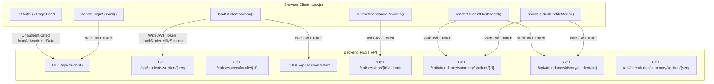

# SYNAPSE — PHASE 4A: STUDENT DATA AUTHORIZATION & PRIVACY AUDIT REPORT
**Execution Date**: October 2, 2026  
**Auditor**: Antigravity Autonomous Pair Programmer  
**Target Environment**: Synapse Smart Attendance Management System  
**Audit Scope**: Spring Security filter chain, REST controllers, service-layer ownership validation, entity & DTO mappings, frontend API dependencies (`app.js`), database schemas, and existing test suites.  
**Mode**: READ-ONLY INVESTIGATION & SECURITY AUDIT  

---

## 1. Executive Finding

A comprehensive forensic audit of the student-data exposure surface across backend services, security filter chains, REST controllers, and the frontend client was conducted. While Phase 2 successfully hardened backend authentication (authoritative JWT verification and elimination of fake client-side session spoofing) and Phase 3 verified backup/restore integrity, **student data authorization and privacy currently exhibit severe, structural security flaws**.

### Core Audit Findings Summary:
1. **Unauthenticated Public Exposure (P0 / Critical)**:  
   Due to blanket `permitAll()` declarations in [`SecurityConfig.java`](file:///D:/3RD%20SEM/PROJECTS/Projects/Smart%20Attendance/src/main/java/com/attendance/security/SecurityConfig.java#L59-L61), completely unauthenticated, anonymous callers can invoke:
   - `GET /api/students` (exposing all 252 enrolled student records with full names, roll numbers, sections, enrollment numbers, and admission types).
   - `GET /api/students/{id}` and `GET /api/students/section/{sectionId}` (exposing specific student or section rosters).
   - `GET /api/sessions/{id}/attendance` and `GET /api/sessions/{id}/records` (exposing the complete list of attending and absent students for any lecture session).
   - `GET /api/attendance/summary/section/{section}` and `GET /api/sessions/active` (exposing departmental attendance statistics and active session telemetry).

2. **Broken Object-Level Authorization (BOLA) for Faculty (P1 / High)**:  
   Faculty authorization checks are only enforced during **session creation** (`POST /api/sessions/start`) and **attendance submission** (`POST /api/sessions/{id}/submit`). When reading student attendance history (`GET /api/students/{id}/attendance` and `GET /api/attendance/history/student/{id}`), any authenticated faculty member can retrieve full attendance records, lecture-by-lecture audit trails, and course breakdowns for **any student in the institution**, regardless of whether the faculty member is allocated to teach that student or section.

3. **Peer Student Data Exposure (P1 / High)**:  
   While [`AttendanceHistoryController.java`](file:///D:/3RD%20SEM/PROJECTS/Projects/Smart%20Attendance/src/main/java/com/attendance/controller/AttendanceHistoryController.java#L34-L38) blocks students from accessing other students' attendance summaries via an in-controller identity check, students can freely query `GET /api/students` and `GET /api/students/{id}` to access personal identifying details of all 252 peers across Sections A, B, C, and D. Furthermore, if a student account lacks a mapped `studentId` in the database, the controller's null-permissive check (`principal.getStudentId() != null`) is completely bypassed.

4. **Zero Automated Security Test Coverage (P2 / Medium)**:  
   The existing test suite in [`AttendanceBackendTests.java`](file:///D:/3RD%20SEM/PROJECTS/Projects/Smart%20Attendance/src/test/java/com/attendance/AttendanceBackendTests.java) contains 5 integration tests covering repository row counts and service-level course allocation checks, but **zero** tests for Spring Security filters, `@PreAuthorize` guards, HTTP 401/403 responses, role boundaries, or BOLA vulnerabilities.

5. **Frontend Lifecycle Interdependence**:  
   On page load, the frontend function [`initAuth()`](file:///D:/3RD%20SEM/PROJECTS/Projects/Smart%20Attendance/app.js#L5241-L5246) eagerly executes `AcademicDataService.loadAllAcademicData()` prior to user authentication. If `GET /api/students` is secured without accommodating the initial landing page state, the frontend client triggers an automated 401 session-expiration toast loop.

---

## 2. Complete Endpoint Inventory

The table below catalogs every endpoint in the application that handles or exposes student identity, roster records, or attendance transactions:

| # | HTTP Method | Route URI | Controller Class & Method | Primary Data Handled |
| :---: | :---: | :--- | :--- | :--- |
| **1** | `GET` | `/api/students` | [`StudentController.getAllStudents`](file:///D:/3RD%20SEM/PROJECTS/Projects/Smart%20Attendance/src/main/java/com/attendance/controller/StudentController.java#L24-L27) | Complete 252 student roster or section-filtered list |
| **2** | `GET` | `/api/students/{id}` | [`StudentController.getStudentById`](file:///D:/3RD%20SEM/PROJECTS/Projects/Smart%20Attendance/src/main/java/com/attendance/controller/StudentController.java#L29-L37) | Individual student demographic & enrollment details |
| **3** | `GET` | `/api/students/section/{sectionId}` | [`StudentController.getStudentsBySection`](file:///D:/3RD%20SEM/PROJECTS/Projects/Smart%20Attendance/src/main/java/com/attendance/controller/StudentController.java#L39-L42) | Section student roster (A: 60, B: 59, C: 66, D: 67) |
| **4** | `POST` | `/api/students` | [`StudentController.createStudent`](file:///D:/3RD%20SEM/PROJECTS/Projects/Smart%20Attendance/src/main/java/com/attendance/controller/StudentController.java#L44-L48) | Student profile creation |
| **5** | `PUT` | `/api/students/{id}` | [`StudentController.updateStudent`](file:///D:/3RD%20SEM/PROJECTS/Projects/Smart%20Attendance/src/main/java/com/attendance/controller/StudentController.java#L50-L54) | Student profile update |
| **6** | `DELETE` | `/api/students/{id}` | [`StudentController.deleteStudent`](file:///D:/3RD%20SEM/PROJECTS/Projects/Smart%20Attendance/src/main/java/com/attendance/controller/StudentController.java#L56-L61) | Student profile deletion |
| **7** | `GET` | `/api/students/{id}/attendance` | [`AttendanceHistoryController.getStudentAttendance`](file:///D:/3RD%20SEM/PROJECTS/Projects/Smart%20Attendance/src/main/java/com/attendance/controller/AttendanceHistoryController.java#L25-L41) | Cumulative attendance summary & course breakdowns |
| **8** | `GET` | `/api/attendance/summary/student/{id}` | [`AttendanceHistoryController.getStudentAttendance`](file:///D:/3RD%20SEM/PROJECTS/Projects/Smart%20Attendance/src/main/java/com/attendance/controller/AttendanceHistoryController.java#L25-L41) | Canonical alias for endpoint #7 |
| **9** | `GET` | `/api/attendance/history/student/{id}` | [`AttendanceHistoryController.getStudentHistory`](file:///D:/3RD%20SEM/PROJECTS/Projects/Smart%20Attendance/src/main/java/com/attendance/controller/AttendanceHistoryController.java#L44-L60) | Granular lecture-by-lecture audit history |
| **10** | `GET` | `/api/students/{id}/attendance/subject/{subjectId}` | [`AttendanceHistoryController.getStudentSubjectAttendance`](file:///D:/3RD%20SEM/PROJECTS/Projects/Smart%20Attendance/src/main/java/com/attendance/controller/AttendanceHistoryController.java#L62-L83) | Specific subject attendance summary for a student |
| **11** | `GET` | `/api/attendance/subject/{subjectId}/section/{section}` | [`AttendanceHistoryController.getSectionSubjectStats`](file:///D:/3RD%20SEM/PROJECTS/Projects/Smart%20Attendance/src/main/java/com/attendance/controller/AttendanceHistoryController.java#L86-L93) | Section attendance aggregated statistics |
| **12** | `GET` | `/api/attendance/summary/section/{section}` | [`AttendanceHistoryController.getSectionSubjectStats`](file:///D:/3RD%20SEM/PROJECTS/Projects/Smart%20Attendance/src/main/java/com/attendance/controller/AttendanceHistoryController.java#L86-L93) | Canonical alias for endpoint #11 |
| **13** | `GET` | `/api/sessions/{id}/attendance` | [`SessionController.getSessionAttendance`](file:///D:/3RD%20SEM/PROJECTS/Projects/Smart%20Attendance/src/main/java/com/attendance/controller/SessionController.java#L94-L97) | List of student marks (PRESENT/ABSENT) for session |
| **14** | `GET` | `/api/sessions/{id}/records` | [`SessionController.getSessionRecordsAlias`](file:///D:/3RD%20SEM/PROJECTS/Projects/Smart%20Attendance/src/main/java/com/attendance/controller/SessionController.java#L99-L102) | Canonical alias for endpoint #13 |
| **15** | `GET` | `/api/sessions/{id}` | [`SessionController.getSession`](file:///D:/3RD%20SEM/PROJECTS/Projects/Smart%20Attendance/src/main/java/com/attendance/controller/SessionController.java#L59-L62) | Session metadata including present/absent totals |
| **16** | `GET` | `/api/sessions/active` | [`SessionController.getActiveSessions`](file:///D:/3RD%20SEM/PROJECTS/Projects/Smart%20Attendance/src/main/java/com/attendance/controller/SessionController.java#L104-L107) | Active recording sessions telemetry |
| **17** | `GET` | `/api/sessions/faculty/{facultyId}` | [`SessionController.getFacultySessions`](file:///D:/3RD%20SEM/PROJECTS/Projects/Smart%20Attendance/src/main/java/com/attendance/controller/SessionController.java#L109-L112) | Historical sessions taught by faculty with totals |
| **18** | `POST` | `/api/sessions` / `/start` | [`SessionController.startSession`](file:///D:/3RD%20SEM/PROJECTS/Projects/Smart%20Attendance/src/main/java/com/attendance/controller/SessionController.java#L24-L57) | Initiates attendance session; binds to section |
| **19** | `POST` | `/api/sessions/{id}/attendance` / `/submit`| [`SessionController.saveAttendance`](file:///D:/3RD%20SEM/PROJECTS/Projects/Smart%20Attendance/src/main/java/com/attendance/controller/SessionController.java#L64-L92) | Submits full section attendance records |
| **20** | `GET` | `/api/auth/me` | [`AuthController.getCurrentUser`](file:///D:/3RD%20SEM/PROJECTS/Projects/Smart%20Attendance/src/main/java/com/attendance/controller/AuthController.java#L34-L40) | Current user identity, role, studentId, facultyId |

---

## 3. Current Authentication Requirements

### A. Filter-Chain Configuration Analysis ([`SecurityConfig.java`](file:///D:/3RD%20SEM/PROJECTS/Projects/Smart%20Attendance/src/main/java/com/attendance/security/SecurityConfig.java#L48-L74))
The Spring Security filter chain defines the following HTTP request matchers:
```java
// Line 50: Static Web Resources
.requestMatchers("/", "/index.html", "/app.js", "/style.css", "/synapse_data.js", "/Assets/**", "/favicon.ico", "/*.html", "/*.js", "/*.css").permitAll()

// Line 53: Public Authentication endpoints
.requestMatchers("/api/auth/**").permitAll()

// Lines 56-61: Blanket Read-Only Public Exposure
.requestMatchers(HttpMethod.GET, "/api/subjects/**").permitAll()
.requestMatchers(HttpMethod.GET, "/api/timetable/**").permitAll()
.requestMatchers(HttpMethod.GET, "/api/faculty/**").permitAll()
.requestMatchers(HttpMethod.GET, "/api/students/**").permitAll()
.requestMatchers(HttpMethod.GET, "/api/sessions/**").permitAll()
.requestMatchers(HttpMethod.GET, "/api/attendance/**").permitAll()

// Lines 64-66: Roster Management
.requestMatchers(HttpMethod.POST, "/api/students/**").hasRole("HOD")
.requestMatchers(HttpMethod.PUT, "/api/students/**").hasRole("HOD")
.requestMatchers(HttpMethod.DELETE, "/api/students/**").hasRole("HOD")

// Line 69: Session Write Operations
.requestMatchers(HttpMethod.POST, "/api/sessions/**").hasAnyRole("FACULTY", "HOD")

// Line 72: Default Fallback
.anyRequest().authenticated()
```

### B. In-Controller vs. Filter-Level Disconnect
1. **Filter-Level Premature Bypass**:  
   Because `HttpMethod.GET` for `/api/students/**`, `/api/sessions/**`, and `/api/attendance/**` is configured as `permitAll()`, the `JwtAuthenticationFilter` executes, but unauthenticated requests are **not** stopped at the gateway.
2. **Asymmetric In-Controller Guards**:  
   - [`AttendanceHistoryController.java`](file:///D:/3RD%20SEM/PROJECTS/Projects/Smart%20Attendance/src/main/java/com/attendance/controller/AttendanceHistoryController.java#L30-L33) manually checks:
     ```java
     if (principal == null) {
         throw new UnauthorizedActionException("401 Unauthorized: Authentication required to access student attendance summary");
     }
     ```
     This manually restores 401 protection on `/api/students/{id}/attendance` and `/api/attendance/history/student/{id}`.
   - However, [`StudentController.java`](file:///D:/3RD%20SEM/PROJECTS/Projects/Smart%20Attendance/src/main/java/com/attendance/controller/StudentController.java#L24-L42), [`SessionController.java`](file:///D:/3RD%20SEM/PROJECTS/Projects/Smart%20Attendance/src/main/java/com/attendance/controller/SessionController.java#L94-L107), and [`AttendanceHistoryController.getSectionSubjectStats`](file:///D:/3RD%20SEM/PROJECTS/Projects/Smart%20Attendance/src/main/java/com/attendance/controller/AttendanceHistoryController.java#L86-L93) contain **no** such check. As a result, those endpoints remain completely open to anonymous users.

### C. Empirical Verification of Authentication Status
Direct live HTTP probes executed against the running Spring Boot backend (`http://localhost:8080`) produced the following authoritative status codes:

| Endpoint Tested | Anonymous (No Token) | Authenticated Student | Authenticated Faculty | Authenticated HOD |
| :--- | :---: | :---: | :---: | :---: |
| `GET /api/students` | **HTTP 200 (VULNERABLE)** | HTTP 200 | HTTP 200 | HTTP 200 |
| `GET /api/students/1` | **HTTP 200 (VULNERABLE)** | HTTP 200 | HTTP 200 | HTTP 200 |
| `GET /api/students/section/A` | **HTTP 200 (VULNERABLE)** | HTTP 200 | HTTP 200 | HTTP 200 |
| `GET /api/sessions/active` | **HTTP 200 (VULNERABLE)** | HTTP 200 | HTTP 200 | HTTP 200 |
| `GET /api/attendance/summary/section/A` | **HTTP 200 (VULNERABLE)** | HTTP 200 | HTTP 200 | HTTP 200 |
| `GET /api/sessions/{id}/attendance` | **HTTP 200 / 404 (VULNERABLE)** | HTTP 200 | HTTP 200 | HTTP 200 |
| `GET /api/attendance/summary/student/46` | HTTP 401 (Protected) | HTTP 200 (Own) | HTTP 200 | HTTP 200 |
| `GET /api/attendance/summary/student/1` | HTTP 401 (Protected) | **HTTP 403 (Protected)** | HTTP 200 (Cross) | HTTP 200 |
| `POST /api/students` | HTTP 403 (Protected) | HTTP 403 (Protected) | HTTP 403 (Protected) | HTTP 201 / 400 (Authorized) |
| `POST /api/sessions/start` | HTTP 403 (Protected) | HTTP 403 (Protected) | HTTP 201 (Allocated) | HTTP 403 (Role Guarded) |

---

## 4. Current Role / Ownership Authorization

### A. Faculty Access & Cross-Section Scoping Audit
- **VERIFIED IMPLEMENTED**: During session initiation (`POST /api/sessions/start`), [`AttendanceSessionService.java`](file:///D:/3RD%20SEM/PROJECTS/Projects/Smart%20Attendance/src/main/java/com/attendance/service/AttendanceSessionService.java#L81-L91) strictly verifies that the authenticated faculty has a `CONFIRMED` allocation in `course_allocations` for the requested course and section. Unauthorized attempts (e.g. Devbrat Sahu attempting DM-A or OS-C) are rejected with HTTP 403.
- **VERIFIED IMPLEMENTED**: During attendance submission (`POST /api/sessions/{id}/submit`), [`AttendanceSessionService.java`](file:///D:/3RD%20SEM/PROJECTS/Projects/Smart%20Attendance/src/main/java/com/attendance/service/AttendanceSessionService.java#L157-L162) strictly validates that the authenticated faculty is the owner of the session.
- **FINDING (BOLA VULNERABILITY)**: When reading student data, faculty scoping is **completely unconstrained**:
  - A faculty member assigned exclusively to Section A and Section B (e.g., `faculty_os`) can issue `GET /api/students/section/C` and receive the entire Section C roster (verified via live probe: HTTP 200).
  - A faculty member can issue `GET /api/attendance/summary/student/125` (a student in Section C) and `GET /api/attendance/history/student/125` and receive complete attendance history (verified via live probe: HTTP 200).
  - There is no query filter or service validation restricting faculty visibility to students enrolled in their assigned sections or courses.

### B. Student Access & Ownership Audit
- **VERIFIED IMPLEMENTED**: In [`AttendanceHistoryController.java`](file:///D:/3RD%20SEM/PROJECTS/Projects/Smart%20Attendance/src/main/java/com/attendance/controller/AttendanceHistoryController.java#L34-L38), when a user with role `STUDENT` requests `GET /api/attendance/summary/student/{id}` or `GET /api/attendance/history/student/{id}`, the controller compares `principal.getStudentId()` with the requested path ID. If they differ, it throws `AccessDeniedException` (HTTP 403). Live probe confirmed: student `303302225048` (id 46) attempting to query student `1` received HTTP 403 Forbidden.
- **FINDING (STUDENT ID NULL-BYPASS DEFECT)**:  
  In [`AttendanceHistoryController.java`](file:///D:/3RD%20SEM/PROJECTS/Projects/Smart%20Attendance/src/main/java/com/attendance/controller/AttendanceHistoryController.java#L35):
  ```java
  if (principal.getStudentId() != null && !principal.getStudentId().equals(id)) {
      throw new AccessDeniedException("403 Forbidden: Students are restricted from accessing attendance records of other students");
  }
  ```
  If a user has role `STUDENT` but `student_id` is null in the `users` table, `principal.getStudentId() != null` evaluates to `false`. The check is bypassed entirely, granting unconstrained access to any student's summary and history.
- **FINDING (PEER ROSTER EXPOSURE)**:  
  A student can freely invoke `GET /api/students` or `GET /api/students/{id}` and download the personal demographic records of all other 251 students (verified via live probe: HTTP 200).
- **FINDING (SESSION ATTENDANCE EXPOSURE)**:  
  A student can invoke `GET /api/sessions/{id}/attendance` and retrieve the attendance status (present or absent) of all classmates in any lecture (verified via controller inspection: endpoint is unauthenticated `permitAll()`).

### C. HOD Privileges Audit
- **VERIFIED IMPLEMENTED**: HOD (`ROLE_HOD`) has administrative authority over student roster management (`POST`, `PUT`, `DELETE` on `/api/students/**`).
- **VERIFIED IMPLEMENTED**: HOD Dr. Anand Tamrakar is blocked from initiating teaching attendance sessions in [`AttendanceSessionService.java`](file:///D:/3RD%20SEM/PROJECTS/Projects/Smart%20Attendance/src/main/java/com/attendance/service/AttendanceSessionService.java#L52-L54) because HOD has 0 teaching allocations and cannot conduct lectures.
- **VERIFIED IMPLEMENTED**: HOD can inspect institutional attendance metrics, section analytics, and any student record for departmental reporting.

---

## 5. Sensitive Data Exposure Matrix

| Field Name | Storage Table & Column | Entity & DTO Exposure | Exposed By Endpoints | Unauthorized Caller Risk | Classification |
| :--- | :--- | :--- | :--- | :--- | :---: |
| **Student Full Name** | `students.name` | `Student.name` -> `StudentDto.name`, `AttendanceRecordDto.studentName` | `/api/students/**`, `/api/sessions/{id}/attendance` | Exposed to Anonymous & Peer Students | **P0** |
| **Roll Number** | `students.roll_number` | `Student.rollNumber` -> `StudentDto.rollNumber`, `AttendanceRecordDto.rollNumber` | `/api/students/**`, `/api/sessions/{id}/attendance` | Exposed to Anonymous & Peer Students | **P0** |
| **Session Attendance Marks** | `attendance_records.status` | `AttendanceRecord.status` -> `AttendanceRecordDto.status` | `/api/sessions/{id}/attendance`, `/records` | Full present/absent roster exposed anonymously | **P0** |
| **Enrollment Number** | `students.enrollment_number` | `Student.enrollmentNumber` -> `StudentDto.enrollmentNumber` | `/api/students/**` | Exposed to Anonymous & Peer Students | **P1** |
| **Section & Semester** | `students.section_id`, `semester` | `StudentDto.section`, `StudentDto.semester` | `/api/students/**`, `/api/attendance/summary/section/**` | Exposed to Anonymous & Peer Students | **P1** |
| **Enrollment & Admission Status** | `students.enrollment_status`, `admission_type` | `StudentDto.enrollmentStatus`, `StudentDto.admissionType` | `/api/students/**` | Exposed to Anonymous & Peer Students | **P1** |
| **Student Attendance History** | `attendance_records`, `attendance_sessions` | `StudentAttendanceHistoryDto` | `/api/attendance/history/student/{id}` | Exposed across sections to unallocated Faculty | **P1** |
| **Section Aggregate Stats** | Aggregated from `attendance_records` | `SectionAttendanceStatsDto` | `/api/attendance/summary/section/{section}` | Exposed to Anonymous Callers | **P1** |
| **Email Address** | `students.email` | In `Student` entity; **Omitted** from `StudentDto` | Not currently serialized in DTO | Schema present; future exposure risk | **P2** |
| **RFID UID** | `students.rfid_uid` | In `Student` entity; **Omitted** from `StudentDto` | Not currently serialized in DTO | Hardware credential; must never leak | **P2** |

---

## 6. Frontend Dependency Map

The following map details every frontend call in [`app.js`](file:///D:/3RD%20SEM/PROJECTS/Projects/Smart%20Attendance/app.js) that interacts with student or attendance endpoints, and highlights the architectural risks if authorization changes are introduced:



### Trace of Client-Side Invocations:

1. **`AcademicDataService.loadAllAcademicData()` ([`app.js#L309-L390`](file:///D:/3RD%20SEM/PROJECTS/Projects/Smart%20Attendance/app.js#L309-L390))**:
   - **Endpoint**: `GET /api/students`
   - **Invocation Point 1**: [`app.js#L5244`](file:///D:/3RD%20SEM/PROJECTS/Projects/Smart%20Attendance/app.js#L5244) in `initAuth()` on DOMContentLoaded.
     - **Auth State**: **Unauthenticated** (No JWT yet stored).
     - **Critical Risk**: If `GET /api/students` is changed to require `authenticated()` at the filter level without updating frontend initialization, `apiClient` receives an HTTP 401. In [`app.js#L102-L110`](file:///D:/3RD%20SEM/PROJECTS/Projects/Smart%20Attendance/app.js#L102-L110), any 401 triggers `handleSessionExpired()`, clearing storage and raising an "Authentication required. Please log in again." alert on clean page loads.
   - **Invocation Point 2**: [`app.js#L4887`](file:///D:/3RD%20SEM/PROJECTS/Projects/Smart%20Attendance/app.js#L4887) in `handleLoginSubmit()`.
     - **Auth State**: **Authenticated** with Bearer token.

2. **`AcademicDataService.loadStudentsBySection(section)` ([`app.js#L395-L402`](file:///D:/3RD%20SEM/PROJECTS/Projects/Smart%20Attendance/app.js#L395-L402))**:
   - **Endpoint**: `GET /api/students/section/{section}`
   - **Invocation Point**: [`app.js#L2758`](file:///D:/3RD%20SEM/PROJECTS/Projects/Smart%20Attendance/app.js#L2758) in `loadStudentsAction()`.
   - **Auth State**: **Authenticated** (`ROLE_FACULTY`).
   - **Workflow Impact**: This is the core faculty attendance roster retrieval. Faculty members have valid JWTs when taking attendance. If backend enforces that faculty can only query their allocated sections, the workflow will succeed for valid classes and safely reject out-of-scope sections.

3. **`AcademicDataService.loadStudentSummary(studentId)` & `loadStudentHistory(studentId)` ([`app.js#L473-L495`](file:///D:/3RD%20SEM/PROJECTS/Projects/Smart%20Attendance/app.js#L473-L495))**:
   - **Endpoints**: `GET /api/attendance/summary/student/{studentId}`, `GET /api/attendance/history/student/{studentId}`
   - **Invocation Points**:
     - Student portal initialization: [`app.js#L5700-L5701`](file:///D:/3RD%20SEM/PROJECTS/Projects/Smart%20Attendance/app.js#L5700-L5701) in `renderStudentDashboard()`.
     - Student profile modal: [`app.js#L3821-L3828`](file:///D:/3RD%20SEM/PROJECTS/Projects/Smart%20Attendance/app.js#L3821-L3828).
   - **Auth State**: **Authenticated** (`ROLE_STUDENT`, `ROLE_FACULTY`, or `ROLE_HOD`).
   - **Workflow Impact**: In the student portal, `student.id` is the student's own ID, which passes the ownership check. In the profile modal, if a faculty member clicks on a student outside their assigned section, an ownership check would return 403. The frontend modal currently swallows errors with `console.warn` and falls back to cached data without crashing.

4. **`AcademicDataService.loadFacultySessions(facultyId)` ([`app.js#L408-L450`](file:///D:/3RD%20SEM/PROJECTS/Projects/Smart%20Attendance/app.js#L408-L450))**:
   - **Endpoint**: `GET /api/sessions/faculty/{facultyId}`
   - **Invocation Points**: [`app.js#L2486`](file:///D:/3RD%20SEM/PROJECTS/Projects/Smart%20Attendance/app.js#L2486), [`L4289`](file:///D:/3RD%20SEM/PROJECTS/Projects/Smart%20Attendance/app.js#L4289), [`L5161`](file:///D:/3RD%20SEM/PROJECTS/Projects/Smart%20Attendance/app.js#L5161).
   - **Auth State**: **Authenticated** (`ROLE_FACULTY`).

---

## 7. Existing Security-Test Coverage

### A. Audit of `src/test/java/com/attendance/AttendanceBackendTests.java`
Inspection of the existing test file revealed exactly 5 test methods:

| Test Name | Method Under Test | Security Properties Tested | Real Authorization Coverage |
| :--- | :--- | :--- | :---: |
| `testStudentRosterCounts` | `studentRepo.count()` | Roster integrity (252 total; 60, 59, 66, 67) | **None** (Data test) |
| `testPrimarySubjects` | `courseRepo.findByIsPrimaryTrue()` | Subject catalog verification | **None** (Data test) |
| `testFacultyAndHodRole` | `facultyRepo.findByFacultyCode()` | Entity role enum values and HOD 0 allocations | **None** (Data test) |
| `testTimetableCounts` | `timetableRepo.count()` | Timetable slot counts | **None** (Data test) |
| `testAuthorizationMatrix` | `sessionService.startSession()` | Service-level `startSession` allocation validation | **Partial** (Service only; no HTTP/Filter/WebMvc) |

### B. Missing Test Coverage Gap Analysis
The existing suite completely lacks:
1. **Zero MockMvc / HTTP-level security tests**: There are no tests verifying HTTP response status codes (401, 403, 200) produced by `SecurityFilterChain`.
2. **Zero Anonymous Denial Tests**: No tests verify that anonymous access to `/api/students/**`, `/api/sessions/**`, or `/api/attendance/**` is blocked.
3. **Zero BOLA / Ownership Tests**: No tests verify that a faculty member is denied access when querying attendance or rosters for sections they do not teach.
4. **Zero Student Boundary Tests**: No tests verify that students cannot access other students' profiles or rosters.
5. **Zero Method Security Tests**: No tests verify `@PreAuthorize("hasRole('HOD')")` on `POST/PUT/DELETE /api/students/**`.

---

## 8. Security Gaps Classified P0 / P1 / P2

### P0 — Critical (Immediate Data Leakage & Direct Security Vulnerability)
- **GAP-01: Anonymous Access to Session Attendance Marks**  
  `GET /api/sessions/{id}/attendance` and `GET /api/sessions/{id}/records` are configured as `permitAll()` in [`SecurityConfig.java#L60`](file:///D:/3RD%20SEM/PROJECTS/Projects/Smart%20Attendance/src/main/java/com/attendance/security/SecurityConfig.java#L60) and lack any controller security checks. Any unauthenticated caller can query any session ID and retrieve student names, roll numbers, and attendance status.
- **GAP-02: Anonymous Access to Complete Student Directory**  
  `GET /api/students`, `GET /api/students/{id}`, and `GET /api/students/section/{sectionId}` are configured as `permitAll()` in [`SecurityConfig.java#L59`](file:///D:/3RD%20SEM/PROJECTS/Projects/Smart%20Attendance/src/main/java/com/attendance/security/SecurityConfig.java#L59). The entire student roster is publicly accessible on the network without authentication.
- **GAP-03: Student Ownership Null-Bypass Vulnerability**  
  In [`AttendanceHistoryController.java#L35`](file:///D:/3RD%20SEM/PROJECTS/Projects/Smart%20Attendance/src/main/java/com/attendance/controller/AttendanceHistoryController.java#L35), the authorization guard `if (principal.getStudentId() != null && !principal.getStudentId().equals(id))` fails open when `principal.getStudentId()` is null. Any student user without an explicit `student_id` foreign key can query all student attendance records.

### P1 — High (Broken Object-Level Authorization & Privilege Flaws)
- **GAP-04: Unrestricted Cross-Section Faculty Attendance Snooping (BOLA)**  
  Faculty members are not scoped to their teaching assignments when querying `GET /api/attendance/summary/student/{id}`, `GET /api/attendance/history/student/{id}`, or `GET /api/students/section/{sectionId}`. A faculty member allocated to Section A can view attendance metrics and rosters for Sections B, C, and D.
- **GAP-05: Authenticated Peer-to-Peer Student Roster Snooping**  
  Students authenticated with their own credentials can query `GET /api/students` and `GET /api/students/{id}` to harvest demographic, section, and enrollment data of all other students.
- **GAP-06: Anonymous Access to Section Attendance Analytics**  
  `GET /api/attendance/summary/section/{section}` and `GET /api/attendance/subject/{subjectId}/section/{section}` are unauthenticated in both `SecurityConfig` and `AttendanceHistoryController`, exposing aggregate departmental attendance metrics to anonymous scrapers.
- **GAP-07: Architectural Inconsistency Between SecurityConfig and Controllers**  
  Security declarations are split: `SecurityConfig.java` permits all GET requests for `/api/students/**` and `/api/attendance/**`, while `AttendanceHistoryController.java` attempts manual programmatic 401 checks for some endpoints but not others.

### P2 — Medium (Defense-in-Depth & Architectural Robustness)
- **GAP-08: Complete Absence of Automated Security & Authorization Regression Tests**  
  No regression test prevents future edits from accidentally opening endpoints or breaking ownership checks.
- **GAP-09: Unused Sensitive Fields in Entity Layer**  
  The `Student` entity contains `rfid_uid` and `email` columns. While not currently mapped in `StudentDto.toDto()`, there are no DTO projection safeguards ensuring future mappings do not inadvertently leak hardware RFID tags.
- **GAP-10: Frontend Eager Loading Anti-Pattern**  
  [`initAuth()`](file:///D:/3RD%20SEM/PROJECTS/Projects/Smart%20Attendance/app.js#L5241) triggers `loadAllAcademicData()` prior to user login, coupling public discovery with private roster data.

---

## 9. Recommended Remediation Plan (Blueprint Only — Not Implemented)

> [!NOTE]
> This remediation plan is provided strictly as architectural guidance for Phase 4B. In accordance with the Phase 4A mandate, no changes have been applied.

### Step 1: SecurityFilterChain Hardening ([`SecurityConfig.java`](file:///D:/3RD%20SEM/PROJECTS/Projects/Smart%20Attendance/src/main/java/com/attendance/security/SecurityConfig.java))
1. Remove `permitAll()` for `/api/students/**`, `/api/sessions/**`, and `/api/attendance/**`.
2. Keep public discovery strictly limited to static academic metadata:
   - `GET /api/subjects/**` -> `permitAll()`
   - `GET /api/timetable/**` -> `permitAll()`
   - `GET /api/faculty/**` -> `permitAll()` (or authenticated if faculty contact info is sensitive)
3. Enforce authentication on all student and attendance endpoints:
   ```java
   .requestMatchers(HttpMethod.GET, "/api/students/**").hasAnyRole("FACULTY", "HOD", "ADMIN")
   .requestMatchers(HttpMethod.GET, "/api/sessions/**").hasAnyRole("FACULTY", "HOD", "ADMIN")
   .requestMatchers(HttpMethod.GET, "/api/attendance/**").authenticated()
   ```

### Step 2: Service & Controller Layer Ownership Verification
1. **Fix Student Null-Bypass**:  
   In [`AttendanceHistoryController.java`](file:///D:/3RD%20SEM/PROJECTS/Projects/Smart%20Attendance/src/main/java/com/attendance/controller/AttendanceHistoryController.java), reject requests from students if `principal.getStudentId() == null`:
   ```java
   if ("STUDENT".equalsIgnoreCase(principal.getRole())) {
       if (principal.getStudentId() == null || !principal.getStudentId().equals(id)) {
           throw new AccessDeniedException("403 Forbidden: Students can only access their own attendance records");
       }
   }
   ```
2. **Enforce Faculty Course/Section Scoping**:  
   When a faculty member queries student summary/history or section roster, verify via `CourseAllocationRepository` that the faculty has an active allocation for that student's section or course:
   ```java
   if ("FACULTY".equalsIgnoreCase(principal.getRole())) {
       boolean isAllocated = allocationRepo.existsByFacultyIdAndSectionId(principal.getFacultyId(), student.getSection().getSectionId());
       if (!isAllocated) {
           throw new AccessDeniedException("403 Forbidden: Faculty is not allocated to student's section");
       }
   }
   ```
3. **Session Attendance Roster Protection**:  
   In [`SessionController.getSessionAttendance`](file:///D:/3RD%20SEM/PROJECTS/Projects/Smart%20Attendance/src/main/java/com/attendance/controller/SessionController.java#L94), add `@PreAuthorize("hasAnyRole('FACULTY', 'HOD')")` and verify that if the caller is faculty, they are the owner of the session.

### Step 3: Frontend Coordination ([`app.js`](file:///D:/3RD%20SEM/PROJECTS/Projects/Smart%20Attendance/app.js))
1. In `AcademicDataService.loadAllAcademicData()`:
   - Defer `apiClient.get('/students')` until after successful authentication.
   - On initial page load, load only public academic metadata (`/subjects`, `/timetable`, `/faculty`).
2. Prevent `apiClient` from triggering global session-expired toast when public background queries fail.

### Step 4: Automated Security Test Suite
1. Introduce a dedicated `SecurityAuthorizationTests.java` using `@SpringBootTest` + `MockMvc`.
2. Test the full matrix: Anonymous, Student, Faculty, HOD across all 20 endpoints.

---

## 10. Exact Files and Lines Inspected

1. [`src/main/java/com/attendance/security/SecurityConfig.java`](file:///D:/3RD%20SEM/PROJECTS/Projects/Smart%20Attendance/src/main/java/com/attendance/security/SecurityConfig.java#L24-L90): Lines 48–74 (Filter chain rules).
2. [`src/main/java/com/attendance/security/UserPrincipal.java`](file:///D:/3RD%20SEM/PROJECTS/Projects/Smart%20Attendance/src/main/java/com/attendance/security/UserPrincipal.java#L1-L80): Lines 15–43 (Role authorities, `facultyId`, `studentId` derivation).
3. [`src/main/java/com/attendance/security/JwtAuthenticationFilter.java`](file:///D:/3RD%20SEM/PROJECTS/Projects/Smart%20Attendance/src/main/java/com/attendance/security/JwtAuthenticationFilter.java#L1-L57): Lines 26–47 (Bearer token parsing and context injection).
4. [`src/main/java/com/attendance/security/CustomUserDetailsService.java`](file:///D:/3RD%20SEM/PROJECTS/Projects/Smart%20Attendance/src/main/java/com/attendance/security/CustomUserDetailsService.java#L1-L27): Lines 18–26 (User lookup).
5. [`src/main/java/com/attendance/controller/StudentController.java`](file:///D:/3RD%20SEM/PROJECTS/Projects/Smart%20Attendance/src/main/java/com/attendance/controller/StudentController.java#L1-L63): Lines 24–42 (GET methods without auth; lines 44–61 HOD methods).
6. [`src/main/java/com/attendance/controller/AttendanceHistoryController.java`](file:///D:/3RD%20SEM/PROJECTS/Projects/Smart%20Attendance/src/main/java/com/attendance/controller/AttendanceHistoryController.java#L1-L100): Lines 25–41, 44–60, 62–83, 86–93 (In-controller checks and missing section checks).
7. [`src/main/java/com/attendance/controller/SessionController.java`](file:///D:/3RD%20SEM/PROJECTS/Projects/Smart%20Attendance/src/main/java/com/attendance/controller/SessionController.java#L1-L114): Lines 24–57 (Start session), 64–92 (Submit attendance), 94–103 (Unprotected session attendance GET).
8. [`src/main/java/com/attendance/controller/AuthController.java`](file:///D:/3RD%20SEM/PROJECTS/Projects/Smart%20Attendance/src/main/java/com/attendance/controller/AuthController.java#L1-L42): Lines 34–40 (`/me` endpoint).
9. [`src/main/java/com/attendance/controller/FacultyController.java`](file:///D:/3RD%20SEM/PROJECTS/Projects/Smart%20Attendance/src/main/java/com/attendance/controller/FacultyController.java#L1-L40): Lines 20–39.
10. [`src/main/java/com/attendance/service/StudentService.java`](file:///D:/3RD%20SEM/PROJECTS/Projects/Smart%20Attendance/src/main/java/com/attendance/service/StudentService.java#L1-L155): Lines 29–59, 139–154 (`toDto` mapping).
11. [`src/main/java/com/attendance/service/AttendanceCalculationService.java`](file:///D:/3RD%20SEM/PROJECTS/Projects/Smart%20Attendance/src/main/java/com/attendance/service/AttendanceCalculationService.java#L1-L206): Lines 32–75, 78–116, 122–204.
12. [`src/main/java/com/attendance/service/AttendanceSessionService.java`](file:///D:/3RD%20SEM/PROJECTS/Projects/Smart%20Attendance/src/main/java/com/attendance/service/AttendanceSessionService.java#L1-L342): Lines 38–140, 148–235, 267–282 (`getSessionAttendance`).
13. [`src/main/java/com/attendance/service/AuthService.java`](file:///D:/3RD%20SEM/PROJECTS/Projects/Smart%20Attendance/src/main/java/com/attendance/service/AuthService.java#L1-L100): Lines 33–50.
14. [`src/main/java/com/attendance/model/Student.java`](file:///D:/3RD%20SEM/PROJECTS/Projects/Smart%20Attendance/src/main/java/com/attendance/model/Student.java#L1-L57): Lines 13–56 (`rfid_uid`, `email` definitions).
15. [`src/main/java/com/attendance/model/User.java`](file:///D:/3RD%20SEM/PROJECTS/Projects/Smart%20Attendance/src/main/java/com/attendance/model/User.java#L1-L70): Lines 14–69.
16. [`src/main/java/com/attendance/dto/StudentDto.java`](file:///D:/3RD%20SEM/PROJECTS/Projects/Smart%20Attendance/src/main/java/com/attendance/dto/StudentDto.java#L1-L32): Lines 9–31.
17. [`src/main/java/com/attendance/dto/AttendanceRecordDto.java`](file:///D:/3RD%20SEM/PROJECTS/Projects/Smart%20Attendance/src/main/java/com/attendance/dto/AttendanceRecordDto.java#L1-L19): Lines 10–18.
18. [`src/test/java/com/attendance/AttendanceBackendTests.java`](file:///D:/3RD%20SEM/PROJECTS/Projects/Smart%20Attendance/src/test/java/com/attendance/AttendanceBackendTests.java#L1-L117): Lines 31–116 (5 existing unit/integration tests).
19. [`app.js`](file:///D:/3RD%20SEM/PROJECTS/Projects/Smart%20Attendance/app.js):
    - Lines 67–148: `apiClient` implementation & 401 handling.
    - Lines 309–390: `loadAllAcademicData()` calling `/students`.
    - Lines 395–402: `loadStudentsBySection()` calling `/students/section/{section}`.
    - Lines 2659–2780: `loadStudentsAction()` (faculty attendance workflow).
    - Lines 3814–3835: Student profile live summary queries.
    - Lines 5241–5270: `initAuth()` eager initialization.
    - Lines 5690–5740: Student dashboard attendance metrics rendering.
20. [`attendance_schema.sql`](file:///D:/3RD%20SEM/PROJECTS/Projects/Smart%20Attendance/attendance_schema.sql): Lines 95–114 (`students`), 140–165 (`attendance_sessions`), 167–178 (`attendance_records`), 181–195 (`users`).

---

## 11. Database Safety Verification

The database was inspected strictly using non-destructive, read-only SQL queries via native `mysql.exe`. Re-verification confirms that zero database rows, schemas, or configurations were modified during Phase 4A:

```sql
SELECT 'attendance_staging_db' AS db, count(*) AS sessions FROM attendance_staging_db.attendance_sessions
UNION ALL
SELECT 'attendance_staging_db', count(*) FROM attendance_staging_db.attendance_records
UNION ALL
SELECT 'attendance_db', count(*) FROM attendance_db.attendance_sessions
UNION ALL
SELECT 'attendance_db', count(*) FROM attendance_db.attendance_records;
```

**Live Verification Output**:
- `attendance_staging_db.attendance_sessions`: **8** (100% Intact)
- `attendance_staging_db.attendance_records`: **300** (100% Intact)
- `attendance_db.attendance_sessions`: **0** (Clean Development Sandbox)
- `attendance_db.attendance_records`: **0** (Clean Development Sandbox)

No test attendance sessions were created. No staging or development databases were altered.

---

## 12. Clear PASS/FAIL Gate Decision

### GATE DECISION: FAIL (Security Audit Gate)

**Justification**:  
The Synapse application currently fails the Student Data Authorization & Privacy standard:
1. Critical P0 vulnerabilities exist where complete student rosters and session-level attendance marks (present/absent records) are accessible to anonymous callers without authentication due to `permitAll()` rules.
2. High P1 vulnerabilities exist where faculty members are not restricted to their assigned courses or sections, allowing cross-sectional student attendance snooping (BOLA).
3. Authenticated students can access the full demographic catalog of all peers across the department.
4. There is zero automated security or authorization regression test coverage.

**Remediation Required**:  
Phase 4B must be scheduled to implement Spring Security filter chain tightening, service/controller-level scoping, frontend initialization decoupling, and an automated MockMvc security test suite before opening the application to faculty pilot testing.

---
*STOP: Phase 4A audit complete. Awaiting user instruction before proceeding to Phase 4B.*
