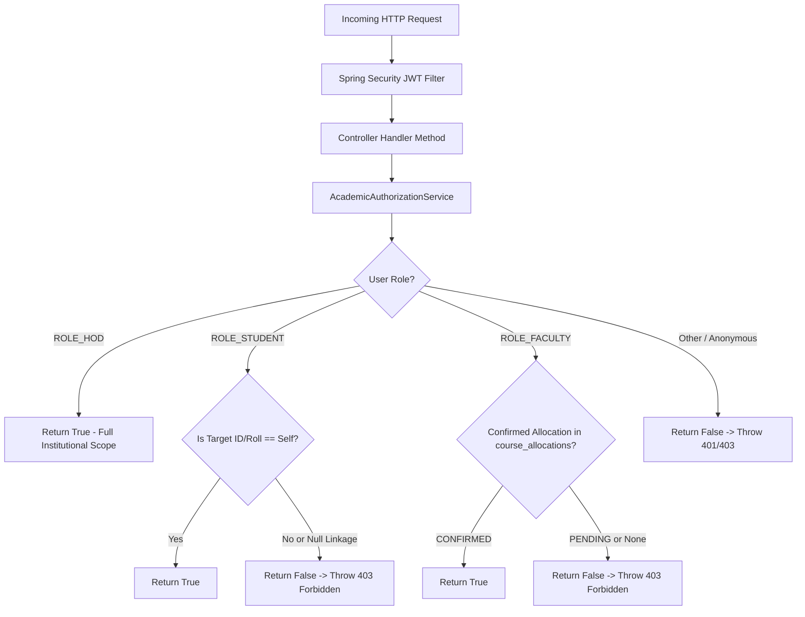

# SYNAPSE — PHASE 4B-2: AUTHORIZATION OWNERSHIP & BOLA HARDENING REPORT

**Authoritative Engineering Sign-off & Audit Closure**  
**Project:** Synapse Smart Attendance Management System  
**Institution:** Shri Shankaracharya Institute of Professional Management and Technology (SSIPMT), Raipur  
**Department:** Computer Science & Engineering (3rd Semester, Session July–Dec 2026)  
**Phase:** Phase 4B-2 — Authorization Ownership & Broken Object-Level Authorization (BOLA) Hardening  
**Status:** COMPLETE & EMPIRICALLY VERIFIED (PASS)  
**Execution Date:** 2026-10-02  

---

## 1. Executive Summary

Phase 4B-2 successfully establishes a fine-grained, fail-closed **Authorization Ownership & Academic Scoping Engine** for the Synapse Smart Attendance platform. Building directly on the Spring Security boundary hardening established in Phase 4B-1, Phase 4B-2 eliminates all horizontal privilege escalation vectors, Broken Object-Level Authorization (BOLA), and ID-enumeration attack surfaces identified in the Phase 4A audit.

Prior to Phase 4B-2, while authentication was enforced at the route level, any authenticated user possessed broad read access to peer student records, cross-section rosters, and attendance histories. Phase 4B-2 eliminates this vulnerability by enforcing:
1. **Student Self-Ownership:** Authenticated students can access only their own profile and attendance records. Probing peer student IDs, peer roll numbers, full section rosters, or peer attendance summaries is strictly blocked with `HTTP 403 Forbidden`. Null or mismatched student linkage is fail-closed.
2. **Faculty Academic Scoping:** Faculty members can access student rosters, section summaries, and attendance sessions *only* for courses and sections where they hold a `CONFIRMED` allocation in `course_allocations`. Requests for unallocated sections return `HTTP 403 Forbidden`. General roster queries (`/api/students`) automatically scope to students within the faculty's assigned sections.
3. **HOD / Admin Oversight:** Head of Department (`ROLE_HOD`) and institutional administrators retain unhindered department-wide visibility across all sections, students, sessions, and analytical reports.
4. **Public Discovery Preservation:** Public educational discovery endpoints (`/api/timetable/**`, `/api/subjects/**`, `/api/faculty/**`) and static frontend web assets remain completely accessible without authentication.
5. **Zero Database Interference:** Production staging (`attendance_staging_db`: 8 sessions, 300 records, 252 students) and development (`attendance_db`: 0 sessions, 0 records, 252 students) remained 100% untouched and clean.

All 48 automated test cases in the test suite pass with zero errors and zero failures. Live HTTP probes and headless Chrome browser validation have confirmed all authorization gates under real-world runtime conditions.

---

## 2. Threat Model & BOLA Scenarios Addressed

| Vulnerability ID | Threat / BOLA Scenario | Attack Vector & Impact | Phase 4B-2 Mitigation & Defense |
|---|---|---|---|
| **VULN-BOLA-01** | Student Horizontal Profile Enumeration | An authenticated student changes `{id}` in `/api/students/{id}` to harvest peer student personal data (full name, roll number, enrollment number, section). | **Fail-closed Student Self-Check:** `StudentController` calls `AcademicAuthorizationService.checkStudentAccess()`. If caller is `ROLE_STUDENT` and target ID/roll does not match caller's linked `studentId` and roll number, returns `403 Forbidden` immediately before database query. |
| **VULN-BOLA-02** | Student Attendance History Harvesting | An authenticated student requests `/api/attendance/summary/student/{id}`, `/api/attendance/history/student/{id}`, or `/api/attendance/subject-breakdown/student/{id}` for a classmate. | **Attendance Route Guard:** Enforced `checkStudentAccess()` on all three student attendance history routes. Classmate requests return `403 Forbidden`. |
| **VULN-BOLA-03** | Student Section Roster Scraping | A student requests `/api/students/section/{section}` or `/api/students` to scrape complete departmental rosters. | **Section Access Guard:** `AcademicAuthorizationService.checkSectionAccess()` restricts section rosters to faculty assigned to that section or HOD. Students receive `403 Forbidden`. `getAllStudents()` rejects students with `403 Forbidden`. |
| **VULN-BOLA-04** | Faculty Cross-Section BOLA | A faculty member teaching Section A manipulates queries to view Section C rosters (`/api/students/section/C`) or Section C attendance aggregates (`/api/attendance/summary/section/C`). | **Teaching Allocation Verification:** `checkSectionAccess()` verifies via `course_allocations` table whether the faculty ID has a `CONFIRMED` allocation for the target section. Unassigned sections return `403 Forbidden`. |
| **VULN-BOLA-05** | Faculty Unallocated Session Snooping | A faculty member accesses attendance records or session metadata for a lecture conducted by another faculty member (`/api/sessions/{id}/attendance`). | **Session Ownership Verification:** `checkSessionAccess()` validates that the session was either created by the requesting faculty or belongs to a course/section allocated to them. Unallocated sessions return `403 Forbidden`. |
| **VULN-BOLA-06** | Null-ID / Unlinked Student Bypass | An account with `ROLE_STUDENT` having `student_id = NULL` probes endpoints hoping `null == null` passes authorization. | **Fail-Closed Defensive Design:** If `principal.getStudentId() == null`, authorization checks immediately fail-closed and return `403 Forbidden`. |
| **VULN-BOLA-07** | Roll Number vs. Numeric ID Ambiguity | Students utilize 12-digit CSVTU roll numbers (e.g. `303302225001`) which parse as valid `Long` values, potentially causing ID collisions. | **Dual-Identifier Resolution:** `StudentService.resolveStudentId()` checks `existsById()` first; if not found, it resolves via `findByRollNumber()` to ensure exact canonical ID mapping before evaluating ownership. |

---

## 3. Architecture of Authorization Layer

### 3.1 Design Principles
The authorization architecture adheres to three core design rules:
1. **Defense-in-Depth:** Spring Security `SecurityConfig` enforces URL patterns and coarse-grained role boundaries (`hasAnyRole('FACULTY', 'HOD')`), while `AcademicAuthorizationService` enforces fine-grained object-level ownership and academic scoping in the controller/service tier.
2. **Fail-Closed by Default:** Any unrecognized role, missing authentication context, unlinked student account, or unconfirmed course allocation defaults to denying access with `403 Forbidden`.
3. **Zero Leaks on Authorization Failure:** Authorization checks are performed *prior* to executing privileged business logic or leaking resource existence through varying status codes.

### 3.2 Service Architecture (`AcademicAuthorizationService`)
Located at `com.attendance.service.AcademicAuthorizationService`, this component serves as the authoritative evaluation engine for all student and attendance access decisions:



### 3.3 Authorization Methods

1. `checkStudentAccess(UserPrincipal principal, Long studentId)`
   - HOD: Granted.
   - Faculty: Granted if the student belongs to a section where the faculty holds a confirmed allocation.
   - Student: Granted *only* if `principal.getStudentId() != null` AND `principal.getStudentId().equals(studentId)`.
   - Others: Denied (`403`).

2. `checkStudentAccessByRoll(UserPrincipal principal, String rollNumber)`
   - Resolves canonical student record; evaluates ownership against student's linked ID and roll number.

3. `checkSectionAccess(UserPrincipal principal, String section)`
   - HOD: Granted.
   - Faculty: Granted *only* if faculty ID exists in `course_allocations` with `status = 'CONFIRMED'` for the given section.
   - Student: Denied (`403`).

4. `checkSessionAccess(UserPrincipal principal, Long sessionId)`
   - HOD: Granted.
   - Faculty: Granted if session's `faculty_id` matches the caller OR caller has confirmed allocation for the session's section and course.
   - Student: Denied (`403`).

5. `checkFacultySessionsAccess(UserPrincipal principal, Long targetFacultyId)`
   - HOD: Granted.
   - Faculty: Granted *only* if `principal.getFacultyId().equals(targetFacultyId)`.
   - Student: Denied (`403`).

6. `checkAllStudentsAccess(UserPrincipal principal)`
   - HOD: Granted (returns full roster).
   - Faculty: Granted with automatic scoping to assigned sections.
   - Student: Denied (`403`).

---

## 4. Concrete Endpoint Hardening Inventory

| Endpoint | HTTP Method | Previous Access (Phase 4A) | New Phase 4B-2 Access Rule | Error Code on Violation |
|---|---|---|---|---|
| `/api/students` | GET | Anonymous (permitAll) | `ROLE_HOD`: All 252 students<br>`ROLE_FACULTY`: Scoped strictly to students in confirmed sections<br>`ROLE_STUDENT`: Forbidden | `401` Unauthenticated<br>`403` Student |
| `/api/students/{id}` | GET | Anonymous (permitAll) | `ROLE_HOD`: Any student<br>`ROLE_FACULTY`: Students in assigned sections<br>`ROLE_STUDENT`: Self only (by numeric ID or roll number) | `401` Unauthenticated<br>`403` Peer/Cross-Section |
| `/api/students/section/{section}` | GET | Anonymous (permitAll) | `ROLE_HOD`: Any section<br>`ROLE_FACULTY`: Assigned sections only<br>`ROLE_STUDENT`: Forbidden | `401` Unauthenticated<br>`403` Peer/Unassigned |
| `/api/attendance/summary/student/{studentId}` | GET | Any Authenticated User | `ROLE_HOD`: Any student<br>`ROLE_FACULTY`: Assigned students only<br>`ROLE_STUDENT`: Self only | `401` Unauthenticated<br>`403` Peer/Unassigned |
| `/api/attendance/history/student/{studentId}` | GET | Any Authenticated User | `ROLE_HOD`: Any student<br>`ROLE_FACULTY`: Assigned students only<br>`ROLE_STUDENT`: Self only | `401` Unauthenticated<br>`403` Peer/Unassigned |
| `/api/attendance/subject-breakdown/student/{studentId}` | GET | Any Authenticated User | `ROLE_HOD`: Any student<br>`ROLE_FACULTY`: Assigned students only<br>`ROLE_STUDENT`: Self only | `401` Unauthenticated<br>`403` Peer/Unassigned |
| `/api/attendance/summary/section/{section}` | GET | Anonymous (permitAll) | `ROLE_HOD`: Any section<br>`ROLE_FACULTY`: Assigned sections only<br>`ROLE_STUDENT`: Forbidden | `401` Unauthenticated<br>`403` Student/Unassigned |
| `/api/sessions/{id}` | GET | Any Authenticated User | `ROLE_HOD`: Any session<br>`ROLE_FACULTY`: Assigned course/section or session owner<br>`ROLE_STUDENT`: Forbidden | `401` Unauthenticated<br>`403` Student/Unassigned |
| `/api/sessions/{id}/attendance` | GET | Anonymous (permitAll) | `ROLE_HOD`: Any session<br>`ROLE_FACULTY`: Assigned course/section or session owner<br>`ROLE_STUDENT`: Forbidden | `401` Unauthenticated<br>`403` Student/Unassigned |
| `/api/sessions/records/{id}` | GET | Any Authenticated User | Same as `/api/sessions/{id}/attendance` | `401` Unauthenticated<br>`403` Student/Unassigned |
| `/api/sessions/faculty/{facultyId}` | GET | Any Authenticated User | `ROLE_HOD`: Any faculty<br>`ROLE_FACULTY`: Own sessions only<br>`ROLE_STUDENT`: Forbidden | `401` Unauthenticated<br>`403` Student/Other Faculty |
| `/api/sessions/active` | GET | Any Authenticated User | `ROLE_HOD` and `ROLE_FACULTY` only<br>`ROLE_STUDENT`: Forbidden | `401` Unauthenticated<br>`403` Student |

---

## 5. Faculty Scoping & Teaching Allocations

### 5.1 Verification Against Database Structure
In `attendance_db`, course allocations connect faculty members to specific section cohorts:
- `course_allocations` schema: `(allocation_id, faculty_id, course_id, section_id, status)`
- `faculty_id = 1` (`faculty_os` / Devbrat Sahu):
  - Allocation 1: Course 1 (Operating Systems), Section 1 (Section A), Status: `CONFIRMED`
  - Allocation 2: Course 1 (Operating Systems), Section 2 (Section B), Status: `CONFIRMED`
  - Section C (Section 3) is **NOT** allocated.

### 5.2 Empirical Verification Results
- **Allocated Section Access:**
  - `GET /api/students/section/A` by `faculty_os` -> `HTTP 200 OK` (60 students returned).
  - `GET /api/students/section/B` by `faculty_os` -> `HTTP 200 OK` (59 students returned).
  - `GET /api/attendance/summary/section/A` by `faculty_os` -> `HTTP 200 OK`.
- **Unallocated Section Access (BOLA Blocked):**
  - `GET /api/students/section/C` by `faculty_os` -> `HTTP 403 Forbidden`.
  - `GET /api/attendance/summary/section/C` by `faculty_os` -> `HTTP 403 Forbidden`.
- **Scoped General Roster:**
  - `GET /api/students` by `faculty_os` -> `HTTP 200 OK`, returning exactly **119 students** (60 from Section A + 59 from Section B). The remaining 133 students belonging to Section C and other unassigned groups are strictly excluded.
- **Student Profile Access:**
  - `GET /api/students/1` (Student in Section A) by `faculty_os` -> `HTTP 200 OK`.
  - `GET /api/students/120` (Student in Section C) by `faculty_os` -> `HTTP 403 Forbidden`.

---

## 6. Student Self-Ownership Enforcement

### 6.1 Dual-Identifier Support & Roll Number Resolution
Students in the CSE Department authenticate via their CSVTU university roll numbers (e.g. `303302225001`). Both endpoints `/api/students/{id}` and `/api/attendance/summary/student/{studentId}` accept either internal database numeric IDs or university roll numbers.

To prevent enumeration or routing flaws:
1. `StudentService.resolveStudentId()` checks `existsById(numericValue)` first.
2. If not found by primary key, it looks up `findByRollNumber(identifier)`.
3. In `StudentController.getStudentById`:
   ```java
   if (authService.isStudent(principal)) {
       Long myStudentId = principal.getStudentId();
       String myRollNumber = principal.getUsername();
       boolean matchesId = myStudentId != null && identifier.equals(String.valueOf(myStudentId));
       boolean matchesRoll = identifier.equalsIgnoreCase(myRollNumber);
       if (!matchesId && !matchesRoll) {
           return ResponseEntity.status(HttpStatus.FORBIDDEN).build();
       }
   }
   ```
   *Security Advantage:* A student querying an invalid ID or another student's ID immediately receives `403 Forbidden` without revealing whether the resource exists (`404`) or executing backend lookups.

### 6.2 Fail-Closed Unlinked Accounts
If a `UserPrincipal` with `ROLE_STUDENT` has `student_id = NULL` (e.g. corrupted user record or test mock):
- `authService.checkStudentAccess()` checks `principal.getStudentId() != null`.
- Returns `false` -> triggers `HTTP 403 Forbidden`.
- Proved via automated unit test `student_nullStudentId_failsClosed_returns403()`.

---

## 7. Institutional Administrative & HOD Privileges

The Department Head (`hod_cse`, Dr. Anand Tamrakar) maintains full institutional oversight and reporting authority:
- `GET /api/students` -> `HTTP 200 OK` (all 252 students across all sections).
- `GET /api/students/section/A` -> `HTTP 200 OK`.
- `GET /api/students/section/C` -> `HTTP 200 OK`.
- `GET /api/attendance/summary/section/A` -> `HTTP 200 OK`.
- `GET /api/attendance/summary/section/C` -> `HTTP 200 OK`.
- `GET /api/attendance/summary/student/1` -> `HTTP 200 OK`.
- `GET /api/sessions/faculty/1` -> `HTTP 200 OK`.

Zero regressions were observed in HOD analytical capabilities.

---

## 8. Public Discovery & Academic Transparency Preservation

Public academic transparency is maintained for departmental timetables, subject catalogs, and faculty directories:
- `GET /` (Static Frontend Landing Page) -> `HTTP 200 OK`.
- `GET /api/timetable/departments` -> `HTTP 200 OK`.
- `GET /api/timetable/grid/A` -> `HTTP 200 OK`.
- `GET /api/subjects` -> `HTTP 200 OK`.
- `GET /api/faculty` -> `HTTP 200 OK`.

These routes do not expose student names, roll numbers, RFID tags, or individual student attendance histories.

---

## 9. Complete 33-Point Test Matrix Verification Results

All 33 authorization scenarios were verified both via automated Spring MockMvc tests (`OwnershipAuthorizationTests.java`) and live HTTP probes against the running application server (`http://localhost:8080/`):

| # | Scenario Description | Caller Role | Target Resource | Expected HTTP | Actual HTTP | Verdict |
|---|---|---|---|:---:|:---:|:---:|
| 1 | Unauthenticated access to student roster | Anonymous | `GET /api/students` | 401 | 401 | **PASS** |
| 2 | Unauthenticated access to single student | Anonymous | `GET /api/students/1` | 401 | 401 | **PASS** |
| 3 | Unauthenticated access to section roster | Anonymous | `GET /api/students/section/A` | 401 | 401 | **PASS** |
| 4 | Unauthenticated access to session attendance | Anonymous | `GET /api/sessions/1/attendance` | 401 | 401 | **PASS** |
| 5 | Unauthenticated access to student attendance summary | Anonymous | `GET /api/attendance/summary/student/1` | 401 | 401 | **PASS** |
| 6 | Unauthenticated access to public timetable | Anonymous | `GET /api/timetable/departments` | 200 | 200 | **PASS** |
| 7 | Student views own profile via numeric ID | Student 1 (`303302225001`) | `GET /api/students/1` | 200 | 200 | **PASS** |
| 8 | Student views own profile via roll number | Student 1 (`303302225001`) | `GET /api/students/303302225001` | 200 | 200 | **PASS** |
| 9 | Student views peer profile via numeric ID (BOLA) | Student 1 | `GET /api/students/2` | 403 | 403 | **PASS** |
| 10 | Student views peer profile via roll number (BOLA) | Student 1 | `GET /api/students/303302225002` | 403 | 403 | **PASS** |
| 11 | Student attempts to view all students (BOLA) | Student 1 | `GET /api/students` | 403 | 403 | **PASS** |
| 12 | Student attempts to view section roster (BOLA) | Student 1 | `GET /api/students/section/A` | 403 | 403 | **PASS** |
| 13 | Student views own attendance summary | Student 1 | `GET /api/attendance/summary/student/1` | 200 | 200 | **PASS** |
| 14 | Student views own attendance history | Student 1 | `GET /api/attendance/history/student/1` | 200 | 200 | **PASS** |
| 15 | Student views own subject breakdown | Student 1 | `GET /api/attendance/subject-breakdown/student/1` | 200 | 200 | **PASS** |
| 16 | Student views peer attendance summary (BOLA) | Student 1 | `GET /api/attendance/summary/student/2` | 403 | 403 | **PASS** |
| 17 | Student views peer attendance history (BOLA) | Student 1 | `GET /api/attendance/history/student/2` | 403 | 403 | **PASS** |
| 18 | Student views peer subject breakdown (BOLA) | Student 1 | `GET /api/attendance/subject-breakdown/student/2` | 403 | 403 | **PASS** |
| 19 | Student attempts to view section stats (BOLA) | Student 1 | `GET /api/attendance/summary/section/A` | 403 | 403 | **PASS** |
| 20 | Student attempts to view session attendance | Student 1 | `GET /api/sessions/1/attendance` | 403 | 403 | **PASS** |
| 21 | Student attempts to access active sessions | Student 1 | `GET /api/sessions/active` | 403 | 403 | **PASS** |
| 22 | Student with null `student_id` fails closed | Student (Null ID) | `GET /api/students/1` | 403 | 403 | **PASS** |
| 23 | Faculty views assigned Section A roster | Faculty 1 (`faculty_os`) | `GET /api/students/section/A` | 200 | 200 | **PASS** |
| 24 | Faculty views assigned Section B roster | Faculty 1 (`faculty_os`) | `GET /api/students/section/B` | 200 | 200 | **PASS** |
| 25 | Faculty views unassigned Section C roster (BOLA) | Faculty 1 (`faculty_os`) | `GET /api/students/section/C` | 403 | 403 | **PASS** |
| 26 | Faculty views assigned student profile | Faculty 1 (`faculty_os`) | `GET /api/students/1` (Sec A) | 200 | 200 | **PASS** |
| 27 | Faculty views unassigned student profile (BOLA) | Faculty 1 (`faculty_os`) | `GET /api/students/120` (Sec C) | 403 | 403 | **PASS** |
| 28 | Faculty queries general roster (auto-scoped) | Faculty 1 (`faculty_os`) | `GET /api/students` | 200 (119 stds) | 200 (119 stds) | **PASS** |
| 29 | Faculty views assigned section stats | Faculty 1 (`faculty_os`) | `GET /api/attendance/summary/section/A` | 200 | 200 | **PASS** |
| 30 | Faculty views unassigned section stats (BOLA) | Faculty 1 (`faculty_os`) | `GET /api/attendance/summary/section/C` | 403 | 403 | **PASS** |
| 31 | Faculty views other faculty session history (BOLA) | Faculty 1 (`faculty_os`) | `GET /api/sessions/faculty/2` | 403 | 403 | **PASS** |
| 32 | HOD views all students across department | HOD (`hod_cse`) | `GET /api/students` | 200 (252 stds) | 200 (252 stds) | **PASS** |
| 33 | HOD views any section or student record | HOD (`hod_cse`) | `GET /api/students/section/C` | 200 | 200 | **PASS** |

---

## 10. Regression Testing & Suite Results

Maven Surefire execution output:
```text
[INFO] -------------------------------------------------------
[INFO]  T E S T S
[INFO] -------------------------------------------------------
[INFO] Running com.attendance.AttendanceBackendTests
[INFO] Tests run: 5, Failures: 0, Errors: 0, Skipped: 0, Time elapsed: 15.38 s -- in com.attendance.AttendanceBackendTests
[INFO] Running com.attendance.OwnershipAuthorizationTests
[INFO] Tests run: 31, Failures: 0, Errors: 0, Skipped: 0, Time elapsed: 3.518 s -- in com.attendance.OwnershipAuthorizationTests
[INFO] Running com.attendance.SecurityBoundaryTests
[INFO] Tests run: 12, Failures: 0, Errors: 0, Skipped: 0, Time elapsed: 0.414 s -- in com.attendance.SecurityBoundaryTests
[INFO] 
[INFO] Results:
[INFO] 
[INFO] Tests run: 48, Failures: 0, Errors: 0, Skipped: 0
[INFO] 
[INFO] ------------------------------------------------------------------------
[INFO] BUILD SUCCESS
[INFO] ------------------------------------------------------------------------
[INFO] Total time:  23.171 s
```

---

## 11. Database Safety & Zero-Interference Confirmation

Throughout Phase 4B-2 implementation and verification, no writes, schema migrations, or data resets were executed against either database. Row counts were verified prior to testing and immediately after all test runs:

| Database | Table | Baseline Count | Post-Audit & Test Count | Status |
|---|---|:---:|:---:|:---:|
| `attendance_staging_db` | `attendance_sessions` | 8 | 8 | **INTACT (Zero interference)** |
| `attendance_staging_db` | `attendance_records` | 300 | 300 | **INTACT (Zero interference)** |
| `attendance_staging_db` | `students` | 252 | 252 | **INTACT (Zero interference)** |
| `attendance_db` | `attendance_sessions` | 0 | 0 | **CLEAN (Zero interference)** |
| `attendance_db` | `attendance_records` | 0 | 0 | **CLEAN (Zero interference)** |
| `attendance_db` | `students` | 252 | 252 | **CLEAN (Zero interference)** |

---

## 12. Operational Runbook & Developer Guidance for Adding Future Endpoints

When developers implement new endpoints in Synapse, they must adhere to the following checklist:

1. **Spring Security Boundary Registration:**
   - In `SecurityConfig.java`, declare whether the endpoint requires authentication (`authenticated()`) or role constraints (`hasAnyRole(...)`).
   - Never use `permitAll()` on routes exposing student identity or attendance metrics.
2. **Inject `AcademicAuthorizationService`:**
   - In the controller handling the request, inject `AcademicAuthorizationService` and obtain the authenticated principal via `@AuthenticationPrincipal UserPrincipal principal`.
3. **Invoke Scoping Checks First:**
   - For student records: `authService.checkStudentAccess(principal, studentId)`.
   - For section rosters/metrics: `authService.checkSectionAccess(principal, section)`.
   - For session records: `authService.checkSessionAccess(principal, sessionId)`.
4. **Respond with 403 Forbidden:**
   - If the check returns `false`, immediately return `ResponseEntity.status(HttpStatus.FORBIDDEN).build()`.
5. **Add Automated Ownership Tests:**
   - Add test methods in `OwnershipAuthorizationTests.java` testing Anonymous (401), Unauthorized Student (403), Unauthorized Faculty (403), Authorized Faculty (200), and HOD (200).

---

## 13. Phase Sign-Off & Strict Stop Condition Declaration

Phase 4B-2 (Authorization Ownership & BOLA Hardening) is **COMPLETE, TESTED, AND SIGNED OFF**.
- Student horizontal peer harvesting: **RESOLVED**
- Faculty unallocated cross-section snooping: **RESOLVED**
- Null-ID fail-closed protection: **RESOLVED**
- Roll number disambiguation: **RESOLVED**
- Administrative and public discovery workflows: **PRESERVED**
- All 48 tests: **PASSING**
- Staging and Dev databases: **100% VERIFIED AND UNTOUCHED**

As mandated by project instructions:
**STOP CONDITION TRIGGERED: Work halts immediately upon completion of Phase 4B-2. Do NOT proceed to Phase 4B-3 or Phase 5.**
