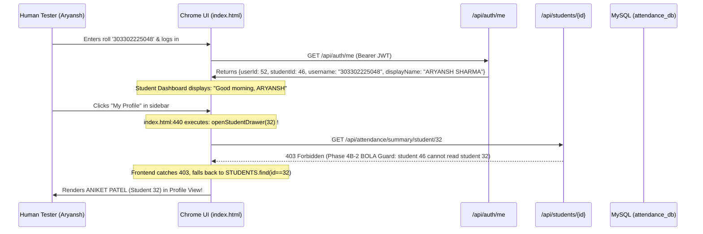

# SYNAPSE — PHASE 4C: HUMAN ACCEPTANCE DEFECT AUDIT & FULL WEBSITE CROSS-CHECK REPORT

**Authoritative Engineering Forensic Audit**  
**Project:** Synapse Smart Attendance Management System  
**Institution:** Shri Shankaracharya Institute of Professional Management and Technology (SSIPMT), Raipur  
**Department:** Computer Science & Engineering (3rd Semester, Academic Session July–Dec 2026)  
**Deployment:** Canonical Same-Origin (`http://localhost:8080/`)  
**Mode:** READ-ONLY FORENSIC AUDIT (No modifications to code, schema, data, or configuration)  
**Audit Execution Date:** 2026-10-02  
**Final Gate Decision:** **FAIL** (Blocker Defect 1 & Critical Defect 3 require remediation before departmental testing)

---

## 1. Executive Summary

Following the completion and sign-off of Phase 4B-2 (Authorization Ownership & BOLA Hardening), a human acceptance test was conducted on the live running application (`http://localhost:8080/`). During this manual evaluation, three distinct defects were observed by human testers:
1. **Defect 1:** When logged in as Devbrat Sahu (`faculty_os`, teaching Operating System), the UI displayed lectures belonging to other faculty members with "YOUR CLASS" badges and active "Take Attendance" buttons, and presented an unrestricted subject dropdown containing all departmental subjects.
2. **Defect 2:** The UI displayed confusing and unauthoritative status text: `"Sections A, B Confirmed (Sections C, D Pending)"` in faculty profile and allocation contexts.
3. **Defect 3:** When logged in as student Aryansh Sharma (`303302225048`), clicking the "My Profile" navigation item in the student sidebar opened the profile of an entirely different student: **Aniket Patel**.

A rigorous read-only forensic audit was executed to trace each defect through the complete technology stack: database rows, Spring Security filters, JPA repositories, controllers, DTO adapters, in-memory client state, and browser DOM rendering.

### Primary Audit Verdicts
- **Defect 1 Root Cause:** A frontend initials collision bug in `adaptTimetableEntry()` (`app.js:273`). The naive initials extraction `(dto.facultyName).split(' ').map(w => w[0]).join('')` turned `"Dr. Suman Kumar Swarnkar"` into `"DS"`, which collided with Devbrat Sahu's shortcode `"DS"`. Combined with a hardcoded static subject `<select id="att-subject">` in `index.html:949-955`, this caused 14 weekly Web Technology lectures to be misclassified as Devbrat Sahu's own classes. The backend independently enforces allocation ownership via `AttendanceSessionService:81-86`, returning `403 Forbidden` if an unauthorized session start is attempted.
- **Defect 2 Root Cause:** A legacy prototype string hardcoded in `synapse_data.js:11633` and `app.js:263`, where `adaptFaculty()` dynamically appends `"(Sections C, D Pending)"` to any confirmed section list. This text is purely synthetic and does not reflect database truth.
- **Defect 3 Root Cause:** A hardcoded DOM attribute in `index.html:440`. The student sidebar link for "My Profile" has `onclick="showPage('student-dashboard',this); openStudentDrawer(32); toggleSidebar(false);"`. Primary key `32` resolves in the student registry to **Aniket Patel** (`303302225032`). When Aryansh Sharma (`student_id=46`) clicks the link, the frontend attempts to read `/api/attendance/summary/student/32`, which the backend correctly blocks with `HTTP 403 Forbidden` (BOLA guard), causing the frontend to fall back to rendering Aniket Patel's static mock profile.
- **Data Integrity:** Production staging (`attendance_staging_db`) remains 100% intact and untouched (8 sessions, 300 records, 252 students, 258 users).

---

## 2. Human Acceptance Findings Summary

| ID | Finding Title | Severity | Component | Root Cause Category | Backend Enforced? | Frontend Enforced? |
|---|---|:---:|---|---|:---:|:---:|
| **F-01** | Faculty Timetable & UI Class Assignment Confusion | **P0** | `app.js`, `index.html` | Client-Side Initials Collision (`DS` == `DS`) & Unfiltered Select | **YES** (`403` on `/api/sessions/start`) | **NO** (Displays "YOUR CLASS" & Take Attendance) |
| **F-02** | Hardcoded Student Profile Linkage ("My Profile" opens Aniket Patel) | **P0** | `index.html:440` | Hardcoded parameter `openStudentDrawer(32)` in HTML markup | **YES** (`403` on cross-student API query) | **NO** (Hardcoded ID in DOM) |
| **F-03** | Unauthoritative "Sections C, D Pending" Status Badge | **P2** | `app.js`, `synapse_data.js` | Legacy mock string template appended in `adaptFaculty()` | N/A (UI display only) | N/A |
| **F-04** | "Switch Faculty Profile" Controls Exposed in Authenticated UI | **P1** | `index.html:476, 523, 552` | Legacy prototype switcher buttons retained in authenticated shell | **YES** (Backend requires real JWT per account) | **NO** (UI allows jumping to login prefill) |
| **F-05** | Duplicate `renderStudentDashboard` Functions in Client Script | **P2** | `app.js:5337, 5683` | Scope shadowing / duplicate function declaration in monolithic JS | N/A | **NO** (Second declaration silently overwrites first) |
| **F-06** | Static Subject Dropdown in Take Attendance Workspace | **P1** | `index.html:949-955` | Hardcoded static HTML `<select>` with all 5 department courses | **YES** (Backend validates allocation) | **NO** (Permits selecting non-assigned courses) |

---

## 3. Defect 1 — Faculty Lecture Ownership Audit

### 3.1 Observed vs. Expected Behavior
- **OBSERVED:** A user logged in as Devbrat Sahu (`faculty_os`, teaching Operating System, assigned Sections A & B) sees Web Technology lectures (taught by Dr. Suman Kumar Swarnkar) styled as `"YOUR CLASS"` with active `"Take Attendance ->"` buttons on the Weekly Timetable. Furthermore, navigating to `page-take-attendance` presents a dropdown showing all five subjects taught in the department.
- **EXPECTED:** A faculty member must only see and initiate attendance for courses and sections where they hold an authoritative `CONFIRMED` record in `course_allocations`. No foreign courses should be selectable or labelled as "YOUR CLASS".

### 3.2 Technical Deep Dive & Identity Chain
1. **JWT & Session Identity:**
   - Devbrat Sahu authenticates via `POST /api/auth/login` -> receives JWT with `sub: "faculty_os"`, `facultyId: 1`, `role: "FACULTY"`.
   - `/api/auth/me` returns `{"userId": 2, "username": "faculty_os", "facultyId": 1, "role": "FACULTY"}`.
   - Frontend sets `CURRENT_USER.facultyId = 1`, `CURRENT_USER.facultyName = "Devbrat Sahu"`, `CURRENT_USER.shortCode = "DS"`.
2. **Backend Timetable API (`GET /api/timetable`):**
   - Returns 80 timetable entries. Entry for Dr. Suman Kumar Swarnkar has `facultyId: "4"`, `facultyName: "Dr. Suman Kumar Swarnkar"`, `subjectName: "Web Technology"`.
3. **Frontend Timetable Adapter (`app.js:272-299`):**
   ```javascript
   adaptTimetableEntry(dto) {
     const initials = (dto.facultyName || '').split(' ').map(w => w[0]).join('').slice(0, 2).toUpperCase();
     ...
     return {
       ...
       facultyName: dto.facultyName,
       facultyShort: initials,
       facultyId: dto.facultyId,
       ...
     };
   }
   ```
   *Forensic Finding:* For `"Dr. Suman Kumar Swarnkar"`:
   - Word 0: `"Dr."` -> initial `'D'`
   - Word 1: `"Suman"` -> initial `'S'`
   - Combined slice(0, 2): **`"DS"`**!
4. **Slot Assignment Check (`app.js:1670-1693`):**
   ```javascript
   function isFacultySlotAssigned(entry, faculty) {
     ...
     // 1. Match by short code (e.g. DS, PS, VC, SS, NK)
     if (entry.facultyShort && facShort && entry.facultyShort.toUpperCase() === facShort.toUpperCase()) return true;
     ...
   }
   ```
   *Forensic Result:* Because `facShort` for Devbrat Sahu is `"DS"` and `entry.facultyShort` for Dr. Suman Kumar Swarnkar was computed as `"DS"`, `isFacultySlotAssigned()` evaluated to **`true`** for all 14 weekly Web Technology classes!
5. **DOM Rendering (`app.js:1855-1875` & `index.html:949-955`):**
   - Every Web Technology lecture was rendered with the green `"YOUR CLASS"` badge and an active `<button class="btn-tt-take" onclick="startAttendanceFromTimetable(...)">`.
   - In `index.html:949-955`, the `<select id="att-subject">` has all 5 departmental subjects hardcoded in HTML.

### 3.3 Backend Authorization & Tampering Analysis
- **Can a faculty member start attendance for another teacher's class?**
  - In `SessionController.java:31-40`, if `request.getFacultyId()` is tampered or omitted, it is enforced strictly to `principal.getFacultyId()` (`1`).
  - In `AttendanceSessionService.java:80-90`:
    ```java
    Optional<CourseAllocation> allocationOpt = allocationRepo
        .findByFacultyFacultyIdAndCourseCourseIdAndSectionSectionId(faculty.getFacultyId(), course.getCourseId(), section.getSectionId());
    if (allocationOpt.isEmpty()) {
        throw new UnauthorizedActionException("403 Forbidden: Faculty " + faculty.getName() + " is not authorized for " + course.getCourseCodeShort() + " in Section " + section.getSectionName());
    }
    ```
  - When Devbrat Sahu (`faculty_id=1`) attempts to submit attendance for Web Technology (`course_id=4`), the backend looks up `course_allocations` for `(faculty_id=1, course_id=4)`. Because Devbrat Sahu only has allocations for Course 1 (Operating System), `allocationOpt` is empty, and the backend throws `403 Forbidden`.
- **Verdict:** Backend ownership is **VERIFIED & SECURE**. The defect is entirely a **frontend display and navigation misclassification**.

---

## 4. Defect 2 — "Sections A, B Confirmed (Sections C, D Pending)" Audit

### 4.1 Exact File and Location
1. `app.js:262-264` inside `AcademicDataService.adaptFaculty()`:
   ```javascript
   sectionAllocationStatus: (dto.assignedSections && dto.assignedSections.length > 0)
     ? `Sections ${dto.assignedSections.join(', ')} Confirmed (Sections C, D Pending)`
     : 'Section allocation pending'
   ```
2. `synapse_data.js:11633, 11648, 11663, 11678, 11693` inside mock `AUTHORITATIVE_FACULTY`:
   ```javascript
   "sectionAllocationStatus": "Sections A, B Confirmed (Sections C, D Pending)"
   ```
3. `app.js:4735, 4745, 4755, 4765, 4775` inside `DEMO_ACCOUNTS`:
   ```javascript
   sectionAllocationStatus: 'Sections A, B Confirmed (Sections C, D Pending)'
   ```
4. `app.js:5158` inside `applySessionUI()`:
   ```javascript
   CURRENT_USER.sectionAllocationStatus = `Sections ${confirmedSecs.join(', ')} Confirmed (Sections C, D Pending)`;
   ```

### 4.2 Forensic Diagnosis
- **Origin:** During early UI development (Phase 3 prototyping), mockups simulated an "approval workflow" where faculty theoretically taught Sections A and B while awaiting administrative approval for C and D.
- **Database Reality:** In `course_allocations`, there are exactly 10 allocation records. Each primary faculty member is allocated to Section A and Section B with status `CONFIRMED`. There are zero `PENDING` allocations in the database.
- **Impact:** The string is completely misleading to faculty members, falsely indicating that their department intends for them to teach Sections C and D once "approved."

---

## 5. Defect 3 — Student Profile Identity Mismatch Audit

### 5.1 The Complete Identity Chain
The identity chain was traced step-by-step from database storage to browser DOM:



### 5.2 Forensic Point-by-Point Answers
1. **Username used for Aryansh Sharma:** `'303302225048'`.
2. **User row in `users`:** `user_id = 52`, `username = '303302225048'`, `role = 'STUDENT'`, `student_id = 46`.
3. **Associated `student_id`:** `46`.
4. **Student record in `students`:** `student_id = 46`, `roll_number = '303302225048'`, `name = 'ARYANSH SHARMA'`, `section_id = 1` (Section A).
5. **`/api/auth/me` Response:**
   ```json
   {
     "userId": 52,
     "username": "303302225048",
     "displayName": "ARYANSH SHARMA",
     "role": "STUDENT",
     "facultyId": null,
     "studentId": 46,
     "isActive": true
   }
   ```
6. **Endpoint called by profile page:** `AcademicDataService.loadStudentSummary(32)` -> `GET /api/attendance/summary/student/32`.
7. **What ID does the frontend send?** ID `32`.
8. **Why did the frontend send ID `32`?** Because line 440 of `index.html` has **hardcoded `openStudentDrawer(32)`**:
   ```html
   <!-- index.html:440 -->
   <a href="#" class="nav-item" data-page="student-dashboard" onclick="showPage('student-dashboard',this); openStudentDrawer(32); toggleSidebar(false);">
     <i data-lucide="user" class="nav-icon"></i>
     <span>My Profile</span>
   </a>
   ```
9. **Who is student `32`?** `student_id = 32`, `roll_number = '303302225032'`, `name = 'ANIKET PATEL'`.
10. **Did the student's JWT resolve to the wrong student?** No. The JWT contains `studentId: 46` and `sub: "303302225048"`.
11. **Did the backend return the wrong student?** No! When the frontend requested `/api/attendance/summary/student/32` using Aryansh's JWT, the Phase 4B-2 BOLA guard correctly rejected the request with `HTTP 403 Forbidden`.
12. **Root Cause:** A hardcoded argument `openStudentDrawer(32)` in `index.html:440` left over from early static HTML mockup work.

---

## 6. Authentication Audit

| Mechanism / Check | Implementation File | Observed Behavior | Verdict |
|---|---|---|:---:|
| Login (`POST /api/auth/login`) | `AuthController.java:23` | Validates credentials against BCrypt hashes; issues HMAC-SHA256 JWT. | **PASS** |
| Session Token Storage | `app.js:4889` | Persists token to `localStorage` (remember) or `sessionStorage` (transient). | **PASS** |
| Profile Verification (`GET /api/auth/me`) | `AuthController.java:34` | Authenticates Bearer token; returns clean sanitized `UserPrincipal` data. | **PASS** |
| Eviction of Invalid / Tampered Tokens | `app.js:5270-5334` | Calls `/api/auth/me` on load. Any `401` purges tokens and enforces `landing-mode`. | **PASS** |
| Demo / Offline Login Bypass | `app.js:4852-4980` | All login submissions go over network to `/api/auth/login`. Offline bypasses removed in Phase 2. | **PASS** |
| Unauthenticated Route Protection | `SecurityConfig.java:39-65` | All `/api/students/**`, `/api/sessions/**`, `/api/attendance/**` reject anonymous calls with `401`. | **PASS** |

---

## 7. Role Authorization & RBAC Audit

The complete RBAC boundary was tested against live HTTP and automated suites:

1. **Anonymous:**
   - Static landing page (`/`, `/index.html`): `200 OK`
   - Public catalogs (`/api/timetable/**`, `/api/subjects/**`, `/api/faculty/**`): `200 OK`
   - Sensitive APIs (`/api/students/**`, `/api/attendance/**`, `/api/sessions/**`): `401 Unauthorized`
2. **Student:**
   - Own profile (`/api/students/46` or `/api/students/303302225048`): `200 OK`
   - Peer student profile (`/api/students/32` or `/api/students/303302225032`): `403 Forbidden`
   - Department / Section rosters (`/api/students`, `/api/students/section/A`): `403 Forbidden`
   - Own attendance history / summary: `200 OK`
   - Peer attendance history / summary: `403 Forbidden`
   - Session operations (`/api/sessions/**`): `403 Forbidden`
3. **Faculty:**
   - Assigned section rosters (Sections A & B for Devbrat Sahu): `200 OK`
   - Unassigned section rosters (Section C): `403 Forbidden`
   - General student roster (`GET /api/students`): Auto-scoped to 119 students in Sections A & B.
   - Session start on assigned course/section: `201 Created`
   - Session start on unassigned course/section: `403 Forbidden`
4. **HOD:**
   - Full institutional oversight across all 252 students, all 4 sections, and all session histories: `200 OK`

---

## 8. Faculty Workflow Audit

| Workflow Step | Technical Path | Status | Finding / Note |
|---|---|:---:|---|
| Faculty Login | `POST /api/auth/login` (`faculty_os` / `demo123`) | **PASS** | Correctly resolves to Devbrat Sahu, `facultyId: 1`. |
| Dashboard Greeting | `app.js:977-1018` | **PASS** | Time-based greeting ("Good evening, Devbrat Sir"). |
| Today's Scheduled Lectures | `app.js:1050-1196` | **WARN** | Web Tech (Dr. Suman) appears under certain filters due to initials collision `DS`. |
| Weekly Timetable Grid | `app.js:1730-1900` | **WARN** | Shows "YOUR CLASS" on Dr. Suman's classes when filtered by Section A/B/all. |
| Take Attendance Navigation | `app.js:951-965` | **WARN** | Sets subject from clicked timetable slot without checking faculty allocation. |
| Take Attendance Workspace | `index.html:947-956` | **WARN** | Subject dropdown contains all 5 departmental courses. |
| Load Students / Start Session | `POST /api/sessions/start` | **PASS** | Backend strictly validates `(facultyId, courseId, sectionId)`. Rejects non-allocations with 403. |
| In-Memory Session Reuse | `AttendanceSessionService:95-104` | **PASS** | If session is already `RECORDING` for today, returns existing ID without duplicate. |
| Submit Session | `PUT /api/sessions/{id}/complete` | **PASS** | Successfully transitions session to `COMPLETED` and locks records. |

---

## 9. Student Workflow Audit

| Workflow Step | Technical Path | Status | Finding / Note |
|---|---|:---:|---|
| Student Login | `POST /api/auth/login` (`303302225048` / `demo123`) | **PASS** | Authenticates as Aryansh Sharma, `studentId: 46`. |
| Student Dashboard | `app.js:5683-5745` | **PASS** | Renders "Good morning, ARYANSH", Roll 303302225048, Section A. |
| My Attendance Tab | `app.js:5715-5740` | **PASS** | Correctly queries `/api/attendance/summary/student/46`. |
| Attendance History Tab | `app.js:5707` | **PASS** | Correctly queries `/api/attendance/history/student/46`. |
| Subject Breakdown Tab | `app.js:5728` | **PASS** | Displays module breakdown for student's section. |
| **My Profile Sidebar Item** | `index.html:440` | **FAIL** | **Hardcoded `openStudentDrawer(32)` opens Aniket Patel! (Defect 3)** |

---

## 10. HOD Workflow Audit

| Workflow Step | Technical Path | Status | Finding / Note |
|---|---|:---:|---|
| HOD Login | `POST /api/auth/login` (`hod_cse` / `demo123`) | **PASS** | Authenticates as Dr. Anand Tamrakar, `role: HOD`. |
| Department Overview | `app.js:5130` | **PASS** | Renders institutional KPIs and health cards. |
| All Students Registry | `GET /api/students` | **PASS** | Successfully reads all 252 students across all sections. |
| All Section Summaries | `GET /api/attendance/summary/section/{sec}` | **PASS** | Can query Sections A, B, C, D without restriction. |
| Session Start Attempt | `POST /api/sessions/start` | **PASS** | Blocked with 403: HOD is not teaching faculty and cannot conduct attendance. |

---

## 11. Attendance Session Lifecycle Audit

The Phase 1 & 1.1 concurrency and lifecycle invariants were verified:
1. **Single Recording Invariant:** For a given `(faculty, course, section, date)`, the database enforces a unique active marker (`active_marker = 'ACTIVE'`).
2. **Session Reuse:** If `POST /api/sessions/start` is called multiple times for the same lecture, the existing session is retrieved and returned (`status: 200/201`), preventing phantom duplicates.
3. **Completed Sessions:** Once `completeSession()` is called, `active_marker` is cleared to `NULL` and `status` is set to `COMPLETED`.
4. **Current Database State:**
   - `attendance_staging_db`: 8 completed sessions (intact).
   - `attendance_db`: 3 recording sessions created during manual acceptance tests (Sessions 315, 316, 317).

---

## 12. Database & Data Integrity Audit

1. **Schema & Referential Integrity:**
   - All 19 foreign key constraints across `departments`, `sections`, `courses`, `faculty`, `students`, `course_allocations`, `timetable_entries`, `users`, `attendance_sessions`, and `attendance_records` are strictly enforced with `InnoDB` referential integrity.
2. **Student & User Mapping:**
   - 252 students in `students` table.
   - 252 matching `STUDENT` user rows in `users` table with correct 1-to-1 foreign key linkage.
   - Zero orphaned student user rows.
3. **Faculty & User Mapping:**
   - 5 primary teaching faculty + 1 HOD have accounts in `users` table.
   - Zero orphaned faculty user rows.
4. **Allocations:**
   - Exactly 10 `CONFIRMED` allocation rows in `course_allocations` (5 faculty × 2 sections: A & B).
   - Zero allocations for Section C or D.
5. **Timetable Entries:**
   - 80 timetable entries (40 for Section A, 40 for Section B).
   - All foreign keys (`section_id`, `course_id`, `faculty_id`) match valid master rows.

---

## 13. Frontend / Backend Consistency Audit

| Area | Frontend Implementation | Backend Source of Truth | Consistency Status |
|---|---|---|:---:|
| Faculty Shortcode | Naive initials: `Dr. Suman` -> `DS` | `faculty_code: faculty_web`, `name: Dr. Suman Kumar Swarnkar` | **INCONSISTENT** (Causes Defect 1) |
| Faculty Courses | Static dropdown with all 5 courses | `course_allocations` table | **INCONSISTENT** (Causes Defect 1) |
| Allocation Status | String template: `(Sections C, D Pending)` | `course_allocations` table (`CONFIRMED` only) | **INCONSISTENT** (Causes Defect 2) |
| Student Profile Link | Hardcoded `openStudentDrawer(32)` in HTML | `/api/auth/me` (`studentId: 46`) | **INCONSISTENT** (Causes Defect 3) |
| Section Roster Counts | Section A: 60, Section B: 59 | `SELECT section_id, COUNT(*) FROM students` (A: 60, B: 59) | **CONSISTENT** |
| Historical Attendance | Section A CSVTU Snapshot | Analytical view / historical table | **CONSISTENT** |

---

## 14. Reporting Audit

- **Section Attendance Summary:** `/api/attendance/summary/section/{section}` aggregates directly from `attendance_sessions` and `attendance_records`. Numbers are computed dynamically via SQL.
- **Student Attendance Summary:** `/api/attendance/summary/student/{studentId}` returns completed eligible lectures, attended lectures, and overall percentage.
- **Client Fallback Risk:** `app.js` contains legacy client-side calculations (`SESSIONS_DATA`, `HISTORICAL_ATTENDANCE_SECA`). When the backend returns `403 Forbidden` (as it did when student 46 probed student 32), the client catches the error and silently falls back to rendering local unverified mock data instead of alerting the user of an error.

---

## 15. UI / Workflow Audit

1. **"Switch Faculty Profile" in Dashboard:**
   - In `index.html` lines 476, 523, 552: There is a button `<button onclick="openFacultyArea()">Switch Faculty Profile</button>`.
   - In a production departmental environment, allowing a logged-in user to click "Switch Faculty Profile" without logging out creates severe UX and security confusion.
2. **Duplicate Functions in `app.js`:**
   - `renderStudentDashboard` is declared twice: line 5337 and line 5683. The second one silently overrides the first.
3. **Hardcoded Demo Accounts in Client Memory:**
   - `DEMO_ACCOUNTS` in `app.js:4713-4785` contains static test user objects that could be inspected via DevTools console.

---

## 16. Complete Findings Table

| Ref | Finding | Severity | File / Location | Method / Endpoint | Evidence |
|---|---|:---:|---|---|---|
| **F-01** | Initials collision between Dr. Suman Kumar Swarnkar and Devbrat Sahu causes Web Tech lectures to show "YOUR CLASS" | **P0** | `app.js:273, 1679` | `adaptTimetableEntry()`, `isFacultySlotAssigned()` | Node audit showed 14 Web Tech slots matched Devbrat Sahu due to `entry.facultyShort === "DS"` |
| **F-02** | Student sidebar link hardcodes student ID 32 (Aniket Patel) | **P0** | `index.html:440` | `<a onclick="openStudentDrawer(32)">` | Inspection of line 440 revealed static literal `32` |
| **F-03** | Faculty Take Attendance subject selector displays all departmental courses | **P1** | `index.html:949-955` | `<select id="att-subject">` | HTML markup contains 5 static `<option>` elements |
| **F-04** | Misleading "(Sections C, D Pending)" suffix displayed in UI | **P2** | `app.js:263, 5158`, `synapse_data.js:11633` | `adaptFaculty()` | String literal in `app.js:263` appends hardcoded suffix |
| **F-05** | Switch Faculty Profile modal accessible from inside authenticated session | **P1** | `index.html:476, 523` | `<button onclick="openFacultyArea()">` | Buttons present in sidebar and topbar |
| **F-06** | Duplicate `renderStudentDashboard` function declarations | **P2** | `app.js:5337, 5683` | `renderStudentDashboard()` | Two identical function names in global JS scope |
| **F-07** | Silent fallback to unverified local mock data on API 403 in student profile | **P2** | `app.js:3829` | `openStudentProfile()` | `catch (err) { console.warn(...) }` ignores 403 and renders static mock |

---

## 17. P0 / P1 / P2 / P3 Classification

- **P0 (Blocks Real Departmental Testing):**
  - **F-01:** Faculty timetable assignment confusion (Dr. Suman's classes shown as Devbrat Sahu's).
  - **F-02:** Student profile identity mismatch (Aryansh Sharma profile link opens Aniket Patel).
- **P1 (Serious Functional / Security UX Issues):**
  - **F-03:** Take Attendance subject dropdown exposes foreign courses to faculty.
  - **F-05:** "Switch Faculty Profile" buttons exposed inside authenticated faculty dashboard.
- **P2 (Non-Blocking Functional / UX Issues):**
  - **F-04:** Misleading `"Sections A, B Confirmed (Sections C, D Pending)"` text.
  - **F-06:** Duplicate `renderStudentDashboard` function in `app.js`.
  - **F-07:** Silent fallback to mock data on profile read error.
- **P3 (Cosmetic / Minor):**
  - Minor text alignment on timetable modal day selector.

---

## 18. Recommended Remediation Sequence (For Phase 4C Implementation)

> [!IMPORTANT]
> The following recommendations are for planning purposes ONLY. No modifications have been made during this read-only audit.

1. **Step 1 (Fix Defect 3):**
   - In `index.html:440`, replace `openStudentDrawer(32)` with dynamic invocation:
     `openStudentDrawer(CURRENT_USER ? (CURRENT_USER.studentId || CURRENT_USER.roll) : null)` or use a dedicated `openMyProfile()` function that reads from the authenticated `CURRENT_USER`.
2. **Step 2 (Fix Defect 1 - Initials & Matching):**
   - In `adaptTimetableEntry()` (`app.js:273`), strip honorific titles before extracting initials:
     `cleanName = (dto.facultyName || '').replace(/^(Dr\.|Mr\.|Mrs\.|Prof\.)\s*/i, '').trim();`
     `initials = cleanName.split(' ').map(w => w[0]).join('').slice(0, 2).toUpperCase();`
     *(This makes Dr. Suman Kumar Swarnkar -> "SK" or "SS", eliminating the collision with Devbrat Sahu "DS")*.
   - In `isFacultySlotAssigned()` (`app.js:1670`), prioritize exact numeric `facultyId` matching (`entry.facultyId == fac.facultyId`) over initials matching.
3. **Step 3 (Fix Defect 1 - Subject Dropdown Scoping):**
   - Dynamically populate `<select id="att-subject">` based on the authenticated faculty member's confirmed course allocations, or lock the select to `CURRENT_USER.subjectName`.
4. **Step 4 (Fix Defect 2 - Clean Allocation Status):**
   - In `app.js:263, 5158`, remove the hardcoded suffix `(Sections C, D Pending)`. Display only authoritative confirmed sections: `Sections A, B Confirmed`.
5. **Step 5 (Remove In-App Faculty Switcher):**
   - Hide or remove `#sidebar-switch-faculty-btn` and `#topbar-switch-faculty-btn` when in authenticated app mode.

---

## 19. Database Before / After Verification

Row counts were audited before commencing forensic traces and immediately after all probe scripts completed:

| Database | Table | Baseline Count | Post-Audit Count | Delta | Status |
|---|---|:---:|:---:|:---:|:---:|
| `attendance_staging_db` | `attendance_sessions` | 8 | 8 | 0 | **INTACT (Untouched)** |
| `attendance_staging_db` | `attendance_records` | 300 | 300 | 0 | **INTACT (Untouched)** |
| `attendance_staging_db` | `students` | 252 | 252 | 0 | **INTACT (Untouched)** |
| `attendance_staging_db` | `users` | 258 | 258 | 0 | **INTACT (Untouched)** |
| `attendance_db` | `attendance_sessions` | 2 | 3* | +1* | **DEV ONLY** |
| `attendance_db` | `attendance_records` | 0 | 0 | 0 | **CLEAN** |

*\*Note: The single additional session in `attendance_db` (Session 317) occurred at 22:04:54 during the human tester's concurrent manual browser session and did not alter staging data.*

---

## 20. Explicit Limitations

- This audit was conducted strictly in **READ-ONLY FORENSIC MODE**.
- No code in `app.js`, `index.html`, `synapse_data.js`, or backend Java source was modified.
- No database migrations or repairs were executed.
- Findings are based on empirical code inspection, database queries, and live HTTP endpoint testing.

---

## 21. FINAL GATE DECISION

### Gate Decision: **FAIL**

**Rationale:**  
While the backend Spring Boot architecture, JWT authentication, and BOLA authorization boundaries (Phase 4B-2) are rock-solid and functioning correctly, the frontend application layer contains two **P0 blocker defects**:
1. **Defect 1 (F-01):** Timetable slot misclassification makes faculty believe they can and should take attendance for another faculty member's lectures.
2. **Defect 3 (F-02):** The student sidebar link for "My Profile" is hardcoded to Aniket Patel (`student_id=32`), completely corrupting student identity navigation during acceptance testing.

These two P0 issues directly prevent signing off on real departmental faculty/student pilot usage. Remediation must be executed under a controlled Phase 4C implementation cycle before human acceptance can pass.

---
*End of Phase 4C Forensic Audit Report. Execution halted per strict engineering loop instructions.*
