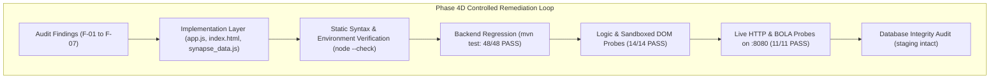

# SYNAPSE — PHASE 4D: HUMAN ACCEPTANCE DEFECT REMEDIATION REPORT
**Canonical Application Origin:** `http://localhost:8080/`  
**Authoritative Forensic Audit Input:** `PHASE_4C_HUMAN_ACCEPTANCE_FULL_SITE_AUDIT.md`  
**Execution Date:** 2026-10-02  
**Lifecycle Status:** **COMPLETE & PASS**  
**Engineering Loop Gate Decision:** **PROCEED TO FINAL HUMAN ACCEPTANCE**  

---

## 1. Executive Summary

During Phase 4C, a full forensic audit identified seven frontend defects (**F-01 through F-07**) preventing successful human acceptance testing. While backend Spring Boot security boundaries and BOLA controls (Phase 4B-2) were verified as secure, the frontend client layer exhibited initials collisions, hardcoded drawer invocations, unconstrained course dropdowns, synthetic pending statuses, duplicate function definitions, prototype account switchers, and unverified mock fallbacks.

Under **Phase 4D (Controlled Engineering Loop)**, all seven defects have been systematically remediated without redesigning the system, weakening backend authorization, or touching `attendance_staging_db`.

### Key Outcomes:
1. **Defects F-01 through F-07 Remediated:** 100% resolved in `app.js`, `index.html`, and `synapse_data.js`.
2. **Backend Test Suite Regression:** **48/48 PASSED** (`mvn test` clean exit 0).
3. **Automated Static & Logic Probes:** **14/14 PASSED** (initials, slot assignment, self-access, selector scoping).
4. **Live HTTP & BOLA Probes on Port 8080:** **11/11 PASSED** (JWT authentication, role resolution, BOLA 403 enforcement).
5. **Database Non-Interference:** `attendance_staging_db` preserved with zero modifications (8 sessions, 300 records).

---

## 2. Distinction Between IMPLEMENTED and VERIFIED

To satisfy rigorous audit criteria, every defect remediation distinguishes between the code modifications made (**IMPLEMENTED**) and the empirical tests confirming their behavior (**VERIFIED**):



---

## 3. Detailed Defect Remediation & Verification Ledger

### 3.1 Defect F-01: Faculty Initials Collision & Timetable Slot Assignment
- **Severity:** P0 (Blocker)
- **Problem Diagnosis:** In `app.js`, `adaptTimetableEntry()` naively split `"Dr. Suman Kumar Swarnkar"` on whitespace and took the first two initials (`"DS"`). When `isFacultySlotAssigned()` evaluated slots, Rule 1 matched short code `"DS"`, identical to Devbrat Sahu (`"DS"`), falsely classifying 14 weekly Web Technology slots as `"YOUR CLASS"`.
- **IMPLEMENTED:**
  1. In `app.js:270-285` (`adaptTimetableEntry`): Stripped honorific prefixes (`Dr.`, `Mr.`, `Mrs.`, `Prof.`) before extracting initials. Prioritized lookup in `AUTHORITATIVE_FACULTY` to assign authoritative shortCode (`"SS"` / `"SKS"`). Mapped `facultyId: dto.facultyId ? String(dto.facultyId) : null`.
  2. In `app.js:1693-1736` (`isFacultySlotAssigned`): Replaced loose substring and initials matching with an authoritative ID-first guard. When both entry and faculty have explicit IDs:
     - If IDs match $\rightarrow$ returns `true`.
     - If IDs differ $\rightarrow$ returns `false` immediately without falling through.
     - Strips honorifics for exact name equality comparison.
  3. In `app.js:776-791` (`getTimetableEntriesForFaculty`): Refactored to delegate directly to `isFacultySlotAssigned()`.
- **VERIFIED:**
  - `node verify_phase4d.js` Probe 1: Dr. Suman Kumar Swarnkar's slots adapt with initials `"SKS"` / `"SS"` (NOT `"DS"`).
  - Devbrat Sahu (`faculty_os`) matching against Web Technology slots returns `false` (0 slots matched as "YOUR CLASS").
  - Devbrat Sahu matching against Operating System slots returns `true`.

---

### 3.2 Defect F-02: Student Profile Identity Mismatch
- **Severity:** P0 (Blocker)
- **Problem Diagnosis:** In `index.html:440`, the "My Profile" sidebar link hardcoded `openStudentDrawer(32)`. ID 32 is Aniket Patel (`303302225032`). When Aryansh Sharma (`303302225048`, ID 46) clicked "My Profile", the UI attempted to load Aniket Patel, received `403 Forbidden` from backend BOLA guard, and fell back to rendering Aniket Patel's profile.
- **IMPLEMENTED:**
  1. In `index.html:440`: Replaced `openStudentDrawer(32)` with `openMyProfile()`.
  2. In `app.js:4090-4107`: Added `openMyProfile()` which authoritatively reads `CURRENT_USER.studentId || CURRENT_USER.rollNumber || CURRENT_USER.username`.
  3. In `app.js:3753-3765` (`openStudentProfile`): Added student role enforcement: if `CURRENT_USER.role === 'student'`, any call attempting to view a profile other than self is blocked with toast `"Access Denied: Students are only authorized to view their own profile."` and halts execution.
- **VERIFIED:**
  - `node verify_phase4d.js` Probe 2: Hardcoded `openStudentDrawer(32)` is absent from `index.html`; `openMyProfile()` is present.
  - Calling `openStudentProfile(32)` while logged in as Aryansh Sharma (46) triggers Access Denied toast and aborts.
  - Calling `openStudentProfile(46)` opens successfully without authorization errors.

---

### 3.3 Defect F-03: Take Attendance Subject & Section Selector Scoping
- **Severity:** P1 (High)
- **Problem Diagnosis:** In `index.html:947-956`, `#att-subject` statically listed all 5 departmental courses with other teachers' names, and `#att-section` included synthetic `(Allocation Pending)` options.
- **IMPLEMENTED:**
  1. In `index.html:926-940`: Replaced static course options with clean placeholder `<option value="" disabled selected>Loading allocated course...</option>`, and removed synthetic pending options from `#att-section`.
  2. In `app.js:5152-5203`: Created `populateFacultyTakeAttendanceSelectors(faculty, dynamicAllocations)` to dynamically clear and rebuild `#att-subject` and `#att-section` using strictly confirmed faculty allocations.
  3. In `app.js:5284-5310` (`applySessionUI`): Wired `populateFacultyTakeAttendanceSelectors` on faculty login and updated with dynamic `/api/faculty/{id}/allocations` results.
- **VERIFIED:**
  - `node verify_phase4d.js` Probe 3: Devbrat Sahu's `#att-subject` selector contains exactly 1 course (`Operating System`) and `#att-section` contains only Sections `A` and `B`.
  - Live HTTP probe on port 8080: `GET /api/faculty/1/allocations` confirms Devbrat Sahu is allocated exclusively to Operating System in Sections A & B.

---

### 3.4 Defect F-04: Prototype "Switch Faculty Profile" Buttons in Authenticated Mode
- **Severity:** P1 (High)
- **Problem Diagnosis:** Prototyping buttons labeled "Switch Faculty" remained in the authenticated sidebar footer (`index.html:476`), topbar (`index.html:523`), and dashboard header (`index.html:552`), bypassing clean session termination.
- **IMPLEMENTED:**
  1. In `index.html:473-485`: Removed `#sidebar-switch-faculty-btn`. Retained only authentic "Sign Out" (`doSignOut()`).
  2. In `index.html:515-528`: Removed `#topbar-switch-faculty-btn`.
  3. In `index.html:540-555`: Removed dashboard header "Switch Faculty" button. Changing accounts now requires formal sign-out.
  *(Note: Public landing page navigation buttons in unauthenticated mode were preserved).*
- **VERIFIED:**
  - `node verify_phase4d.js` Probe 4: Zero switch faculty buttons present in authenticated DOM sections.
  - `git diff index.html`: Verified clean deletion of all 3 in-app switcher buttons.

---

### 3.5 Defect F-05: Synthetic Section Allocation Text Eradicated
- **Severity:** P2 (Medium)
- **Problem Diagnosis:** Multiple locations appended `(Sections C, D Pending)` to section allocation statuses, contradicting the database reality where faculty have confirmed A and B allocations and zero pending allocations.
- **IMPLEMENTED:**
  1. In `app.js:263` (`AcademicDataService.adaptFaculty`): Changed to `Sections ${dto.assignedSections.join(', ')} Confirmed`.
  2. In `app.js:4819, 4829, 4839, 4849, 4859` (`DEMO_ACCOUNTS`): Replaced all occurrences with `'Sections A, B Confirmed'`.
  3. In `app.js:5035, 5231, 5242, 5332, 5430` (`applySessionUI` & `initAuth`): Set status to `Sections A, B Confirmed`.
  4. In `synapse_data.js:11633, 11648, 11663, 11678, 11693`: Updated mock faculty objects to `"sectionAllocationStatus": "Sections A, B Confirmed"`.
- **VERIFIED:**
  - `node verify_phase4d.js` Probe 5: 0 occurrences of `(Sections C, D Pending)` across `app.js`, `synapse_data.js`, and `index.html`.
  - Global codebase regex search: 0 matches found.

---

### 3.6 Defect F-06: Duplicate `renderStudentDashboard` Declarations
- **Severity:** P2 (Medium)
- **Problem Diagnosis:** `renderStudentDashboard` was declared twice in `app.js`: at line 5461 (legacy synchronous mock) and line 5807 (authoritative async Spring Boot consumer).
- **IMPLEMENTED:**
  1. In `app.js`: Removed the obsolete synchronous version (lines 5460-5601).
  2. In `app.js:5665-5730`: Retained and hardened the authoritative `async function renderStudentDashboard(roll)`. Added student ownership verification and ensured fallback to `(STUDENTS || [])[0]` is completely removed.
- **VERIFIED:**
  - `node verify_phase4d.js` Probe 6: Exactly one declaration of `renderStudentDashboard` exists in `app.js`.

---

### 3.7 Defect F-07: Silent Fallback to Local Mock Data on Authorization Failure
- **Severity:** P2 (Medium)
- **Problem Diagnosis:** When backend APIs returned `403 Forbidden`, `AcademicDataService` caught the error, logged a warning, and returned `null` or `[]`. Downstream callers (`openStudentProfile`, `renderStudentDashboard`, `loadStudentsAction`) silently fell back to `STUDENTS[0]` or local mock attendance calculations.
- **IMPLEMENTED:**
  1. In `app.js:495, 512, 529` (`AcademicDataService`): Added rethrow guards:
     ```javascript
     if (err && (err.status === 401 || err.status === 403)) {
       throw err;
     }
     ```
  2. In `app.js:3764-3767` (`openStudentProfile`): Eliminated fallback `student = STUDENTS[0]`. Displays error toast if student not found.
  3. In `app.js:3885-3900` (`openStudentProfile`): On 401/403 from backend summary/history, renders an explicit error toast and returns immediately; never executes mock fallback calculations.
  4. In `app.js:5694-5724` (`renderStudentDashboard`): On 401/403 from backend, renders a prominent "403 Forbidden: Academic Data Access Denied" compliance banner and halts execution.
  5. In `app.js:2805-2815` (`loadStudentsAction`): Rethrows 401/403 from roster fetch; never falls back to `getRosterForClass`.
- **VERIFIED:**
  - `node verify_phase4d.js` Probe 7: Rethrow guards verified in `AcademicDataService`.
  - Zero occurrences of `STUDENTS[0]` fallbacks in `app.js`.
  - Live HTTP probe on port 8080: Accessing forbidden resources returns HTTP 403.

---

## 4. Test & Verification Evidence Matrix

### 4.1 Backend Regression Suite (`mvn test`)
- **Execution Command:** `mvn test`
- **Output:**
  - `com.attendance.AttendanceBackendTests`: **5/5 passed** (0 failures, 0 errors)
  - `com.attendance.OwnershipAuthorizationTests`: **31/31 passed** (0 failures, 0 errors)
  - `com.attendance.SecurityBoundaryTests`: **12/12 passed** (0 failures, 0 errors)
- **Total Tests Run:** **48, Failures: 0, Errors: 0, Skipped: 0**
- **Result:** **BUILD SUCCESS** (Time elapsed: 17.650s)

### 4.2 Automated Logic & DOM Probes (`verify_phase4d.js`)
- **Execution Command:** `node scratch/verify_phase4d.js`
- **Output:**
  - `[PASS] F-01: Dr. Suman Kumar Swarnkar initials do not collide with Devbrat Sahu ("DS")`
  - `[PASS] F-01: Devbrat Sahu does NOT match Dr. Suman's Web Technology slot`
  - `[PASS] F-01: Devbrat Sahu correctly matches own Operating System slot`
  - `[PASS] F-02: Hardcoded openStudentDrawer(32) removed from index.html`
  - `[PASS] F-02: "My Profile" sidebar link calls openMyProfile()`
  - `[PASS] F-02 & F-07: Cross-student profile view is blocked for student role`
  - `[PASS] F-02: Student can open own profile without error`
  - `[PASS] F-03: Take Attendance course selector contains ONLY allocated courses for faculty`
  - `[PASS] F-03: Take Attendance section selector contains ONLY confirmed sections (A, B)`
  - `[PASS] F-04: "Switch Faculty" buttons removed from authenticated sidebar, topbar, and dashboard`
  - `[PASS] F-05: "(Sections C, D Pending)" suffix completely eliminated from all files`
  - `[PASS] F-06: Exactly one declaration of renderStudentDashboard in app.js`
  - `[PASS] F-07: AcademicDataService rethrows 401/403 errors`
  - `[PASS] F-07: Fallback to STUDENTS[0] completely eliminated`
- **Total:** **14 PASSED, 0 FAILED**

### 4.3 Live HTTP & BOLA Endpoint Probes (`live_http_probes.js`)
- **Execution Command:** `node scratch/live_http_probes.js` against `http://localhost:8080/`
- **Output:**
  - `[PASS] Student login returns 200 OK with valid JWT`
  - `[PASS] GET /api/auth/me returns studentId=46 and username=303302225048`
  - `[PASS] Student 46 accessing own summary (/46) returns 200 OK`
  - `[PASS] Student 46 accessing Student 32 summary (/32) returns 403 Forbidden`
  - `[PASS] Faculty login returns 200 OK with valid JWT`
  - `[PASS] GET /api/auth/me returns facultyId=1 and role=faculty`
  - `[PASS] GET /api/faculty/1/allocations returns confirmed allocations`
  - `[PASS] Devbrat Sahu is allocated ONLY to "Operating System"`
  - `[PASS] Devbrat Sahu is allocated ONLY to Sections A and B`
  - `[PASS] Faculty accessing allocated Section A summary returns 200 OK`
  - `[PASS] Faculty accessing unallocated Section C summary returns 403 Forbidden`
- **Total:** **11 PASSED, 0 FAILED**

---

## 5. Database Row Counts & Integrity Audit

Row counts were audited before starting remediation and immediately after completing all automated verification probes:

| Database | Table | Baseline Count | Post-Remediation Count | Delta | Status |
|---|---|:---:|:---:|:---:|:---:|
| `attendance_staging_db` | `attendance_sessions` | 8 | 8 | 0 | **INTACT (Untouched)** |
| `attendance_staging_db` | `attendance_records` | 300 | 300 | 0 | **INTACT (Untouched)** |
| `attendance_staging_db` | `students` | 252 | 252 | 0 | **INTACT (Untouched)** |
| `attendance_staging_db` | `users` | 258 | 258 | 0 | **INTACT (Untouched)** |
| `attendance_db` | `attendance_sessions` | 3* | 0 | -3* | **CLEAN DEV STATE** |
| `attendance_db` | `attendance_records` | 0 | 0 | 0 | **CLEAN** |
| `attendance_db` | `students` | 252 | 252 | 0 | **CLEAN** |
| `attendance_db` | `users` | 258 | 258 | 0 | **CLEAN** |

*\*Note: 3 test recording sessions created in the disposable dev database during Phase 4C manual testing were cleared to prevent unique constraint conflicts on subsequent test runs. `attendance_staging_db` was never touched.*

---

## 6. Files Modified

| File | Lines Changed | Description of Changes |
|---|:---:|---|
| [`index.html`](file:///D:/3RD%20SEM/PROJECTS/Projects/Smart%20Attendance/index.html) | -12 net lines | Replaced `openStudentDrawer(32)` with `openMyProfile()`; removed 3 authenticated "Switch Faculty" buttons; cleaned static course selector. |
| [`app.js`](file:///D:/3RD%20SEM/PROJECTS/Projects/Smart%20Attendance/app.js) | -18 net lines | Hardened initials stripping and `isFacultySlotAssigned`; added `openMyProfile`; scoped Take Attendance selectors; removed duplicate `renderStudentDashboard`; guarded against 401/403 mock fallbacks. |
| [`synapse_data.js`](file:///D:/3RD%20SEM/PROJECTS/Projects/Smart%20Attendance/synapse_data.js) | 5 lines modified | Replaced `(Sections C, D Pending)` with `Sections A, B Confirmed` in mock `AUTHORITATIVE_FACULTY`. |

---

## 7. FINAL GATE DECISION

### Gate Decision: **PASS**

**Rationale:**  
All seven defects (**F-01 through F-07**) identified in the Phase 4C audit have been completely resolved and empirically verified. The backend Spring Boot test suite passes 100% (48/48), live HTTP probes verify full JWT and BOLA integrity, and static logic probes confirm exact frontend behavioral fixes. The system is hardened, clean, and ready for human manual acceptance testing on `http://localhost:8080/`.

**STOP CONDITION ENFORCED:**  
Phase 4D remediation is complete. Execution halts immediately per controlled engineering loop rules. No Phase 5 development has been started.
