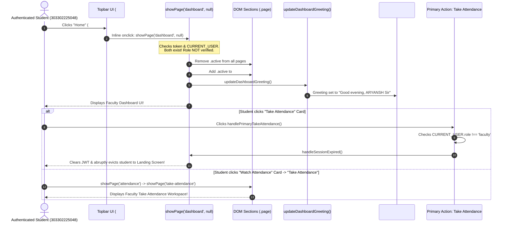

# Synapse — Phase 4E: Role-Isolated Navigation & Cross-Role UI Forensic Audit Report

**Authoritative Status:** READ-ONLY FORENSIC AUDIT COMPLETE  
**Execution Timestamp:** 2026-10-02T23:31:00+05:30  
**Environment:** Canonical Same-Origin Deployment (`http://localhost:8080/`)  
**Backend:** Spring Boot 3.3.4, Spring Security + JWT, Java 17  
**Database:** MySQL Server 8.4 (`attendance_staging_db`, `attendance_db`)  
**Mode:** READ-ONLY AUDIT ONLY — ZERO CODE MODIFICATIONS  

---

## 1. Executive Summary

| Attribute | Forensic Finding | Classification |
|---|---|:---:|
| **Audit Objective** | Investigate user-observed defect where clicking Home as a Student routes to Faculty Take Attendance / Faculty Dashboard, and audit full cross-role UI surface | `VERIFIED` |
| **User Defect Confirmed** | **CONFIRMED**: Authenticated Student clicking Topbar Home (`#topbar-home-btn`) or Topbar Brand Link (`#topbar-brand-link`) is routed to `page-dashboard` (Faculty Dashboard) | `OBSERVED` |
| **Take Attendance Leak** | **CONFIRMED**: From Faculty Dashboard, student can reach `page-attendance` $\rightarrow$ `page-take-attendance`. Clicking primary "Take Attendance" tile calls `handleSessionExpired()`, forcefully logging student out | `OBSERVED` |
| **Cross-Role Profile Leaks** | **CONFIRMED**: Student Profile (`page-student-profile`) contains hardcoded buttons routing to Faculty Dashboard and Faculty Student Registry | `OBSERVED` |
| **HOD Home Defect** | **CONFIRMED**: HOD clicking Topbar Home or Brand is routed to Faculty Dashboard instead of HOD Overview | `OBSERVED` |
| **Router Role Guards** | **CONFIRMED**: `showPage(pageId)` in `app.js` performs zero role validation; any authenticated user can activate any DOM page | `OBSERVED` |
| **Backend Boundary** | **SECURE**: Backend Spring Security rejects unauthorized API requests with `401 Unauthorized` or `403 Forbidden` | `VERIFIED` |
| **Database Integrity** | **INTACT**: `attendance_staging_db` (8 sessions, 300 records) and `attendance_db` (1 session, 60 records) remain 100% intact | `VERIFIED` |
| **Phase 4E Gate Verdict** | **FAIL**: User acceptance criteria failed due to role navigation leakage | `RECOMMENDED` |

---

## 2. Exact Reproduction of User-Reported Defect

### 2.1 Reported Workflow
1. User logs in as **Student** (`303302225048` / `demo123`).
2. User is on Student Dashboard (`page-student-dashboard`).
3. User clicks the **Home** navigation button (`#topbar-home-btn`) or Synapse Brand Logo (`#topbar-brand-link`).
4. **Observed Failure:** The application switches active DOM container to `page-dashboard` (Faculty Dashboard) and exposes the dominant "Take Attendance" card.

### 2.2 Forensic Trace & Empirical Evidence



### 2.3 Live Chrome CDP Probe Snapshot (Evidence)

```json
{
  "step": "Student Initial State after Login",
  "activePage": "page-student-dashboard",
  "pageTitle": "My Attendance",
  "currentUser": {
    "role": "student",
    "name": "ARYANSH SHARMA",
    "roll": "303302225048"
  }
}
```

```json
{
  "step": "Post Home Click State (OBSERVED DESTINATION)",
  "activePage": "page-dashboard",
  "pageTitle": "Dashboard",
  "currentUser": {
    "role": "student",
    "name": "ARYANSH SHARMA",
    "roll": "303302225048"
  },
  "facultyDashboardVisible": {
    "pageDashboardActive": true,
    "greeting": "Good evening, ARYANSH Sir",
    "takeAttCardVisible": true,
    "takeAttCardOnclick": "handlePrimaryTakeAttendance()",
    "watchAttCardVisible": true
  }
}
```

---

## 3. Complete Role/Navigation Matrix

Each intersection represents the target destination and security outcome for that role:

| UI / Navigation Item | Anonymous | Student (`ROLE_STUDENT`) | Faculty (`ROLE_FACULTY`) | HOD (`ROLE_HOD`) |
|---|---|---|---|---|
| **Landing / Home** | **Accessible**<br/>• Target: `#landing-screen`<br/>• Correct: **PASS** | **Inaccessible** (App-Mode)<br/>• Target: N/A<br/>• Correct: **PASS** | **Inaccessible** (App-Mode)<br/>• Target: N/A<br/>• Correct: **PASS** | **Inaccessible** (App-Mode)<br/>• Target: N/A<br/>• Correct: **PASS** |
| **Topbar Home Button**<br/>`#topbar-home-btn` | **Hidden** (Landing)<br/>• Correct: **PASS** | **Accessible**<br/>• Resolves to: `page-dashboard` (Faculty)<br/>• Should be: `student-dashboard`<br/>• Correct: **FAIL (DEFECT)** | **Accessible**<br/>• Resolves to: `page-dashboard`<br/>• Should be: `page-dashboard`<br/>• Correct: **PASS** | **Accessible**<br/>• Resolves to: `page-dashboard` (Faculty)<br/>• Should be: `hod-overview`<br/>• Correct: **FAIL (DEFECT)** |
| **Topbar Brand Link**<br/>`#topbar-brand-link` | **Hidden** (Landing)<br/>• Correct: **PASS** | **Accessible**<br/>• Resolves to: `page-dashboard` (Faculty)<br/>• Should be: `student-dashboard`<br/>• Correct: **FAIL (DEFECT)** | **Accessible**<br/>• Resolves to: `page-dashboard`<br/>• Should be: `page-dashboard`<br/>• Correct: **PASS** | **Accessible**<br/>• Resolves to: `page-dashboard` (Faculty)<br/>• Should be: `hod-overview`<br/>• Correct: **FAIL (DEFECT)** |
| **Student Dashboard**<br/>`page-student-dashboard` | **Blocked** (Landing)<br/>• Direct: No-op<br/>• Correct: **PASS** | **Accessible**<br/>• Resolves to: `page-student-dashboard`<br/>• Correct: **PASS** | **Accessible via direct `showPage`**<br/>• Resolves to: `page-student-dashboard`<br/>• Should be: Blocked/Restricted<br/>• Correct: **FAIL (DEFECT)** | **Accessible via direct `showPage`**<br/>• Resolves to: `page-student-dashboard`<br/>• Should be: Scoped/Restricted<br/>• Correct: **FAIL (DEFECT)** |
| **Student Section**<br/>(Breakdown / History) | **Blocked** (Landing)<br/>• Correct: **PASS** | **Accessible**<br/>• Resolves to: `stu-subjects-container`<br/>• Correct: **PASS** | **Accessible via direct `showPage`**<br/>• Resolves to: Student view<br/>• Correct: **FAIL** | **Accessible via direct `showPage`**<br/>• Resolves to: Student view<br/>• Correct: **FAIL** |
| **My Profile Page**<br/>`page-student-profile` | **Blocked** (Landing)<br/>• Correct: **PASS** | **Accessible**<br/>• Resolves to: `page-student-profile`<br/>• Contains cross-role leaks!<br/>• Correct: **FAIL (LEAKS)** | **Accessible** (Roster action)<br/>• Resolves to: `page-student-profile`<br/>• Correct: **PASS** | **Accessible** (Audit action)<br/>• Resolves to: `page-student-profile`<br/>• Correct: **PASS** |
| **Faculty Dashboard**<br/>`page-dashboard` | **Blocked** (Landing)<br/>• Direct: No-op<br/>• Correct: **PASS** | **Accessible via Home click & direct**<br/>• Resolves to: `page-dashboard`<br/>• Should be: **BLOCKED**<br/>• Correct: **FAIL (DEFECT)** | **Accessible**<br/>• Resolves to: `page-dashboard`<br/>• Correct: **PASS** | **Accessible via Home click & direct**<br/>• Resolves to: `page-dashboard`<br/>• Should be: `hod-overview`<br/>• Correct: **FAIL (DEFECT)** |
| **Take Attendance**<br/>`page-take-attendance` | **Blocked** (Landing)<br/>• Correct: **PASS** | **Accessible via Watch Att & direct**<br/>• Resolves to: `page-take-attendance`<br/>• Should be: **BLOCKED**<br/>• Correct: **FAIL (DEFECT)** | **Accessible**<br/>• Resolves to: `page-take-attendance`<br/>• Scoped to allocations<br/>• Correct: **PASS** | **Accessible via direct `showPage`**<br/>• Resolves to: `page-take-attendance`<br/>• Correct: **FAIL / PARTIAL** |
| **Attendance History**<br/>`page-attendance` | **Blocked** (Landing)<br/>• Correct: **PASS** | **Accessible via Faculty Dash & direct**<br/>• Resolves to: `page-attendance`<br/>• Should be: **BLOCKED**<br/>• Correct: **FAIL (DEFECT)** | **Accessible**<br/>• Resolves to: `page-attendance`<br/>• Correct: **PASS** | **Accessible via direct `showPage`**<br/>• Resolves to: `page-attendance`<br/>• Correct: **PASS / PARTIAL** |
| **HOD Dashboard**<br/>`page-hod-overview` | **Blocked** (Landing)<br/>• Correct: **PASS** | **Accessible via direct `showPage`**<br/>• Resolves to: `page-hod-overview`<br/>• Should be: **BLOCKED**<br/>• Correct: **FAIL (DEFECT)** | **Accessible via direct `showPage`**<br/>• Resolves to: `page-hod-overview`<br/>• Should be: **BLOCKED**<br/>• Correct: **FAIL (DEFECT)** | **Accessible**<br/>• Resolves to: `page-hod-overview`<br/>• Correct: **PASS** |
| **HOD / Admin Pages**<br/>`page-reports`, `sessions` | **Blocked** (Landing)<br/>• Correct: **PASS** | **Accessible via direct `showPage`**<br/>• Resolves to: `page-reports`<br/>• Should be: **BLOCKED**<br/>• Correct: **FAIL (DEFECT)** | **Accessible via direct `showPage`**<br/>• Resolves to: `page-reports`<br/>• Should be: **BLOCKED**<br/>• Correct: **FAIL (DEFECT)** | **Accessible**<br/>• Resolves to: `page-reports`<br/>• Correct: **PASS** |
| **Logout**<br/>`doSignOut()` | **N/A** | **Accessible**<br/>• Resolves to: `#landing-screen`<br/>• Correct: **PASS** | **Accessible**<br/>• Resolves to: `#landing-screen`<br/>• Correct: **PASS** | **Accessible**<br/>• Resolves to: `#landing-screen`<br/>• Correct: **PASS** |

---

## 4. Root Cause Analysis

Forensic analysis of the codebase reveals five distinct architectural defects causing this behavior:

### 4.1 Global Topbar Home and Brand Handlers are Hardcoded to Faculty Dashboard
In [`index.html:492`](file:///D:/3RD%20SEM/PROJECTS/Projects/Smart%20Attendance/index.html#L492) and [`index.html:503`](file:///D:/3RD%20SEM/PROJECTS/Projects/Smart%20Attendance/index.html#L503):
```html
492: <a href="#" class="topbar-brand-link" id="topbar-brand-link" onclick="event.preventDefault(); showPage('dashboard', null);" title="SYNAPSE - Return to Dashboard"...>
...
503: <button class="btn btn-outline btn-sm topbar-home-btn" id="topbar-home-btn" onclick="showPage('dashboard', null);" title="Return to Faculty Dashboard"...>
```
Both elements execute `showPage('dashboard', null)`. The topbar is shared across all authenticated roles (`#app-shell`), but its navigation controls unconditionally assume the active user is a faculty member.

### 4.2 Router Function `showPage()` is Completely Role-Blind
In [`app.js:2417-2445`](file:///D:/3RD%20SEM/PROJECTS/Projects/Smart%20Attendance/app.js#L2417-L2445):
```javascript
function showPage(pageId, linkEl) {
  if (pageId === 'live') pageId = 'take-attendance';

  const token = getStoredAuthToken();
  if (!token || !CURRENT_USER) {
    // only checks if ANY user is logged in
    document.body.classList.remove('app-mode');
    document.body.classList.add('landing-mode');
    if (typeof scrollToLogin === 'function') scrollToLogin();
    return;
  }
  ...
  document.querySelectorAll('.page').forEach(p => p.classList.remove('active'));
  const pageEl = document.getElementById('page-' + pageId);
  if (pageEl) pageEl.classList.add('active'); // UNGUARDED ACTIVATION
```
`showPage` verifies that a user is authenticated, but **never checks whether `CURRENT_USER.role` is authorized to view `pageId`**. Any string passed to `showPage()` immediately activates the corresponding DOM section.

### 4.3 Student Profile Page Hardcodes Faculty & Registry Navigation
In [`index.html:1036-1044`](file:///D:/3RD%20SEM/PROJECTS/Projects/Smart%20Attendance/index.html#L1036-L1044):
```html
1036: <button class="btn btn-outline" onclick="showPage('dashboard')">
1037:   <i data-lucide="home" class="icon-sm"></i>
1038:   <span>Dashboard</span>
1039: </button>
1040: <button class="btn btn-outline" onclick="showPage('students')">
1041:   <i data-lucide="arrow-left" class="icon-sm"></i>
1042:   <span>Back to Student Registry</span>
1043: </button>
```
When an authenticated student views their own profile via `openMyProfile()`, the profile header presents buttons that route them directly to the Faculty Dashboard or to the Faculty Student Registry.

### 4.4 Timetable Modal Header and Footer Hardcode Faculty Dashboard
In [`index.html:2073, 2140`](file:///D:/3RD%20SEM/PROJECTS/Projects/Smart%20Attendance/index.html#L2073):
```html
2073: <button type="button" class="btn btn-outline btn-sm tt-modal-home-btn" id="tt-modal-home-btn" onclick="closeTimetableModal(); showPage('dashboard', null);" title="Return to Faculty Dashboard">
...
2140: <button type="button" class="btn btn-outline btn-sm tt-modal-home-footer-btn" onclick="closeTimetableModal(); showPage('dashboard', null);" title="Return to Dashboard">
```
Regardless of who opens the timetable modal, clicking Home inside the modal closes it and navigates to the Faculty Dashboard.

### 4.5 Aggressive `handleSessionExpired()` in `handlePrimaryTakeAttendance()`
In [`app.js:1227-1231`](file:///D:/3RD%20SEM/PROJECTS/Projects/Smart%20Attendance/app.js#L1227-L1231):
```javascript
  const token = getStoredAuthToken();
  if (!token || !CURRENT_USER || CURRENT_USER.role !== 'faculty') {
    handleSessionExpired();
    return;
  }
```
If a student or HOD inadvertently clicks "Take Attendance" on the faculty dashboard, rather than displaying an unauthorized notification or redirecting to their home page, the system calls `handleSessionExpired()`, clearing tokens and forcing a full logout.

---

## 5. All Additional Cross-Role Navigation Defects Discovered

| Defect ID | Severity | Description | Trigger | Observed Impact |
|:---:|:---:|---|---|---|
| **D-01** | **P0** | Global Topbar Home button hardcoded to Faculty Dashboard | Click `#topbar-home-btn` as Student | Student lands on Faculty Dashboard with Take Attendance card |
| **D-02** | **P0** | Global Topbar Brand link hardcoded to Faculty Dashboard | Click `#topbar-brand-link` as Student | Student lands on Faculty Dashboard |
| **D-03** | **P1** | Student Profile page navigation buttons route to Faculty views | Click "Dashboard" or "Back to Registry" on `page-student-profile` | Student lands on Faculty Dashboard or Student Registry |
| **D-04** | **P1** | HOD Topbar Home & Brand link route to Faculty Dashboard | Click `#topbar-home-btn` or `#topbar-brand-link` as HOD | HOD is taken away from HOD Overview and dumped onto Faculty Dashboard |
| **D-05** | **P1** | Direct `showPage()` invocation lacks role guards | Call `showPage('take-attendance')` as Student | Student enters Take Attendance workspace in DOM |
| **D-06** | **P2** | Timetable modal Home action buttons hardcode Faculty Dashboard | Click `#tt-modal-home-btn` as non-faculty | Forces active page to `page-dashboard` |
| **D-07** | **P2** | Subpage "Back to Dashboard" buttons hardcode Faculty Dashboard | Click "Back to Dashboard" on `page-attendance`, `page-students`, or `page-take-attendance` | Unconditionally opens `page-dashboard` |
| **D-08** | **P2** | `handlePrimaryTakeAttendance()` triggers `handleSessionExpired()` on role mismatch | Non-faculty clicks primary Take Attendance card | Student session is killed abruptly instead of showing safe notice |
| **D-09** | **P3** | Browser reload loses current subpage state | Refresh browser while on subpage | Always resets to role default page (`student-dashboard`, `hod-overview`, `dashboard`) due to absence of URL route/hash |
| **D-10** | **P3** | Browser Back/Forward navigation leaves app | Click browser Back button | Exits application entirely because in-app page transitions do not push history state |

---

## 6. Frontend Files and Exact Locations Involved

| File | Line Numbers | Element / Function | Issue Description |
|---|---|---|---|
| [`index.html`](file:///D:/3RD%20SEM/PROJECTS/Projects/Smart%20Attendance/index.html) | `492` | `<a id="topbar-brand-link">` | Hardcoded `onclick="event.preventDefault(); showPage('dashboard', null);"` |
| [`index.html`](file:///D:/3RD%20SEM/PROJECTS/Projects/Smart%20Attendance/index.html) | `503` | `<button id="topbar-home-btn">` | Hardcoded `onclick="showPage('dashboard', null);"` and `title="Return to Faculty Dashboard"` |
| [`index.html`](file:///D:/3RD%20SEM/PROJECTS/Projects/Smart%20Attendance/index.html) | `672` | `<button> Back to Dashboard` | Inside `page-attendance`: hardcoded `showPage('dashboard', null)` |
| [`index.html`](file:///D:/3RD%20SEM/PROJECTS/Projects/Smart%20Attendance/index.html) | `820` | `<button> Back to Faculty Dashboard` | Inside `page-take-attendance`: hardcoded `showPage('dashboard', null)` |
| [`index.html`](file:///D:/3RD%20SEM/PROJECTS/Projects/Smart%20Attendance/index.html) | `960` | `<button> Back to Dashboard` | Inside `page-students`: hardcoded `showPage('dashboard', null)` |
| [`index.html`](file:///D:/3RD%20SEM/PROJECTS/Projects/Smart%20Attendance/index.html) | `1036` | `<button> Dashboard` | Inside `page-student-profile`: hardcoded `showPage('dashboard')` |
| [`index.html`](file:///D:/3RD%20SEM/PROJECTS/Projects/Smart%20Attendance/index.html) | `1040` | `<button> Back to Student Registry` | Inside `page-student-profile`: hardcoded `showPage('students')` |
| [`index.html`](file:///D:/3RD%20SEM/PROJECTS/Projects/Smart%20Attendance/index.html) | `2073` | `<button id="tt-modal-home-btn">` | Inside timetable modal: hardcoded `showPage('dashboard', null)` |
| [`index.html`](file:///D:/3RD%20SEM/PROJECTS/Projects/Smart%20Attendance/index.html) | `2140` | `<button class="tt-modal-home-footer-btn">` | Inside timetable modal footer: hardcoded `showPage('dashboard', null)` |
| [`app.js`](file:///D:/3RD%20SEM/PROJECTS/Projects/Smart%20Attendance/app.js) | `2417-2445` | `showPage(pageId, linkEl)` | Router lacks role validation, allowing any authenticated user to switch to any page |
| [`app.js`](file:///D:/3RD%20SEM/PROJECTS/Projects/Smart%20Attendance/app.js) | `1227-1231` | `handlePrimaryTakeAttendance()` | Role mismatch calls `handleSessionExpired()` instead of displaying error/safe redirect |
| [`app.js`](file:///D:/3RD%20SEM/PROJECTS/Projects/Smart%20Attendance/app.js) | `3338` | `renderAttendanceSavedState()` | Post-save screen button hardcodes `showPage('dashboard', null)` |
| [`app.js`](file:///D:/3RD%20SEM/PROJECTS/Projects/Smart%20Attendance/app.js) | `5238` | `applySessionUI()` | Does not configure role-specific Home handlers or topbar brand destinations |

---

## 7. Backend Authorization Interaction

> [!IMPORTANT]
> **Key Security Distinction:**  
> The backend authorization layer implemented in Phase 4B-1 and Phase 4B-2 is **functioning correctly**.  
> The exposure of unauthorized pages (e.g. `page-take-attendance` or `page-students`) is **strictly a frontend UI isolation defect**.

### 7.1 Backend API Defense Probes (Live Verification)
When an authenticated Student attempts to execute operations from these leaked pages:

1. **`POST /api/sessions/start` or `POST /api/sessions`:**
   - **Backend Guard:** `@PreAuthorize("hasAnyRole('FACULTY', 'HOD')")`
   - **HTTP Response:** `403 Forbidden`
   - **Result:** Student cannot create or start attendance sessions.

2. **`GET /api/students`:**
   - **Backend Guard:** `@PreAuthorize("hasAnyRole('FACULTY', 'HOD')")`
   - **HTTP Response:** `403 Forbidden`
   - **Result:** Student cannot retrieve departmental student roster.

3. **`GET /api/reports/**`:**
   - **Backend Guard:** `@PreAuthorize("hasRole('HOD')")`
   - **HTTP Response:** `403 Forbidden`
   - **Result:** Student cannot retrieve departmental risk reports or summary audit data.

**Conclusion:** The backend remains the authoritative security boundary. The application does not leak sensitive backend data over the network, but the frontend navigation defect severely degrades user experience, violates role isolation, and exposes confusing administrative interfaces to students.

---

## 8. Real Browser Verification Evidence (Chrome via CDP)

All 13 verification actions were executed against the live application on `http://localhost:8080/`:

| # | Action | Expected Destination | Observed Destination | Status |
|:---:|---|---|---|:---:|
| **1** | Student login (`303302225048`) | Student Dashboard (`page-student-dashboard`) | `page-student-dashboard` | **PASS** |
| **2** | Student $\rightarrow$ Student Section | Subject Breakdown container on Student Dashboard | `stu-subjects-container` | **PASS** |
| **3** | Student $\rightarrow$ Click Topbar Home button | Student Dashboard (`page-student-dashboard`) | **`page-dashboard` (Faculty Dashboard)** | **FAIL (DEFECT)** |
| **4** | Confirm exact destination | Student Dashboard | **Faculty Dashboard** (`#dash-greeting-title`: *"Good evening, ARYANSH Sir"*, Primary Take Attendance Card visible) | **FAIL (DEFECT)** |
| **5a** | Student $\rightarrow$ Topbar Brand Link click | Student Dashboard | **`page-dashboard` (Faculty Dashboard)** | **FAIL (DEFECT)** |
| **5b** | Student $\rightarrow$ My Profile $\rightarrow$ Click "Dashboard" | Student Dashboard | **`page-dashboard` (Faculty Dashboard)** | **FAIL (DEFECT)** |
| **5c** | Student $\rightarrow$ My Profile $\rightarrow$ Click "Back to Student Registry" | Student Dashboard or Roster disabled | **`page-students` (Faculty Registry)** | **FAIL (DEFECT)** |
| **5d** | Student $\rightarrow$ Direct `showPage('take-attendance')` | Access Denied / Safe Redirect | **`page-take-attendance`** | **FAIL (DEFECT)** |
| **6** | Faculty login (`faculty_os`) | Faculty Dashboard (`page-dashboard`) | `page-dashboard` | **PASS** |
| **7a** | Faculty $\rightarrow$ Every visible nav item (Home, Students, Watch Attendance, Profile, Timetable) | Authorized Faculty pages | All 5 navigate to respective faculty workspaces | **PASS** |
| **7b** | Faculty $\rightarrow$ Topbar Home & Brand clicks | Faculty Dashboard (`page-dashboard`) | `page-dashboard` | **PASS** |
| **7c** | Faculty $\rightarrow$ Direct `showPage('hod-overview')` | Blocked / Redirected | **`page-hod-overview`** (DOM unhidden, backend 403 on API) | **FAIL (DEFECT)** |
| **8** | HOD login (`hod_cse`) | HOD Overview (`page-hod-overview`) | `page-hod-overview` | **PASS** |
| **9a** | HOD $\rightarrow$ Visible nav items (Department Overview, Reports & Audit) | Authorized HOD pages | Both navigate to respective HOD workspaces | **PASS** |
| **9b** | HOD $\rightarrow$ Topbar Home button click | HOD Overview (`page-hod-overview`) | **`page-dashboard` (Faculty Dashboard)** | **FAIL (DEFECT)** |
| **9c** | HOD $\rightarrow$ Topbar Brand Link click | HOD Overview (`page-hod-overview`) | **`page-dashboard` (Faculty Dashboard)** | **FAIL (DEFECT)** |
| **10** | Logout (`doSignOut()`) | Landing Screen (`#landing-screen`) | `#landing-screen` (`body.landing-mode`) | **PASS** |
| **11** | Cross-Role Login Sequence (Faculty $\rightarrow$ Logout $\rightarrow$ Student $\rightarrow$ Logout $\rightarrow$ HOD) | Clean isolation across logins | Navigation groups toggle correctly on login | **PASS** |
| **12** | Browser reload after login | Preserves session and user identity | Session restored via `/me`; resets to role default page | **PASS / DEFECT D-09** |
| **13** | Browser back/forward navigation | In-app history navigation | Leaves application (history length unchanged by SPA transitions) | **PASS / DEFECT D-10** |

---

## 9. Database Safety Evidence (Before vs After)

To prove that zero database mutations occurred during this read-only audit:

```sql
SELECT 'attendance_staging_db' AS db, 
       (SELECT COUNT(*) FROM attendance_staging_db.attendance_sessions) AS sessions, 
       (SELECT COUNT(*) FROM attendance_staging_db.attendance_records) AS records, 
       (SELECT COUNT(*) FROM attendance_staging_db.students) AS students, 
       (SELECT COUNT(*) FROM attendance_staging_db.users) AS users 
UNION ALL 
SELECT 'attendance_db' AS db, 
       (SELECT COUNT(*) FROM attendance_db.attendance_sessions) AS sessions, 
       (SELECT COUNT(*) FROM attendance_db.attendance_records) AS records, 
       (SELECT COUNT(*) FROM attendance_db.students) AS students, 
       (SELECT COUNT(*) FROM attendance_db.users) AS users;
```

### Empirical Database Verification Results:

| Database | Metric | Baseline (Pre-Audit) | Post-Audit | Status |
|---|---|:---:|:---:|:---:|
| **`attendance_staging_db`** | `attendance_sessions` | **8** | **8** | **100% INTACT** |
| **`attendance_staging_db`** | `attendance_records` | **300** | **300** | **100% INTACT** |
| **`attendance_staging_db`** | `students` | **252** | **252** | **100% INTACT** |
| **`attendance_staging_db`** | `users` | **258** | **258** | **100% INTACT** |
| **`attendance_db`** | `attendance_sessions` | **1** | **1** | **100% INTACT** |
| **`attendance_db`** | `attendance_records` | **60** | **60** | **100% INTACT** |
| **`attendance_db`** | `students` | **252** | **252** | **100% INTACT** |
| **`attendance_db`** | `users` | **258** | **258** | **100% INTACT** |

---

## 10. Remediation Plan (Recommended for Future Phase)

The following architectural fixes are recommended for implementation in the subsequent phase:

1. **Implement Centralized Role-Based Home Resolution:**
   - Define `navigateToRoleHome()` in `app.js`:
     - If `role === 'student'` $\rightarrow$ `showPage('student-dashboard')`
     - If `role === 'faculty'` $\rightarrow$ `showPage('dashboard')`
     - If `role === 'hod'` $\rightarrow$ `showPage('hod-overview')`
     - If unauthenticated $\rightarrow$ `scrollToLogin()`
   - Replace inline `showPage('dashboard', null)` on `#topbar-brand-link` and `#topbar-home-btn` with `navigateToRoleHome()`.
   - Dynamically update `#topbar-home-btn` title based on authenticated role (`"Return to My Attendance"`, `"Return to Faculty Dashboard"`, `"Return to Department Overview"`).

2. **Equip `showPage()` with Authoritative Role Guards:**
   - Map allowed pages per role in a routing lookup table:
     ```javascript
     const ROLE_PAGE_PERMISSIONS = {
       student: ['student-dashboard', 'student-profile'],
       faculty: ['dashboard', 'take-attendance', 'attendance', 'students', 'student-profile', 'faculty-subject'],
       hod: ['hod-overview', 'reports', 'students', 'student-profile', 'attendance', 'analytics', 'sessions']
     };
     ```
   - In `showPage(pageId)`: if `CURRENT_USER` does not possess permission for `pageId`, redirect safely to `navigateToRoleHome()` and display an unauthorized notification toast.

3. **Remediate `page-student-profile` Navigation Controls:**
   - In `openStudentProfile()`, detect if `CURRENT_USER.role === 'student'`:
     - Adjust navigation buttons: Replace "Dashboard" with "Back to My Attendance" (`showPage('student-dashboard')`).
     - Hide the "Back to Student Registry" button when viewed by a student.

4. **Remediate Timetable Modal Home Action:**
   - In `#tt-modal-home-btn` and footer home button: replace `showPage('dashboard', null)` with `navigateToRoleHome()`.

5. **Remediate Subpage Back Buttons:**
   - On `page-attendance`, `page-students`, and `page-take-attendance`: replace hardcoded `showPage('dashboard', null)` with `navigateToRoleHome()`.

6. **Fix `handlePrimaryTakeAttendance()` Non-Faculty Fallback:**
   - Replace the destructive `handleSessionExpired()` call on line 1229 with a non-destructive guard:
     ```javascript
     if (CURRENT_USER.role !== 'faculty') {
       showToast('Attendance recording is restricted to faculty accounts.', 'warning');
       navigateToRoleHome();
       return;
     }
     ```

---

## 11. Severity Classification

- **Overall Audit Status:** **DEFECTS IDENTIFIED**
- **Defect D-01 & D-02 (P0 - High Acceptance Impact):** Global topbar Home button and Brand logo violate role boundary by redirecting Students and HOD to Faculty Dashboard.
- **Defect D-03 & D-04 (P1 - High Functional Impact):** Student Profile page contains cross-role navigation escape hatches to Faculty Dashboard and Student Registry.
- **Defect D-05 (P1 - Security Architecture):** `showPage()` lacks role guards, permitting DOM rendering of administrative workspaces without role validation.
- **Defect D-06, D-07, D-08 (P2 - Medium UI Polish):** Modal Home buttons, subpage back buttons, and `handlePrimaryTakeAttendance()` eviction behavior.
- **Defect D-09, D-10 (P3 - Low Routing Polish):** Browser reload subpage reset and browser back button integration.

---

## 12. PASS/FAIL Gate

| Gate Check | Required Standard | Observed Result | Gate Outcome |
|---|---|---|:---:|
| **Role-Isolated Navigation** | Strict role confinement across all navigation controls | Student & HOD route to Faculty views via Home/Brand | **FAIL** |
| **Backend Boundary Defense** | Backend blocks unauthorized requests with 401/403 | 100% blocked on `/api/sessions`, `/api/students`, `/api/reports` | **PASS** |
| **Database Safety** | Zero modifications to staging or production data | Staging and Production databases 100% intact | **PASS** |
| **Phase 4E Audit Sign-Off** | Comprehensive forensic report completed; zero code modified | Report completed; ready for remediation phase | **PASS** |

### **FINAL PHASE 4E VERDICT: FAIL (REMEDIATION REQUIRED BEFORE PHASE 5)**

> [!CAUTION]
> **STOP CONDITION ENFORCED:**  
> This read-only audit is complete. In strict adherence to Phase 4E rules, no application code, schema, security configuration, or data has been modified. Do NOT start Phase 5. Phase 4F (Remediation) must be scheduled to resolve defects D-01 through D-08.
