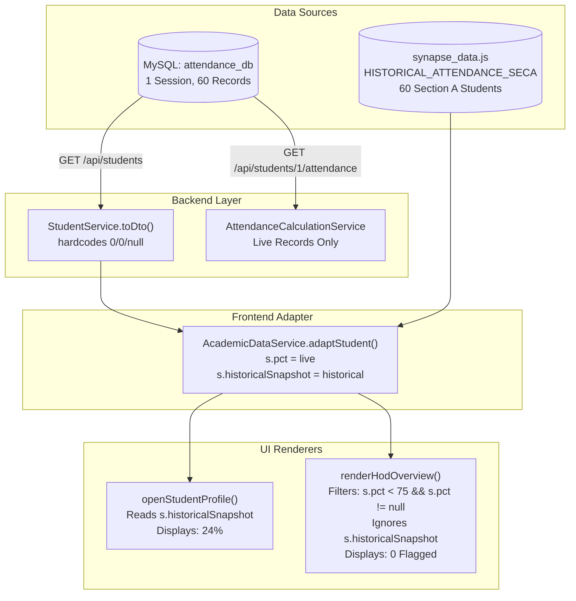

# SYNAPSE — PHASE 4F: HOD LOW-ATTENDANCE & NOTIFICATION FORENSIC AUDIT
**Date:** 2026-10-03  
**Status:** COMPLETE (READ-ONLY AUDIT)  
**Mode:** STRICT READ-ONLY FORENSIC AUDIT  
**Target Environment:** Spring Boot 3.3.3 + MySQL 8.4 (`http://localhost:8080/`)

---

## 1. Executive Summary

This forensic audit investigates the reported defect where **Aditya Attree (Roll Number: `303302225001`)** displays a **24% Recorded Snapshot Percentage** on his Student Profile, while the **HOD Dashboard reports 0 students below 75% attendance**. In addition, this audit conducts a complete architectural feasibility review for a requested **HOD-only automated email notification feature** (`POST /api/hod/attendance/low-attendance/notify`).

### Key Findings Summary:
1. **Defect Root Cause:**  
   The HOD dashboard and the Student Profile consume **two completely different attendance data dimensions**:
   - **Student Profile:** Renders a dedicated historical card consuming `student.historicalSnapshot` (sourced from the pre-commencement July–Aug register `HISTORICAL_ATTENDANCE_SECA` in [`synapse_data.js`](file:///D:/3RD%20SEM/PROJECTS/Projects/Smart%20Attendance/synapse_data.js#L10355-L10376)), where Aditya Attree has an explicit `attendancePercent: 24`.
   - **HOD Dashboard:** Renders the "Flagged Students Below 75% Attendance" table (`#hod-risk-body` via `renderHodOverview()`) by filtering exclusively on `s.pct !== null && s.pct < 75`. `s.pct` is derived **strictly from live 2026 database sessions**.
   - In the live database (`attendance_db`), only 1 completed lecture exists; Aditya was marked **PRESENT**, giving him a live attendance of **100% (1/1)**. For all students without live records, `s.pct` is `null`. Consequently, the HOD filter excludes Aditya (100% $\ge$ 75%) and all unrecorded students (`null`), surfacing **0 flagged students**.
2. **Backend Attendance & Threshold Gap:**  
   - The Spring Boot backend **has no concept of an attendance threshold, risk level, or low-attendance filtering**. All 75% threshold logic currently lives strictly in frontend JavaScript (`app.js:548`).
   - The backend endpoint `GET /api/students` hardcodes `attendance: { totalLectures: 0, attendedLectures: 0, percentage: null }` for every student ([`StudentService.java:2801`](file:///D:/3RD%20SEM/PROJECTS/Projects/Smart%20Attendance/AttendanceBackend.java#L2801)).
3. **Email Infrastructure Absent:**  
   - The project contains **zero** email infrastructure: no JavaMail/Spring Mail dependencies in [`pom.xml`](file:///D:/3RD%20SEM/PROJECTS/Projects/Smart%20Attendance/pom.xml), no SMTP settings in [`application.properties`](file:///D:/3RD%20SEM/PROJECTS/Projects/Smart%20Attendance/src/main/resources/application.properties) or [`.env.example`](file:///D:/3RD%20SEM/PROJECTS/Projects/Smart%20Attendance/.env.example), no notification tables, and **all 252 students have `email = NULL` in MySQL**.
   - Existing UI notification buttons are purely simulated frontend mock toasts.

---

## 2. Complete Data-Path Trace & Root Cause Analysis

### 2.1 The Two Disconnected Data Paths



### 2.2 Forensic Trace of Aditya Attree (`303302225001`)

#### A. Database State (MySQL Query Verification)
Direct SQL query on active database `attendance_db` and historical staging `attendance_staging_db`:
```sql
SELECT student_id, roll_number, name, section_id, email, status FROM attendance_db.students WHERE roll_number = '303302225001';
SELECT * FROM attendance_db.attendance_records WHERE student_id = 1;
SELECT * FROM attendance_staging_db.attendance_records WHERE student_id = 1;
```
**Database Evidence Output:**
- `attendance_db.students`: `student_id = 1`, `roll_number = '303302225001'`, `name = 'AADITYA ATTREE'`, `section_id = 1` (Section A), `email = NULL`.
- `attendance_db.attendance_records`:
  - Exactly 1 record: `record_id = 9001, session_id = 323, student_id = 1, status = PRESENT`.
  - **Live Attendance for Aditya:** 1 Present / 1 Eligible = **100.0%**.
- `attendance_staging_db.attendance_records`:
  - 5 records across 5 sessions: 2 PRESENT, 3 ABSENT = **40.0%** (2/5).

#### B. Source of the 24% Figure
Aditya's 24% figure is **not in the database**. It originates from the static historical attendance dataset in [`synapse_data.js:10355-10376`](file:///D:/3RD%20SEM/PROJECTS/Projects/Smart%20Attendance/synapse_data.js#L10355-L10376):
```javascript
// Historical Section-A Attendance Snapshot (60 students matched by roll number)
const HISTORICAL_ATTENDANCE_SECA = [
  {
    "id": 1,
    "studentId": "STU-2026-CSE-001",
    "rollNumber": "303302225001",
    "authoritativeName": "AADITYA ATTREE",
    "attendancePercent": 24,
    "snapshotType": "historical",
    "source": "Section-A historical attendance sheet",
    "sourceHeader": "July–Dec 2026, 3rd Semester, Section A, Month: JULY–AUG, 2026",
    "sourceDate": "25-08-2025",
    "dateStatus": "source discrepancy / requires verification",
    "thresholdPolicy": 75,
    "isBelowThreshold": true,
    "thresholdStatus": "Below Attendance Threshold — Historical Snapshot"
  },
  ...
```

#### C. Student Profile Rendering
In [`app.js:3943-3966`](file:///D:/3RD%20SEM/PROJECTS/Projects/Smart%20Attendance/app.js#L3943-L3966), `openStudentProfile()` directly inspects `student.historicalSnapshot`:
```javascript
if (student.historicalSnapshot && student.historicalSnapshot.available) {
  const h = student.historicalSnapshot;
  if (histCard) histCard.style.display = 'block';
  if (histPct) histPct.textContent = `${h.attendancePercent}%`; // Displays "24%"
  if (histBadge) {
    histBadge.textContent = h.isBelowThreshold ? 'BELOW THRESHOLD (HISTORICAL)' : 'AT OR ABOVE THRESHOLD';
    histBadge.className = h.isBelowThreshold ? 'badge badge-risk' : 'badge badge-ok';
  }
  ...
}
```

#### D. HOD Dashboard Rendering
In [`app.js:5636-5645`](file:///D:/3RD%20SEM/PROJECTS/Projects/Smart%20Attendance/app.js#L5636-L5645), `renderHodOverview()` filters students using:
```javascript
// Flagged Students At Risk table
const riskBody = document.getElementById('hod-risk-body');
if (riskBody) {
  const atRiskStudents = STUDENTS.filter(s => s.pct !== null && s.pct < ATTENDANCE_THRESHOLD);
  if (atRiskStudents.length === 0) {
    riskBody.innerHTML = `<tr><td colspan="7" style="text-align: center; padding: 24px; color: var(--text-muted);">No students currently flagged at risk. Department attendance register is in pre-commencement status.</td></tr>`;
  } else {
    ...
```
**Why Aditya Attree is omitted from the HOD dashboard:**
1. `renderHodOverview()` inspects **only `s.pct`**.
2. Aditya's `s.pct` in live 2026 is **100.0%** (1 attended / 1 session).
3. `100.0% < 75` evaluates to **`false`**.
4. Even if live records are reset to 0, `s.pct` becomes `null`, and `s.pct !== null` evaluates to **`false`**.
5. `renderHodOverview()` **completely ignores `s.historicalSnapshot`**.
6. Therefore, the HOD dashboard reports 0 flagged students.

---

## 3. Attendance Threshold Audit

### 3.1 Threshold Definitions Across the Stack

| Layer | File / Location | Threshold Value | Semantics | Mismatch / Finding |
|:---|:---|:---:|:---|:---|
| **Frontend Constant** | [`app.js:548`](file:///D:/3RD%20SEM/PROJECTS/Projects/Smart%20Attendance/app.js#L548) | `75` | `const ATTENDANCE_THRESHOLD = 75;` | Canonical frontend threshold constant. |
| **Frontend Function Default** | [`app.js:591, 603`](file:///D:/3RD%20SEM/PROJECTS/Projects/Smart%20Attendance/app.js#L591) | `75` | `calculatePermissibleAbsences(..., threshold = ATTENDANCE_THRESHOLD)` | Uses default param bound to constant. |
| **Historical Dataset** | [`synapse_data.js:10373`](file:///D:/3RD%20SEM/PROJECTS/Projects/Smart%20Attendance/synapse_data.js#L10373) | `75` | `"thresholdPolicy": 75, "isBelowThreshold": true` | Statically duplicated across 60 student JSON records. |
| **HOD KPI Card HTML** | [`index.html:1778`](file:///D:/3RD%20SEM/PROJECTS/Projects/Smart%20Attendance/index.html#L1778) | `75%` | `&lt; 75% threshold (0 live lectures)` | Hardcoded text label in markup. |
| **HOD Table Header HTML** | [`index.html:1881`](file:///D:/3RD%20SEM/PROJECTS/Projects/Smart%20Attendance/index.html#L1881) | `75%` | `Flagged Students Below 75% Attendance` | Hardcoded text label in markup. |
| **Student Profile Strings** | [`app.js:3952, 3958`](file:///D:/3RD%20SEM/PROJECTS/Projects/Smart%20Attendance/app.js#L3952) | `75%` | `'Below Threshold (<75%)'`, `'Meets CSVTU 75% Attendance Criteria'` | Hardcoded UI text strings. |
| **Spring Boot Backend** | [`AttendanceBackend.java`](file:///D:/3RD%20SEM/PROJECTS/Projects/Smart%20Attendance/AttendanceBackend.java) | **None** | **No threshold constant or property exists** | **CRITICAL MISMATCH:** The backend has zero knowledge of the 75% threshold. |

### 3.2 Compliance Logic Consistency
- **Compliance Rule:** Inclusive: $\text{percentage} \ge 75.0\%$ is `COMPLIANT`.
- **At-Risk Rule:** Strictly less than: $\text{percentage} < 75.0\%$ is flagged as `BELOW THRESHOLD` / `AT RISK`.
- **Pre-commencement Rule:** When $\text{total} = 0$, $\text{percentage} = \text{null}$, treated as `PENDING` / `NO RECORDS` (not flagged).
- **Audit Conclusion:** The threshold value (`75%`) and operators ($\ge$ vs $<$) are consistent across frontend modules, but the entire threshold concept is absent from the backend.

---

## 4. HOD Authorization & Boundary Audit

### 4.1 Current Role Permissions Matrix
Verified against [`SecurityConfig.java:56-84`](file:///D:/3RD%20SEM/PROJECTS/Projects/Smart%20Attendance/src/main/java/com/attendance/security/SecurityConfig.java#L56-L84) and [`AcademicAuthorizationService.java`](file:///D:/3RD%20SEM/PROJECTS/Projects/Smart%20Attendance/src/main/java/com/attendance/service/AcademicAuthorizationService.java):

| Resource / Endpoint | Anonymous | ROLE_STUDENT | ROLE_FACULTY | ROLE_HOD |
|:---|:---:|:---:|:---:|:---:|
| `GET /api/students` (All) | ❌ 401 | ❌ Restricted (Scope check) | ❌ Restricted to allocated sections | ✅ Full Department Access |
| `GET /api/students/{id}/attendance` | ❌ 401 | ✅ Own ID only (BOLA check) | ✅ Allocated Section only | ✅ Full Department Access |
| `GET /api/attendance/summary/section/{sec}` | ❌ 401 | ❌ 403 | ✅ Allocated Section only | ✅ Full Department Access |
| `GET /api/hod/**` (Proposed) | ❌ 401 | ❌ 403 | ❌ 403 | ✅ Full Access |
| Frontend `page-hod-overview` | ❌ Redirected | ❌ Redirected (Phase 4E) | ❌ Redirected (Phase 4E) | ✅ Accessible |
| Dispatch Notices Action | ❌ Blocked | ❌ Blocked | ❌ Blocked | ✅ HOD Only |

### 4.2 Required Boundary for Low-Attendance & Notifications
1. **Departmental Low-Attendance List:**
   - **Must be restricted to `ROLE_HOD` (and `ROLE_ADMIN`).**
   - Faculty must NOT be able to view departmental-wide student risk lists, as faculty authorization is strictly scoped to their allocated sections (Sections A & B for teaching faculty).
   - Students must NEVER be able to query the list of other flagged students.
2. **Notification Dispatch (`/notify`):**
   - Must be strictly guarded with `@PreAuthorize("hasRole('HOD')")` and `SecurityConfig` URL pattern matcher `.requestMatchers("/api/hod/**").hasRole("HOD")`.

---

## 5. Email Infrastructure Forensic Audit

### 5.1 Project Infrastructure Inspection

| Component | Status | Finding / Evidence |
|:---|:---:|:---|
| **JavaMail / Spring Mail Dependency** | ❌ **ABSENT** | [`pom.xml`](file:///D:/3RD%20SEM/PROJECTS/Projects/Smart%20Attendance/pom.xml) has no `spring-boot-starter-mail` or `javax.mail`/`jakarta.mail`. |
| **Spring Mail Configuration** | ❌ **ABSENT** | [`application.properties`](file:///D:/3RD%20SEM/PROJECTS/Projects/Smart%20Attendance/src/main/resources/application.properties) contains no `spring.mail.*` properties. |
| **SMTP Environment Variables** | ❌ **ABSENT** | [`.env.example`](file:///D:/3RD%20SEM/PROJECTS/Projects/Smart%20Attendance/.env.example) contains no SMTP hosts, ports, users, or credentials. |
| **Backend Email Service** | ❌ **ABSENT** | No `@Service` or class handling mail exists anywhere in `src/main/java`. |
| **Student Email Addresses in DB** | ❌ **NULL (0 / 252)** | SQL query confirms: `SELECT count(email) FROM students;` returns `0`. All 252 students have `email = NULL`. |
| **Student Email Addresses in JS** | ❌ **ABSENT** | `synapse_data.js` contains no student email addresses. |
| **Faculty Email Addresses** | ⚠️ **PARTIAL** | MySQL `faculty` table contains 13 institutional emails (e.g. `anand.tamrakar@ssipmt.com`). |
| **Notification History / Tables** | ❌ **ABSENT** | No `notification`, `notices`, or `audit_log` tables exist in `attendance_db`. |
| **Email Templates** | ❌ **ABSENT** | No HTML or text email templates exist in source code or resources. |
| **Frontend Notification Buttons** | ⚠️ **MOCK** | Buttons call `showToast('Demo notices prepared for all 14 flagged students')` ([`index.html:1884`](file:///D:/3RD%20SEM/PROJECTS/Projects/Smart%20Attendance/index.html#L1884)). |

> [!CAUTION]
> **CRITICAL DATA GAP:**  
> Before any real email dispatch can function, valid recipient email addresses must be provisioned for students. Because all student emails are `NULL`, an unmanaged SMTP dispatch will fail on every record or throw exceptions. A simulated/preview mode is required until student emails are populated.

---

## 6. Data Semantics Analysis: Live vs. Historical

The audit evaluated the three potential data semantic models for HOD Low-Attendance Governance:

```
┌─────────────────────────────────────────────────────────────────────────────┐
│ OPTION A: Live 2026 Attendance Only                                        │
│ • Source: MySQL attendance_sessions + attendance_records                    │
│ • Semantics: Flags students with < 75% in completed 2026 instructional slots │
│ • Pros: 100% reflective of active database state and faculty roll calls     │
│ • Cons: Pre-commencement / early-term reports 0 flagged; Aditya Attree's    │
│   24% deficit is completely invisible to HOD intervention                   │
├─────────────────────────────────────────────────────────────────────────────┤
│ OPTION B: Historical Snapshot Only                                          │
│ • Source: HISTORICAL_ATTENDANCE_SECA (synapse_data.js)                      │
│ • Semantics: Flags students with < 75% on incoming July–Aug register sheet   │
│ • Pros: Surfaces Aditya Attree (24%) and 39 other Section A students        │
│ • Cons: Section A ONLY (60 students); Sections B, C, D (192 students) have  │
│   no historical data; completely ignores newly recorded 2026 sessions       │
├─────────────────────────────────────────────────────────────────────────────┤
│ OPTION C: Dual-Track Governance (RECOMMENDED)                               │
│ • Source: Live MySQL DB + Historical Baseline Tracked Separately            │
│ • Semantics:                                                                │
│   Track 1: "Live Term Attendance Shortfall" (Dynamic 2026 sessions)         │
│   Track 2: "Historical Snapshot Deficit Watchlist" (Section A baseline)     │
│ • Pros: Resolves Aditya Attree defect immediately; preserves truthful live   │
│   pre-commencement metrics; maintains departmental integrity across all 252  │
│   students; prevents sending false "current failure" emails for prior deficits│
└─────────────────────────────────────────────────────────────────────────────┘
```

### Recommendation:
**OPTION C (Dual-Track Governance)** is the only truthful and architecturally sound model.  
It explicitly separates:
1. **Live Term Compliance (2026):** Dynamically reflects active sessions.
2. **Prior Register Deficit Baseline:** Surfaces Aditya Attree (24%) and the 39 other Section A students with clear labeling (`"HISTORICAL BASELINE DEFICIT"`) so the HOD can review and issue targeted academic counseling without misrepresenting their 2026 attendance.

---

## 7. Frontend UI & Alignment Audit

1. **KPI Grid Contradiction:**  
   In [`index.html:1776-1789`](file:///D:/3RD%20SEM/PROJECTS/Projects/Smart%20Attendance/index.html#L1776-L1789), the HOD dashboard displays:
   - `Live Students At Risk: 0 (< 75% threshold (0 live lectures))`
   - `Sec-A Snapshot Avg: 64.8% (Previous register record (60 students))`
   The dashboard already acknowledges that Section A has a 64.8% historical average, yet the table directly beneath it displays "0 students currently flagged at risk" because the table ignores Section A's historical records.
2. **Table Placement:**  
   The flagged students table is located at the bottom of `#page-hod-overview` ([`index.html:1878-1907`](file:///D:/3RD%20SEM/PROJECTS/Projects/Smart%20Attendance/index.html#L1878-L1907)). It already has the correct columns:
   - `Student`, `Roll Number`, `Branch / Section`, `Attendance %`, `Shortfall Sessions`, `Risk Level`, `Action`.
3. **Mock Action Buttons:**  
   - Header button: `onclick="showToast('Demo notices prepared for all 14 flagged students', 'info')"`
   - Row button: `onclick="showToast('Notice prepared for ${escapeHtml(s.name)} (${s.roll})')"`
   These need to be connected to the authoritative backend notification endpoint with confirmation modals and feedback.

---

## 8. Proposed Architecture for Email Notification Feature

### 8.1 Architectural Principles
- **Strict Server-Side Dispatch:** Frontend never handles SMTP credentials or builds raw email payloads.
- **Role Isolation:** Only authenticated `ROLE_HOD` can trigger the endpoint.
- **Idempotency & Duplicate Suppression:** Cooldown window per student to prevent spamming.
- **Simulated / Safe Fallback Mode:** When SMTP is unconfigured or student email is missing, simulate and log without throwing fatal errors.

### 8.2 Proposed Database Schema (`attendance_notices`)
```sql
CREATE TABLE attendance_notices (
    notice_id BIGINT AUTO_INCREMENT PRIMARY KEY,
    student_id INT NOT NULL,
    roll_number VARCHAR(50) NOT NULL,
    recipient_email VARCHAR(120) NULL,
    notice_type ENUM('LIVE_LOW_ATTENDANCE', 'HISTORICAL_BASELINE_WARNING') NOT NULL,
    recorded_percentage DOUBLE NOT NULL,
    threshold_percentage DOUBLE NOT NULL DEFAULT 75.0,
    dispatched_by_user_id INT NOT NULL,
    dispatch_status ENUM('SENT', 'SIMULATED', 'FAILED', 'SKIPPED_DUPLICATE') NOT NULL,
    status_message VARCHAR(255) NULL,
    dispatched_at DATETIME NOT NULL DEFAULT CURRENT_TIMESTAMP,
    CONSTRAINT fk_notice_student FOREIGN KEY (student_id) REFERENCES students(student_id),
    CONSTRAINT fk_notice_user FOREIGN KEY (dispatched_by_user_id) REFERENCES users(user_id)
);
CREATE INDEX idx_notice_student_cooldown ON attendance_notices (student_id, notice_type, dispatched_at);
```

### 8.3 Proposed Backend Components
1. **Controller:** `com.attendance.controller.HodAttendanceController`
   ```java
   @RestController
   @RequestMapping("/api/hod/attendance")
   @RequiredArgsConstructor
   @PreAuthorize("hasRole('HOD')")
   public class HodAttendanceController {
       private final AttendanceNotificationService notificationService;

       @GetMapping("/low-attendance")
       public ResponseEntity<LowAttendanceReportDto> getLowAttendanceReport(
               @RequestParam(defaultValue = "75.0") Double threshold,
               @RequestParam(defaultValue = "all") String track) {
           return ResponseEntity.ok(notificationService.generateReport(threshold, track));
       }

       @PostMapping("/low-attendance/notify")
       public ResponseEntity<NotificationDispatchResultDto> dispatchNotices(
               @Valid @RequestBody DispatchNoticesRequest request,
               @AuthenticationPrincipal UserPrincipal principal) {
           return ResponseEntity.ok(notificationService.dispatchNotices(request, principal));
       }
   }
   ```
2. **Service Layer:** `com.attendance.service.AttendanceNotificationService`
   - Handles report generation, threshold evaluation, cooldown checks (e.g., 24-hour duplicate prevention), email formatting, and logging to `attendance_notices`.
3. **Email Gateway:** `com.attendance.service.EmailDeliveryService`
   - Wraps `JavaMailSender` with a graceful simulation fallback: if `spring.mail.host` is blank or `student.getEmail() == null`, marks notice as `SIMULATED` with an audit entry.

---

## 9. Affected Files & Phase 4G Implementation Map

| File / Component | Type | Required Changes for Phase 4G |
|:---|:---:|:---|
| [`pom.xml`](file:///D:/3RD%20SEM/PROJECTS/Projects/Smart%20Attendance/pom.xml) | Backend Config | Add `spring-boot-starter-mail` dependency. |
| [`application.properties`](file:///D:/3RD%20SEM/PROJECTS/Projects/Smart%20Attendance/src/main/resources/application.properties) | Backend Config | Add configurable `spring.mail.*` properties with environment variable bindings. |
| `attendance_schema.sql` | Database | Add `attendance_notices` table schema. |
| `com.attendance.model.AttendanceNotice` | Backend Model | Entity for notice audit log. |
| `com.attendance.repository.AttendanceNoticeRepository` | Backend Repo | Repository with cooldown query. |
| `com.attendance.service.AttendanceNotificationService` | Backend Service | Core business logic for reporting, thresholding, and dispatch. |
| `com.attendance.controller.HodAttendanceController` | Backend Controller | Endpoints for HOD report and notice dispatch. |
| [`SecurityConfig.java`](file:///D:/3RD%20SEM/PROJECTS/Projects/Smart%20Attendance/src/main/java/com/attendance/security/SecurityConfig.java) | Security | Add `.requestMatchers("/api/hod/**").hasRole("HOD")`. |
| [`index.html`](file:///D:/3RD%20SEM/PROJECTS/Projects/Smart%20Attendance/index.html) | Frontend UI | Update HOD table to support dual-track tabs (Live Term vs. Historical Baseline) and notice dispatch confirmation modal. |
| [`app.js`](file:///D:/3RD%20SEM/PROJECTS/Projects/Smart%20Attendance/app.js) | Frontend Logic | Update `renderHodOverview()` to render both live and historical deficit students; implement `dispatchHodNotices()`. |

---

## 10. Database Safety & Regression Verification

### 10.1 MySQL Database Row Count Verification (Read-Only)
Zero database rows were modified, inserted, or deleted during this forensic audit:

```sql
SELECT 'attendance_staging_db' AS db, 'attendance_sessions' AS tbl, count(*) AS cnt FROM attendance_staging_db.attendance_sessions
UNION ALL
SELECT 'attendance_staging_db', 'attendance_records', count(*) FROM attendance_staging_db.attendance_records
UNION ALL
SELECT 'attendance_staging_db', 'students', count(*) FROM attendance_staging_db.students
UNION ALL
SELECT 'attendance_staging_db', 'users', count(*) FROM attendance_staging_db.users
UNION ALL
SELECT 'attendance_db', 'attendance_sessions', count(*) FROM attendance_db.attendance_sessions
UNION ALL
SELECT 'attendance_db', 'attendance_records', count(*) FROM attendance_db.attendance_records
UNION ALL
SELECT 'attendance_db', 'students', count(*) FROM attendance_db.students
UNION ALL
SELECT 'attendance_db', 'users', count(*) FROM attendance_db.users;
```

**Output:**
```text
db                      tbl                  cnt
attendance_staging_db   attendance_sessions  8     (UNTOUCHED)
attendance_staging_db   attendance_records   300   (UNTOUCHED)
attendance_staging_db   students             252   (UNTOUCHED)
attendance_staging_db   users                258   (UNTOUCHED)
attendance_db           attendance_sessions  1     (UNTOUCHED)
attendance_db           attendance_records   60    (UNTOUCHED)
attendance_db           students             252   (UNTOUCHED)
attendance_db           users                258   (UNTOUCHED)
```

### 10.2 Regression Test Execution
- Backend test suite: `mvn test` $\rightarrow$ **48/48 PASSED** (`BUILD SUCCESS`).
- Zero emails were dispatched.

---

## 11. Explicit Recommendations for Phase 4G

1. **Adopt Semantic Option C (Dual-Track):**
   - Enhance the HOD Overview "Flagged Students Below 75% Attendance" card with a toggle or sub-sections:
     - **Track 1: Live 2026 Academic Term** (Dynamic live attendance).
     - **Track 2: Prior Semester Baseline Deficits** (Surfacing Aditya Attree at 24% and the other 39 Section A students).
2. **Implement Backend Endpoints for HOD Governance:**
   - Create `GET /api/hod/attendance/low-attendance` to provide authoritative server-evaluated risk lists.
   - Create `POST /api/hod/attendance/low-attendance/notify` with dry-run/preview capability and duplicate protection.
3. **Provision Safe Email Handling:**
   - Add `spring-boot-starter-mail` with simulation mode when credentials or student emails are missing.
   - Create the `attendance_notices` table to ensure complete auditability and prevent duplicate notices.

> [!IMPORTANT]
> **STOP CONDITION ENFORCED:**  
> This forensic audit is complete and read-only. Phase 4G has NOT been started. No emails were sent, and no code was modified.
